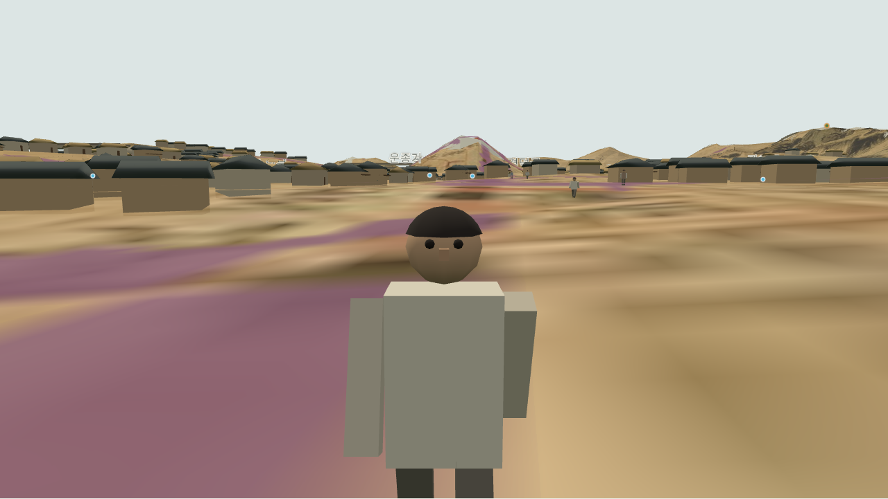
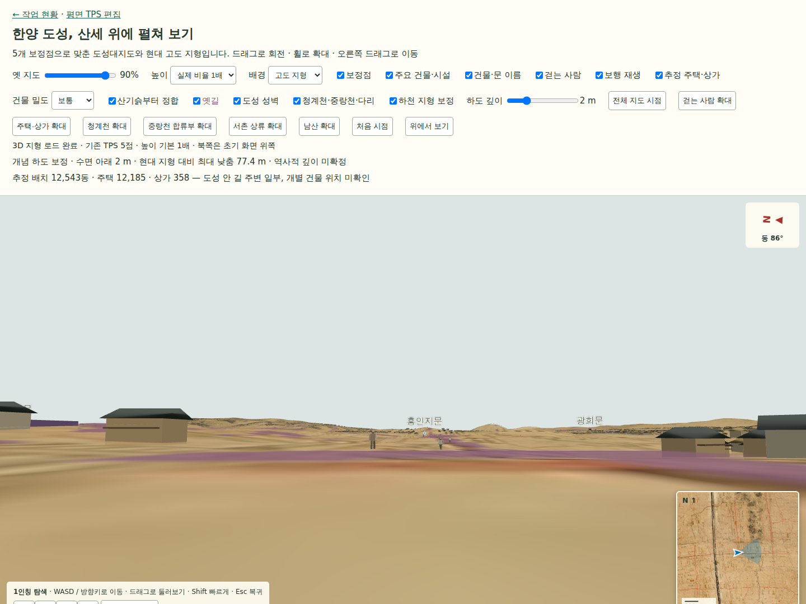

# 036 — 한양을 내려다보는 지도에서 길 위를 걷는 화면으로

**날짜**: 2026-09-11\
**범위**: 보행자, 단계별 로딩, 1인칭 탐색, 발 높이 보정, 미니맵·나침반, 얼굴 표현\
**선행**: [031 보행자](20260911_031_walking_people.md) → [032 단계별 표시](20260911_032_progressive_loading.md) → [033 1인칭](20260911_033_first_person.md) → [034 접지·길잡이](20260911_034_walk_ground_and_navigation.md) → [035 얼굴](20260911_035_pedestrian_faces.md)

도성 전체의 지형과 원도, 성벽·하천·건물 배치를 만든 뒤 사용자가 길을 따라 사람을 걷게 해 달라고 했다. 이어 빈 화면으로 기다리는 로딩을 개선하고, 1인칭으로 들어가 현재 위치와 방향을 확인하며 사람을 가까이 볼 수 있도록 작업했다. 이 기록은 031~035의 구현 흐름과 실제 확인 결과를 묶는다.

## 길 위의 사람이 공간의 크기를 보여준다

건물과 문을 위에서 내려다볼 때는 규모가 적당해 보여도 길 위 사람과 나란히 놓으면 인상이 달라진다. 종로·육조거리·돈의문 안쪽 길에 약 1.7 m 높이의 보행자 130명을 배치했다. 종로에 90명, 나머지 두 길에 각각 20명이며 서로 반대 방향으로 왕복한다.

경로는 도성대지도에서 읽은 가이드선을 붉은 길 픽셀에 맞춘 것이다. 희미한 부분은 수동 가이드로 연결하고, 실제 배치에는 지도와 같은 변형을 적용했다. 보행 속도는 0.8~1.29 m/s다. 사람 수와 이동은 장면의 규모와 움직임을 보여 주기 위한 가정이며 당시 통행량을 조사한 결과는 아니다.

가까이 보는 기능을 추가하면서 머리에도 표현이 필요해졌다. 머리 윗부분을 덮는 어두운 머리카락, 두 눈, 작은 코를 더했다. 얼굴과 몸은 같은 보행 방향으로 회전한다. 머리카락·양쪽 눈·코를 각각 인스턴스 묶음으로 그려 기존 여섯 묶음에 네 묶음만 추가했다. 130명 각각에 별도 렌더링 호출을 만드는 방식은 피했다.

머리모양과 옷은 단순한 개념 표현이다. 18세기 복식이나 신분별 외양을 복원한 모델은 아니다.

## 발이 묻힌 이유는 화면에 보이는 길의 높이였다

사용자가 “사람은 지표면 위에 발이 올라오게” 해 달라고 했다. 기존 보행 높이는 DEM과 원도 표면을 기준으로 계산했는데, 화면의 옛길은 이들보다 **0.7 m 높은 별도 표면**에 그려져 있었다. 원도 불투명도를 0으로 바꿔도 옛길은 독립적으로 남는다. DEM만 따라 내려가면 보이는 길 속에 사람이 묻힐 수 있었다.

보행 높이 계산에 옛길 표면을 추가하고, 지도·길 표시 여부에 따라 현재 보이는 표면 중 높은 값을 사용하도록 고쳤다. 하천 보정을 바꿀 때도 경로 높이를 다시 구한다. 길의 높이 배열은 기존 원도 삼각형의 좌표·인덱스를 재사용해 교차 계산에 넘긴다.

발은 경로 중심선 위에만 있지 않다. 사람끼리 조금씩 비껴 걷고 다리가 앞뒤로 흔들리므로, 중심선의 한 점 높이로는 충분하지 않았다. 1 m 이하 간격으로 나눈 경로점마다 **2.5 × 2.5 m 범위의 최고 표면**을 저장하고, 이동하는 구간 양 끝 중 높은 값을 쓴다. 매 프레임 130명의 발 아래 삼각형을 모두 다시 찾는 대신 미리 계산한 값을 이용한다.

이 방법은 파묻힘을 줄이는 보수적인 보정이다. 경사진 구간에서는 사람이 조금 뜨거나 구간 경계에서 높이가 바뀔 수 있다. 양발을 따로 지면에 붙이는 관절 제어는 아직 없다.

## 지형이 준비되면 먼저 보여 준다

지도·지형·건물·사람을 모두 준비한 뒤 첫 화면을 그리면 사용자는 로딩 내내 빈 캔버스를 보게 된다. 지형부터 실제 프레임을 그린 뒤 원도, 주요 건물, 물길, 보정 지형·성벽·길, 일반 건물, 보행자 순으로 추가하도록 바꿨다.

하천 주변 삼각형 세분화와 최근접 수로 계산은 워커에서 수행한다. 지형이 나온 뒤에는 로딩 중에도 회전·확대가 가능하고, 다음 단계가 도착해도 사용자가 바꾼 시점을 유지한다. 자료 요청이 실패하면 준비된 장면과 재시도 안내를 남긴다.

총 계산량이 사라진 것은 아니다. 후반의 건물 접지 계산과 GPU 업로드 등으로 지연이 남을 수 있다. 이번 변경의 목적은 준비된 지형까지 빈 화면 뒤에 감춰 두지 않는 것이다.

## 1인칭에서는 현재 위치와 방향이 필요하다

‘1인칭으로 걷기’를 누르면 종로의 보행 경로에서 시작한다. WASD/방향키로 이동하고 마우스나 터치 드래그로 둘러본다. 일반 이동은 1.5 m/s, Shift 이동은 4 m/s이며 계산된 지면 기준 눈높이는 1.65 m다. Esc로 나가면 진입 전 카메라 위치와 방향, 바라보던 지점, 시야각 등을 복원한다.

Tailscale의 기존 HTTP 주소에서 쓸 수 있도록 드래그 입력을 사용했다. 1인칭 동안 전체 지도용 OrbitControls의 갱신을 멈추고, 입력 포커스를 잃으면 눌린 이동 키도 해제한다.

사용자가 오른쪽 아래 미니맵과 오른쪽 위 나침반을 요청했다. 미니맵은 **북쪽 고정, 주변 1.8 km**를 보여 주며 현재 위치는 가운데 화살표, 시선은 화살표와 부채꼴로 표시한다. 나침반은 북쪽 바늘과 현재 방위·각도를 보여 준다.

미니맵에는 변형 전 원도를 그대로 넣지 않았다. **3D 원도와 같은 128 × 112 격자 삼각형**으로 원도를 2D 캔버스에 한 번 그려 저장한다. 이후에는 카메라 위치 주변만 잘라 표시한다. 산기슭 정합을 적용한 지도와 같은 좌표를 사용하면서, 미니맵 때문에 매 프레임 장면을 두 번 렌더링하거나 새 지도 타일을 요청하지 않도록 했다.

위 화면은 얼굴 요소를 추가하기 전 길잡이 기능을 확인한 캡처다. 1인칭을 종료하면 미니맵과 나침반도 숨기며, 좁은 화면에서는 미니맵 너비를 줄이도록 했다.

## 구현 때 확인한 결과

| 검사 | 확인 결과 | 재현 파일 |
|---|---|---|
| 보행 | 130명·세 경로, 이동·일시정지·숨김, 물길 이격 | [check_people_browser.py](../scripts/terrain/check_people_browser.py) |
| 발과 표시 표면 | 130명의 다리 모형 꼭짓점을 표면 삼각형과 비교. 검사 상태별 최소 여유 약 9~13 cm | 같은 보행 검사 |
| 1인칭 | 2초 이동 약 3 m, 드래그 시선, 원래 시점 복귀, 높이·원도 전환 | [check_first_person_browser.py](../scripts/terrain/check_first_person_browser.py) |
| 미니맵·나침반 | 이동 시 미니맵 위치 갱신, 드래그 시 방위 변경, 진입·복귀 시 표시 전환 | 같은 1인칭 검사 |
| 얼굴 | 130명 모두 구성 요소 존재, 코가 보행 방향 앞쪽에 위치, 확대 화면 확인 | [check_people_faces_browser.py](../scripts/terrain/check_people_faces_browser.py) |
| 단계별 표시 | 원도·주택 응답 보류 중 선행 지형 표시와 조작, 실패 시 장면 유지 | [check_progressive_browser.py](../scripts/terrain/check_progressive_browser.py) |
| 기본 검사 | Django 7개 검사, 지표면 교차 검사 통과 | `manage.py test webapp`, [test_ground_support.cjs](../scripts/terrain/test_ground_support.cjs) |

발 높이 검사는 기본 상태와 고도 2배·원도 숨김·길 숨김·하천 보정 전환의 네 상태에서 각각 네 애니메이션 시점을 검사했다. 모든 위치·보행 위상의 전수 검증은 아니다. 첫 검사 코드에서는 이미 배율이 적용된 표면 높이에 배율을 다시 곱해 큰 음수 간격을 보고했다. 실제 표시 좌표와 원래 높이 배열의 단위를 구분하도록 검사식을 수정한 뒤 재검사했다.

최종 보행·1인칭·얼굴 브라우저 검사에서 JavaScript 오류는 없었다. 캡처는 임시 디렉터리에만 두지 않고 이 기록의 `images/`에 함께 보존했다.

## 남아 있는 작업

- 1인칭은 지형을 따라가는 자유 탐색이다. 건물·성벽 충돌, 교량 상판 보행과 물길 진입 제한은 구현하지 않았다.
- 보행자 접지는 표시 레이어의 높이를 고려하지만 경사면의 양발을 따로 맞추지는 않는다. 길 마스크의 투명한 빈 부분까지 구별하는 접지 판정도 아니다.
- 1인칭 높이 검사는 카메라와 계산된 지면 사이의 눈높이를 확인한다. 모든 표시 레이어와 고도 배율에서 실제 눈높이가 맞는지 독립적인 표면 대조를 더 할 여지가 있다.
- 좁은 화면용 배치는 CSS로 대응했다. 실제 모바일 기기의 조작감과 로딩 성능은 별도 확인 대상이다.
- 정밀 역사 지형·복식·보행 행태를 검증한 복원으로 해석하지 않는다. 현재 화면은 도성 전체의 개략 배치를 둘러보는 단계다.
