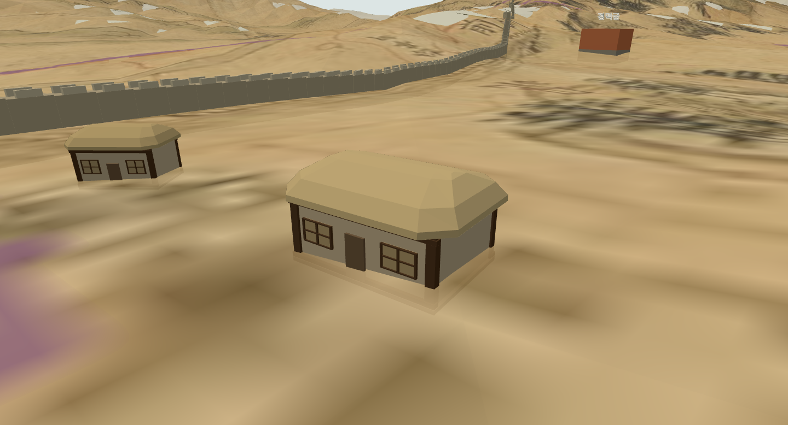
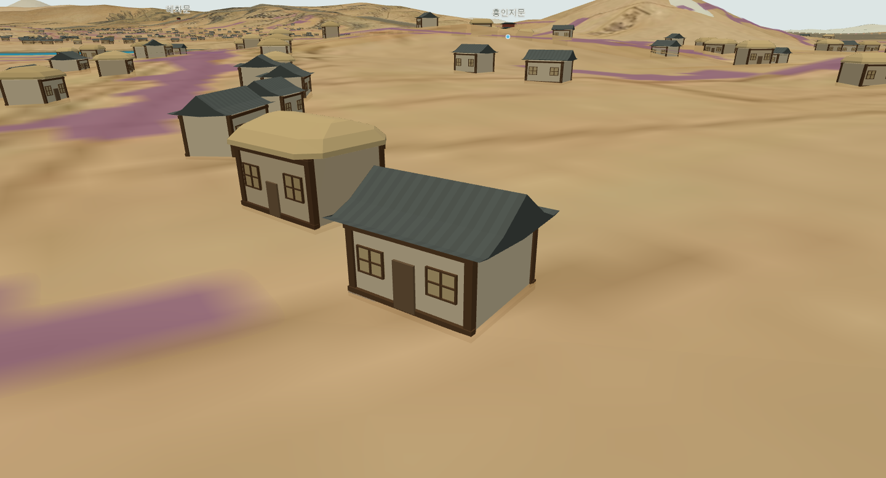

# 037 — 길가로 모은 집에 초가·기와지붕을 얹는다

**날짜**: 2026-09-11\
**선행**: [028 주택·상가 배치](20260911_028_roadside_settlement.md), [030 낮은 기단](20260911_030_low_house_footings.md), [036 길 위 탐색](20260911_036_from_city_overview_to_street_walk.md)

사용자가 건물을 길가 위주로 배치하고, 집 형태도 초가집 등 한옥 위주로 만들어 달라고 했다. 일반 건물의 위치·방향과 모양을 함께 변경했다.

## 길 주변의 넓은 띠를 채우고 있었다

기존 후보는 길 마스크를 65 px 크기로 확장한 영역에서 생성했다. 이름은 길 주변 배치였지만, 실제로는 넓은 띠에 집이 퍼져 길에서 멀리 떨어진 집도 많이 보였다. 픽셀 거리로만 제한하면 산기슭부터 늘린 지도에서는 간격도 함께 늘어난다.

후보 띠를 25 px 필터 범위로 좁히고, 후보 간격을 6 px에서 3 px로 줄였다. 길에 가까운 자리들을 충분히 만든 뒤 브라우저에서 서로 겹치는 집을 거르도록 했다. 각 후보에는 가까운 길 픽셀 좌표도 저장한다. JSON은 길 참조 좌표 두 열을 추가한 스키마 2다.

배치할 때 집과 길 픽셀을 같은 원도 변형으로 옮긴 다음 실제 미터 단위 거리를 검사한다. 지붕 앞쪽 여유가 최소 2 m이고, 가까운 길 가장자리까지의 거리에서 지붕 반깊이를 뺀 값이 최대 9 m인 후보만 남긴다. 지붕 능선은 길 방향을 따르고, 출입구·차양이 길 반대편을 향하면 건물을 180도 돌린다.

| 단계 | 동수 |
|---|---:|
| 원도 후보 | 48,429 |
| 길가 거리·지형·수계·시설·건물 간격 조건 통과 | 4,202 |
| 성김 | 1,272 |
| 보통 | 2,540 |
| 촘촘함 | 3,641 |

보통의 2,540동은 주택 2,375동과 상가 165동이다. 이전 기본 표시 12,543동보다 줄었지만, 한성부 전체 건물 수를 맞추려고 빈 공간을 채우지 않았다. 길가를 읽기 쉬운 배치로 만드는 것이 이번 변경의 목적이다. 궁궐·제례 공간 제외, 낮은 기단과 경사 필터는 유지한다.

## 작은 상자에서 한옥의 윤곽으로

기존 삼각 지붕을 두 종류로 나눴다. 일반 주택은 초가 위주로, 일부 주택과 상가는 기와집으로 표시한다.

- **초가**: 두꺼운 처마와 둥근 모서리, 완만하게 올라가는 사면지붕과 짧은 용마루를 표현한다. 볏짚 느낌의 밝은 황갈색을 사용한다.
- **기와집**: 능선 양쪽으로 내려오는 맞배지붕에 곡선 처마를 만들고 끝을 조금 들어 올린다. 짙은 회색 지붕에 폭 방향으로 색을 달리한 줄을 넣어 기와 배열을 암시한다.
- **벽체**: 흙벽색 면에 목재 기둥·상하 보를 두고 양쪽에 창살을 만든다. 작은 출입구나 상가 차양은 길 쪽에 놓는다.

기존 작은 단층 건물의 폭·깊이·높이는 유지했다. 벽과 목재 부재는 하나의 정점색 기하로 합치고, 초가와 기와는 별도 인스턴스 묶음으로 그린다. 집마다 두 지붕 중 하나만 표시한다. 전체 일반 건물은 기존 네 묶음에서 다섯 묶음으로 늘었다.

이 형태와 초가·기와 비율은 개관용 표현이다. 도성대지도에 없는 필지나 개별 주택을 복원한 결과도, 18세기 한옥 실측 모델도 아니다.

## 검증과 남은 한계

배치 자료 검사 3개와 Django 검사 7개가 통과했다. 자료 검사에서는 길 참조점이 실제 길 마스크 위에 있는지, 건물 후보가 도로·궁궐 제외 영역 밖인지, 작은 건물 치수를 유지하는지 확인한다.

브라우저 배치 검사에서는 지붕 앞쪽 최소 여유 2.0066 m, 길 거리 제한 최대 8.9999 m, 모든 출입구의 길 방향을 확인했다. 밀도별 표시 수와 하천 이격, 원도 숨김·고도 2배·하천 보정 변경 시 지면 접지도 검사했다.

길 마스크 자체는 개략 판독이며 작은 붉은 기호나 흐릿한 단절이 남아 있다. 가까운 길 픽셀과 국부 방향을 기준으로 배치하므로 교차로·급한 곡선의 지붕 전체와 도로 사이를 정밀하게 충돌 검사한 것은 아니다. 건물끼리의 간격은 기존 외접원 방식으로 보수적으로 확보한다.

재현 파일:

- [후보 생성](../scripts/buildings/build_settlement.py)
- [배치·한옥 모형](../webapp/static/settlement.js)
- [자료 검사](../scripts/buildings/test_settlement.py)
- [브라우저 검사](../scripts/terrain/check_settlement_browser.py)

## 화면 확인

최종 브라우저 검사에서 기본 배치 2,540동 중 초가 1,490동·기와 1,050동을 확인했다. 집마다 올바른 지붕 하나만 표시되는지, 밀도·숨김·높이·하천 보정 전환 후에도 모형이 유지되는지 검사했다. JavaScript 오류는 없었다.

