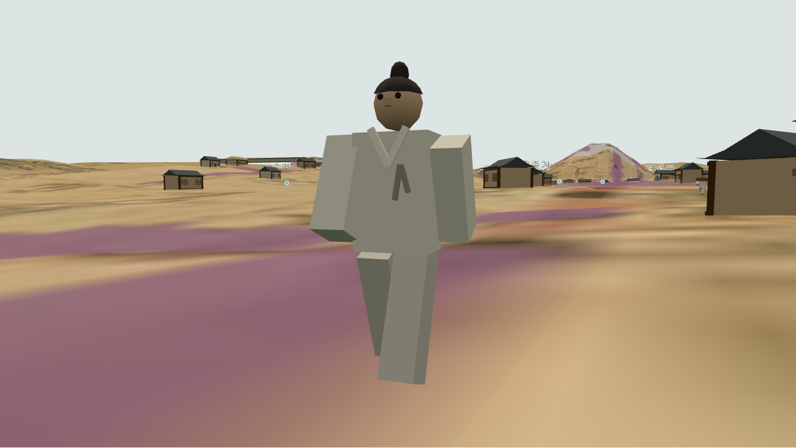
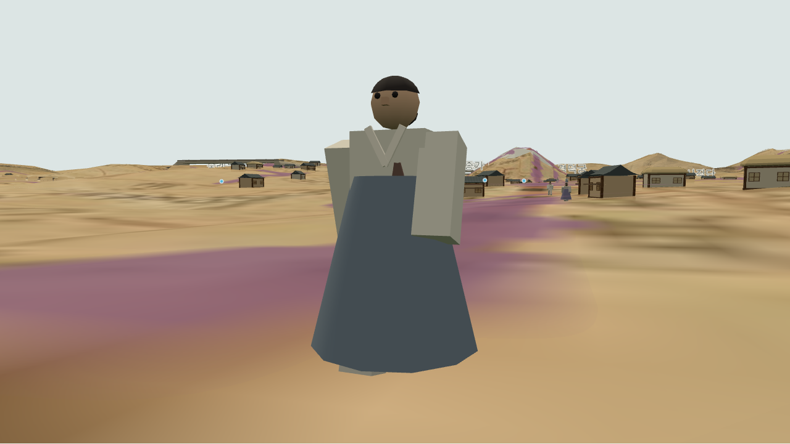

# 039 — 보행자의 남녀 복식

2026-09-12. 기존 보행자 130명에게 남녀를 구분할 수 있는 단순한 조선 복식을 적용했다.

남성은 넉넉한 바지와 저고리, 작은 상투를 표시한다. 여성은 아래로 퍼지는 긴 치마와 짧은 저고리, 뒤쪽 쪽머리를 표시한다. 넓은 소매, 교차하는 밝은 옷깃과 두 가닥 고름을 추가하고 저고리·치마 색상을 다섯 종류로 분산했다. 남녀 각 65명은 시각적 구성을 위한 값이며 당시 인구비나 특정 신분·연령·연도의 복식 고증 결과가 아니다.

이동 경로·속도·얼굴 방향·지면 추적은 기존 구현을 유지한다. 치마 아래에서도 다리 보행 동작을 유지하고, 성별 전용 부위는 해당 인스턴스만 표시한다. 모든 부위는 인스턴스 묶음으로 그린다.

구현: `webapp/static/pedestrians.js`. 기존 얼굴 브라우저 검사에 남녀 수와 치마·상투·쪽머리 표시 구분, 전신 확대 화면을 추가했다.

남녀 복식·얼굴 브라우저 검사 통과: 남녀 각 65명, 전용 부위 표시와 유효한 배치 행렬, 얼굴 진행 방향을 확인했다. 확대 화면을 직접 확인했으며 JavaScript 오류가 없었다. JavaScript 문법 검사와 Django 7개 검사도 통과했다.

기존 보행 브라우저 검사도 통과했다. 세 경로 이동·수로 이격·일시정지·숨김과 고도/원도/옛길/하도 보정 전환을 확인했다. 검사한 발과 지면의 최소 간격은 약 8.6 cm로 지면 관통이 없었다.
