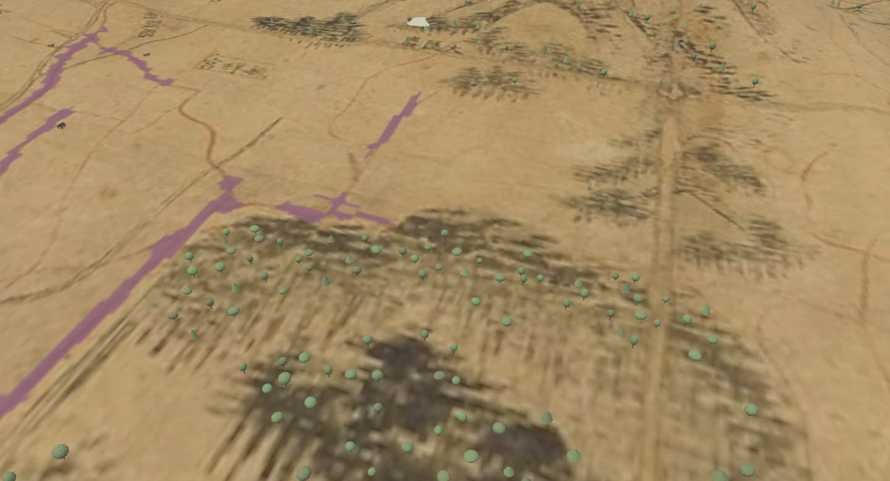
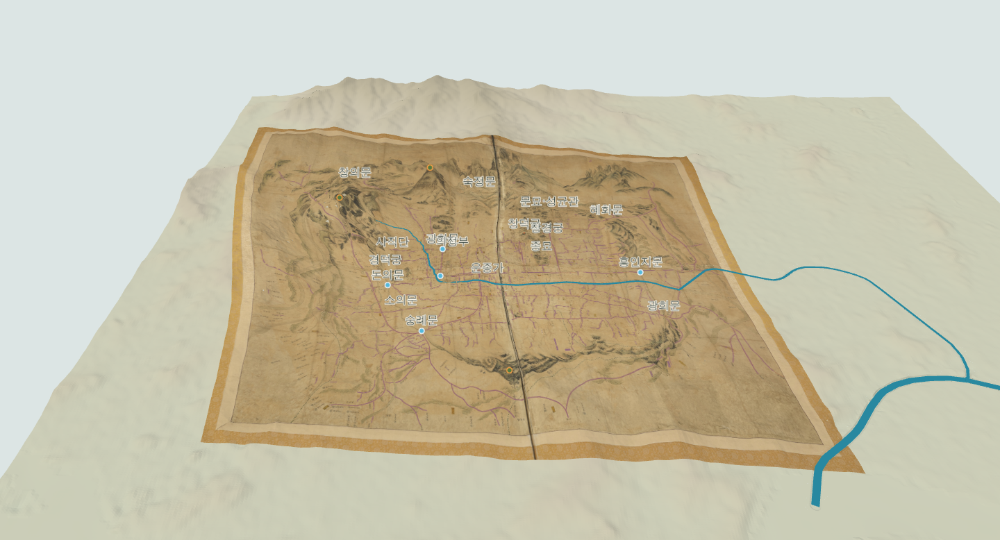

# 040 — 원도 수목 구역의 나무와 숲

2026-09-12. 사용자가 원도에 나무가 많은 경복궁 안, 종묘–창경궁 주변, 산들에 나무를 추가하도록 요청했다.

## 배치 근거

도성대지도 asset-0001 전체도를 확인하고 경복궁 안, 동궐 후원, 종묘와 동궐 사이, 인왕산, 백악, 동북 산지, 낙산, 남산의 8개 구역을 원본 픽셀 다각형으로 지정했다. 이 범위의 어두운 수목·산기슭 표현을 따라 고정 난수로 후보 2,640개를 생성한다. 수목 기호 하나를 나무 한 그루로 판독한 결과는 아니다. 산지 음영이나 문자도 포함될 수 있으며 개별 위치·수종·치수·밀도는 추정이다.

붉은 길 마스크 주변, 판독 수계·성벽은 후보에서 제외한다. 변형 지도 좌표로 옮긴 후 주요 시설, 주택 후보 전체, 성벽, 수로와의 간격을 다시 검사하고 수관 반경에 따라 나무끼리의 간격도 확보한다. 건물 밀도를 바꿔도 기존 주택 후보와 겹치지 않게 한다.

## 모형과 화면

궁궐·종묘 쪽은 높이 5~9 m, 산지는 6~12 m로 가정했다. 갈색 줄기, 둥근 수관, 소나무를 연상시키는 두 단 수관을 차분한 녹색으로 표현한다. 특정 수종의 복원 모델은 아니다. 네 개의 인스턴스 메시를 사용하며 프레임마다 나무를 다시 계산하지 않는다.

주택 이후 나무와 사람을 준비하므로 기존 단계별 로딩을 유지한다. ‘나무·숲’ 표시 전환과 ‘경복궁 숲 확대’ 버튼을 추가했다. 원도 표시/숨김, 높이 강조, 하천 보정 변경 시 줄기 밑동을 표시 지형에 맞춘다. 높이 강조로 나무 자체의 크기를 늘리지는 않는다.

## 재현

- 후보 생성: `.venv/bin/python scripts/vegetation/build_trees.py`
- 원도 구역·후보·출처 해시: `gis/vegetation/doseong_trees.json`
- 모형·배치: `webapp/static/trees.js`
- 브라우저 검사: `.venv/bin/python scripts/terrain/check_trees_browser.py`

Django 기존 7개 검사(신규 자료·모듈 제공 포함)와 JavaScript 문법 검사를 통과했다.

최종 기본 배치 2,468그루: 경복궁 301, 동궐 후원 628, 종묘–동궐 241, 인왕산 481, 백악 312, 동북 산지 112, 낙산 118, 남산 275. 기존 주택 2,540동·보행자 130명과 로딩 단계 0~8이 유지되는 것을 확인했다.

브라우저 검사 통과: 8구역 생성, 수관 간격·시설/수계 이격, 유효한 변환 행렬, 나무 표시 전환과 높이/원도/하도 전환을 확인했다. 구역별 표본에 대해 실제 표시 메시의 수직 광선 교차로 밑동 높이를 독립 검사했으며 최대 차이는 약 18.2 cm였다(밑동을 12 cm 묻는 설정 및 경사지 표면 차이 포함). JavaScript 오류 없음.
