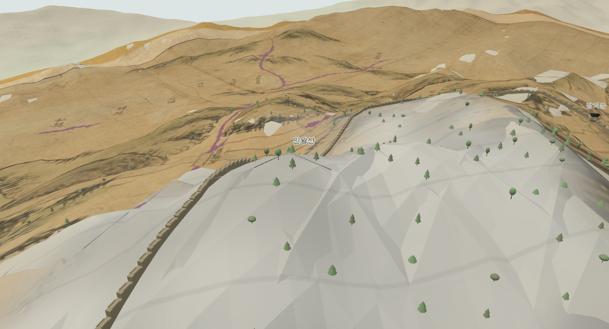
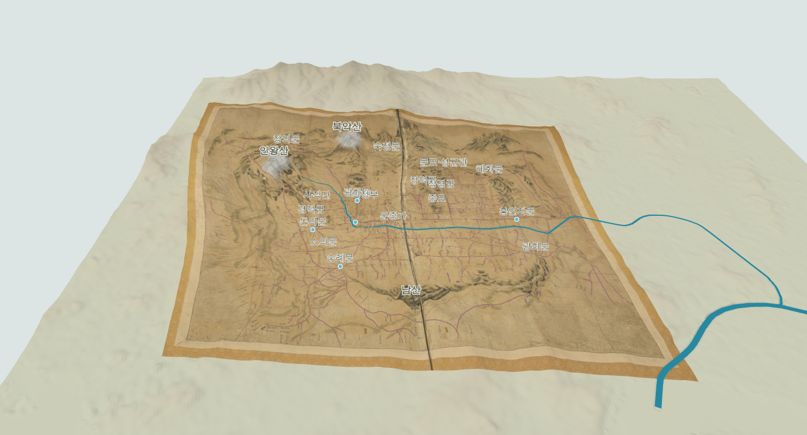

# 041 — 근거리 확대와 화강암·산 이름

2026-09-12. 사용자가 일반 시점 확대가 점점 느려지고 멈추는 문제를 보고했다. 이어 북악산·인왕산의 화강암 표현과 산 정상의 원형 점을 산 이름으로 바꾸도록 요청했다.

## 가리킨 지형을 기준으로 확대

기존 OrbitControls의 최소 거리는 60 m이며 고정 중심점까지의 거리를 기준으로 확대했다. 중심점이 실제 지표보다 높거나 낮으면 도로에 가까이 가기도 전에 제한에 도달했다. 카메라 near 값 10 m도 가까운 물체를 보기 어렵게 했다.

최소 거리를 1 m로 줄이고 커서 방향 확대를 활성화했다. 휠과 터치 두 손가락 확대 시 실제 표시 중인 지형을 찾아 초점 거리를 갱신한다. 시선 방향을 유지한 채 초점 평면을 옮기므로 가리킨 곳으로 갑자기 고개를 돌리지 않는다. 지형을 맞히지 않은 하늘 방향에서는 기존 초점을 유지한다.

지형 공간 인덱스의 60 m 셀을 광선이 통과하는 순서로 방문해 삼각형과 교차한다. 확대마다 전체 고밀도 지형을 순회하지 않는다. 높이 강조 후에도 현재 정점 배열을 읽고, 원도를 숨기면 DEM만 선택한다. 하도 보정 시 인덱스가 갱신된다.

near 값은 거리에 따라 0.05~10 m로 조절한다. 일반 카메라가 표시 지면·옛길 아래로 내려가면 카메라와 초점을 함께 올려 최소 1.1 m 여유를 둔다. 1인칭 모드에서는 일반 탐색 보정을 적용하지 않는다. 공급받은 OrbitControls 원본은 수정하지 않았다.

## 화강암 질감

기존 원도 산지 대응점인 인왕산 (650,890), 백악 (1080,490) 주변을 개략 타원 범위로 지정했다. 실제 지질 경계의 판독 결과는 아니다. 높은 능선 쪽에 회백색 바탕, 밝고 어두운 알갱이, 옅은 불규칙 균열을 셰이더로 표현한다. 사용자 화면 검토 후 먼 거리에서는 미세 알갱이를 전부 줄이고 60~100 m 규모의 큰 회백색 면과 소수의 넓고 옅은 절리로 읽히도록 조정했다. 알갱이는 약 25~140 m 사이에서 서서히 사라지며 화면 픽셀보다 작은 무늬도 줄인다. 별도 바위 덩어리 메시를 얹거나 지형 형상을 바꾸는 처리는 아니다.

질감은 3D 좌표를 사용하며 높이 강조 배율을 되돌려 무늬가 배율 전환으로 바뀌지 않게 한다. DEM과 원도 양쪽 재질에 적용하고 ‘화강암 질감’으로 끌 수 있다. ‘인왕산 암반 확대’를 제공한다. 별도 이미지 다운로드나 추가 지형 메시가 필요하지 않다.

## 산 이름

산지 보정점의 원형 스프라이트 3개를 제거하고 북악산·인왕산·남산 글자 스프라이트로 바꿨다. 도심 보정점 5개는 유지한다. 산 이름은 ‘건물·문·산 이름’ 항목을 따르며 건물이나 보정점 표시와 독립적이다. 산기슭 정합을 껐을 때는 원도 산 그림의 기존 변형 위치에 붙인다.

## 관련 파일

- `webapp/static/orbit_navigation.js`: 일반 탐색 초점·근거리 처리
- `webapp/static/city_wall.js`: 공유 지형 인덱스를 이용한 광선 교차
- `webapp/static/granite.js`: 화강암 재질
- `webapp/static/terrain3d.js`: 통합과 산 이름
- `scripts/terrain/check_orbit_granite_browser.py`: 확대·교차·질감·이름·1인칭 복귀 검사

## 검증

Django 7개 검사와 JavaScript 문법 검사 통과. 브라우저에서 평지·인왕산의 고정 초점 상황을 재현한 뒤 연속 휠 입력으로 각각 목표 주변 2.57 m, 6.84 m까지 접근했다. near는 0.05 m로 줄었고 근거리 오른쪽 드래그 이동도 동작했다. 원래 60 m 제한으로 막히던 접근이 가능해졌다.

공유 인덱스 교차 결과를 Three.js 전체 메시 Raycaster와 비교했다. 높이 1/2배, 원도 숨김, 하도 보정 해제에서 위치 오차 0이었다. 검사한 세 광선의 인덱스 교차 합계는 약 0.1~0.8 ms였다(이 환경의 표본값). 1인칭 진입·복귀 후 일반 시점 위치와 near 복원도 통과했다.

도심 점 5개와 산 이름 3개, 보정점 숨김과 산 이름의 독립성, 화강암 켜기/끄기의 실제 렌더 차이를 확인했다. JavaScript·셰이더 오류 없음.

먼 거리의 잔무늬를 줄인 최종 질감도 브라우저 렌더·표시 전환 검사를 통과했다. 인왕산 확대 및 전체 지도 화면을 직접 확인했다.

