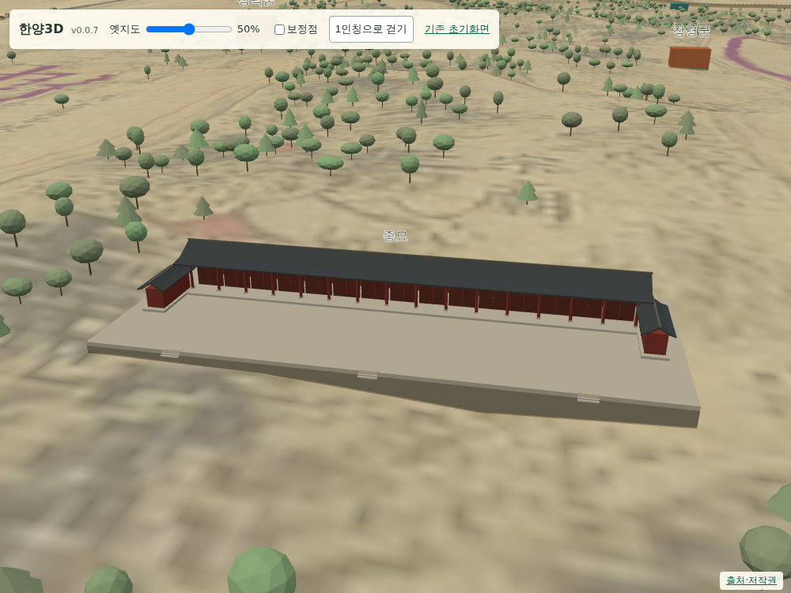
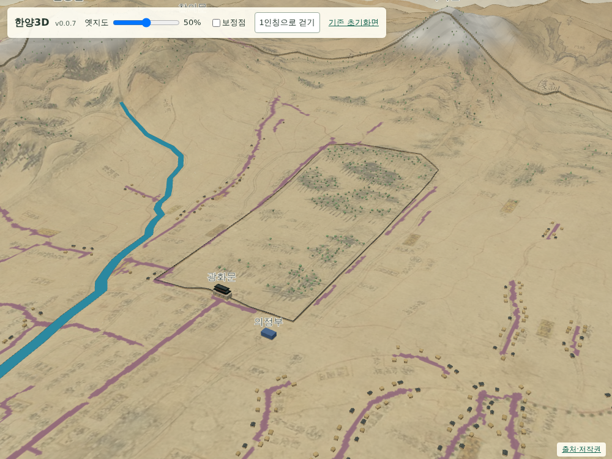

# 049 — 경복궁 담장·종묘 정전, 지도 제목과 출처 정리

## 요청과 구현

경복궁에 담장을 추가하고 종묘 건물을 구체화했다. 지도 컨트롤에 `한양3D`와 서버의 배포 버전을 표시한다. 출처·저작권 페이지는 기본 3D 화면에서 사용한 자료에 한정했다.

- 경복궁: 도성대지도 원본 픽셀에서 둘레를 수동 판독했다. 북쪽은 흐릿하여 개략 연결했다. 321개 담장 구간, 폭 1.2m·높이 3.2m·기와 덮개 0.55m는 시각화 가정이다. 광화문 모형을 피해 담장을 연결하며 FABDEM 공통 지면의 구간별 최저·최고 높이를 사용한다. 성벽 표시 전환에 함께 반응한다. 나무 배치에서 담장 주변을 제외한다.
- 종묘: 보라색 박스를 15칸 신실 문, 붉은 원기둥, 긴 맞배지붕, 월대·계단, 낮은 양쪽 익랑으로 교체했다. 모형 범위 94×38m, 높이 10m는 실측값이 아니다. 기존 대표 위치를 유지한다.
- 제목: `settings.APP_VERSION`을 템플릿에 전달해 이미지·healthz와 같은 버전을 표시한다. 데스크톱과 모바일 컨트롤에 적용한다.
- 출처: 도성대지도 전체 이미지(asset-0001), FABDEM V1.2, 종묘 연혁 참고, Three.js 라이선스를 표시한다. 현재 화면에서 쓰지 않는 지적도·부분도·평면 지도 배경·Leaflet 항목은 이 페이지에서 제외했다. 기존 카탈로그 기록은 유지한다.

## 역사적 근거와 한계

[궁능유적본부 종묘 소개·역사](https://royal.khs.go.kr/ROYAL/contents/R105010000.do)의 연혁은 1726년 정전 15칸, 1836년 19칸 증축을 명시한다. 프로젝트 시점에 맞춰 15칸을 표현했다. 세부 건축 형태·치수·방향은 정밀 복원이 아니다. 경복궁 담장도 18세기 잔존 담장 상태의 복원을 뜻하지 않는다.

## 검증

- Django 11개 테스트, 변경 JS 구문 및 diff 검사.
- `scripts/terrain/check_palace_browser.py`: 실제 브라우저에서 정전 15칸/문 15개, 담장 321구간, 지형 배율 1→2→1 접지, 투명도 0% 위치 유지 확인. 담장 하단은 지면 최저값보다 약 0.4m 낮아 뜨지 않는다.
- 데스크톱 확대 화면으로 종묘·경복궁을 검토했다. 390px 모바일에서 제목·버전·걷기 버튼 표시, 가로 넘침 없음 확인. 출처 항목 및 브라우저 오류 없음 확인.
- 배포 버전: `honestjung/hanyang3d:v0.0.7`. 운영 배포 결과는 아래에 기록한다.
- 기존 공개 화면 브라우저 검사도 통과: 다리 4개 접지, 지면·지도·도로 높이 일치, 지도 0% 배치 유지, 눈높이 약 1.65m. 보행자 130명·나무 2,454그루, 산 이름과 화강암 표시 확인.
- Docker 내부 Django 테스트 및 정상/누락/버전 불일치 런타임 검사 통과. 제공 리소스 53개.
- Docker Hub push 완료: `sha256:08c41cf35c8cb45789f5480bae94d23483abbc6a91d20e05df0533b37057cea5`.

## 화면

## 운영 반영

2026-09-12 dolfinid 배포 완료. 공개 `/healthz`는 v0.0.7·리소스 53개·오류 없음이다. 공개 JS 3개와 담장 데이터의 SHA-256이 로컬에서 검증한 파일과 같으며, 첫 화면 제목·버전 및 출처 페이지 구성도 확인했다.
