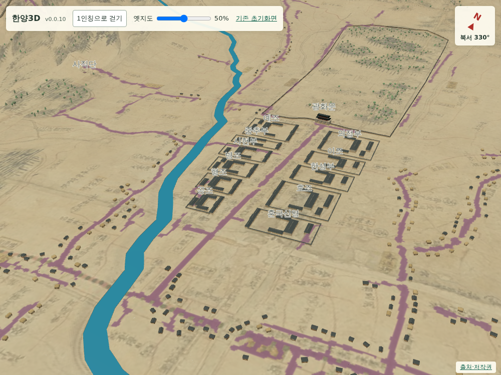
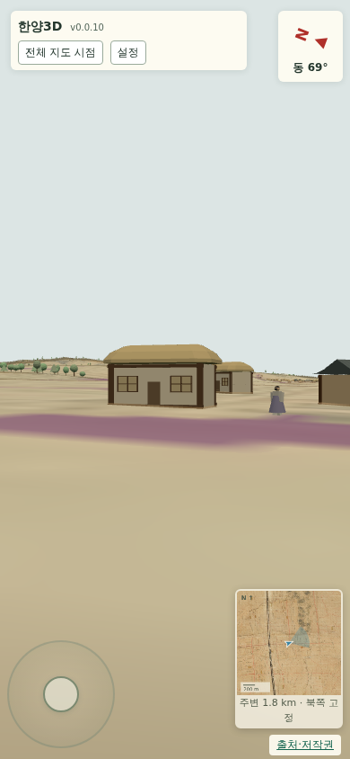

# 052 — 육조거리 관청과 모바일 설정 패널

## 요청과 근거

사용자가 제공한 [서울 S-MAP 오픈랩 육조거리 자료](https://openlab.eseoul.go.kr/gallery/viewStoryMapContent.do?scid=NJDK-f3GQKD_3BA4XkZM5g)의 배치도·복원 이미지를 확인했다. 참고 이미지의 주소·해시는 `gis/buildings/yukjo_reference.json`에 저장했다. 외부 3D 자산이나 이미지를 장면에 삽입하지 않고 기하 모형을 직접 작성했다.

자료는 1863년경과 1865년경 배치를 비교한다. 프로젝트에서 사용하는 18세기 원도와 시대가 같지 않으므로, 개편 이전의 예조·한성부 배치를 참고한 개략 모형으로 명시했다. 실제 1750년 건물의 정확한 복원이라고 표시하지 않는다.

## 건물

광화문 서쪽: 예조·중추부·사헌부·병조·형조·공조. 동쪽: 의정부·이조·한성부·호조·훈국신영. 기존 의정부 박스는 새 관청 모형으로 교체해 중복 표시하지 않는다.

원도 지명과 길을 따라 11개 구획을 배치하고, 서쪽 일부가 기존 물길과 겹치는 것을 화면 검토 후 교정했다. 관청마다 출입문·긴 행랑·주전각·옆 전각·후면 전각·담장과 빈 마당을 간략히 표현했다. 구획별 폭·깊이는 원도 좌표를 현재 지형 변형에 통과시킨 값이며 실측 치수가 아니다.

전각과 짧은 담장 구간마다 지면을 별도로 샘플링해 접지한다. 관청 전체를 높은 단일 받침 위에 올리지 않는다. 기둥·창살 등을 재질별 메시 5개/관청으로 묶고 지면 변경 때만 재생성해 렌더 호출을 줄였다. 일반 주택·나무는 관청 구획을 피해 배치한다.

## 연대 데이터

후속 요청에 따라 모든 주요 건물 feature에 `temporal`을 추가했다. 건물의 존속 연대(`existence`)와 현재 모형의 배치·형태 연대(`depiction`)를 구분하고 미상 값은 null로 저장한다. 육조거리 모형은 참고 연대 1863년경 / 개편 전 배치 단계 끝 1864년으로 기록했다. 이는 철거 연도가 아니다. 종묘의 15칸 형태는 1726–1835년이다. 상세 규약은 [건물 연대 데이터](../docs/building_periods.md)에 있다. 연대별 표시 UI는 아직 구현하지 않았다.

## 모바일

상단에 제목·버전, 걷기/시점 전환, 설정 버튼만 표시한다. 설정을 누르면 옛지도 투명도와 기존 초기화면 링크가 나타난다. 설정을 열고 닫아도 1인칭이 종료되지 않는다. PC에서는 옵션이 항상 보인다.

## 검증

Django 11개 테스트·JS 구문·diff 검사. `scripts/terrain/check_yukjo_browser.py`에서 11개 관청, 재질 묶음 수, 지형 배율 변경 후 개별 전각·담장 접지, 모바일 옵션 초기 숨김·펼침·접힘·1인칭 유지·가로 넘침·브라우저 오류를 확인한다.

최종 브라우저 검사 통과. 물길과 겹치던 서쪽 구획을 축소·북쪽으로 재배치했다. 관청별 렌더 메시 5개, 높이 배율 1→2→1에서 지면 접촉 오차 1e-6m 미만. 모바일 설정과 1인칭 유지 정상.

연대 메타데이터 형식 검사: 주요 시설 27개 모두 필드 보유, 중복 ID 없음, 시작/끝 정수·null 및 순서 유효. 육조거리 11개는 참고 연대 1863년 저장.

Docker 빌드·내부 테스트·기동 검사 통과(리소스 55개). Docker Hub push digest: `sha256:95bcbfe81c7f2f978fa3bf124bdf33fffe5e3d39f75c03ab1a4daea2bb374ba4`.

2026-09-12 dolfinid v0.0.10 배포 완료. 공개 healthz 정상(리소스 55개), 관청 11개와 주요 시설 27개의 연대 필드 확인. 공개 JS는 검증한 로컬 파일과 SHA-256이 같고, 설정 패널 및 S-MAP 출처 링크도 반영됐다.
