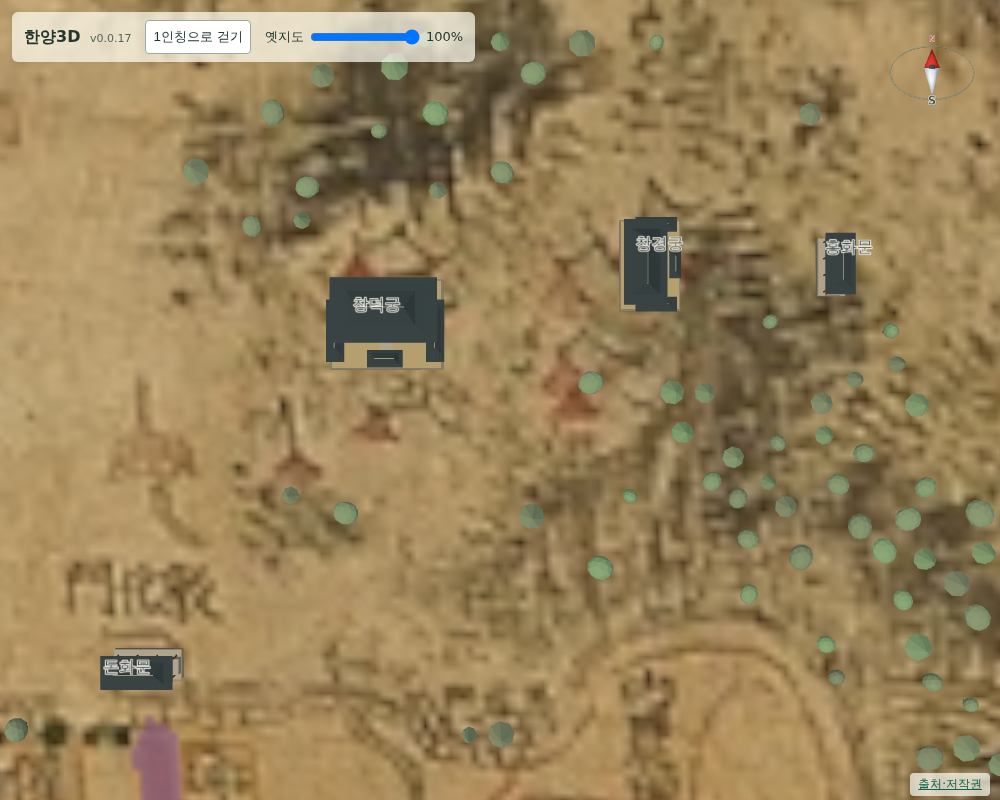
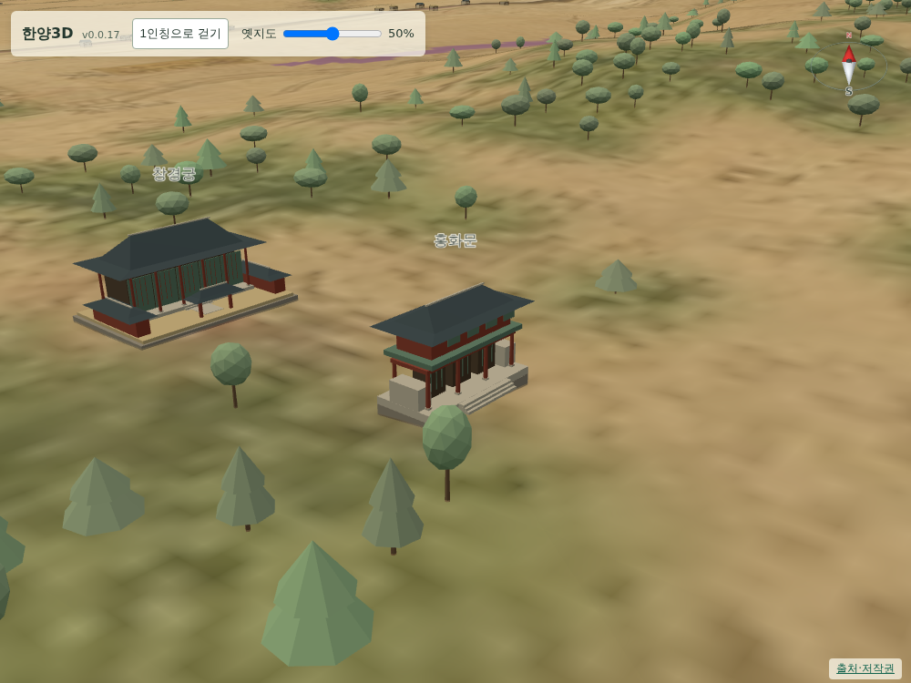

# 058 — 동궐 배치 보정과 돈화문·홍화문

사용자 요청으로 창경궁을 원도에 그려진 궁궐 지붕 자리로 옮기고, 창덕궁과 창경궁 앞에 정문 모형을 추가했다.

## 원도 판독과 배치

원도를 확대해 보면 동궐 구역의 붉은 전각 지붕은 두 무리로 그려져 있고, 서쪽 무리 남쪽에 `敦化門` 글씨와 문 기호, 남향 길이 이어진다. 창덕궁과 돈화문을 이 판독에 맞춰 `source_position`으로 기록했다.

- 창덕궁 `(1749, 1020)` — 서쪽 전각 지붕 무리
- 돈화문 `(1717, 1064)` — `敦化門` 글씨 아래 문 기호와 길 시작점

창덕궁의 기존 위경도 위치는 그려진 지붕에서 북쪽으로 약 330 m 떨어져 있었다. 원도의 돈화문 기호 앞에 정문을 두려면 궁도 같은 판독 기준을 써야 하므로 함께 옮겼다. 위경도는 현대 위치 참고값으로 남기고 화면 배치만 원도 좌표를 사용한다.

## 창경궁·홍화문 배치 재조정

처음에는 창경궁도 동쪽 전각 지붕 무리로 옮겼다. 그 결과 창경궁이 창덕궁과 약 70 m까지 붙어 사실상 한 궁 안에 들어간 것처럼 보였다. 사용자 지적에 따라 창경궁과 홍화문의 중간 지점이 기존 현대 위경도 위치와 맞도록 두 모형을 함께 옮겼다.

- 창경궁 `(1908, 1029)` — 중간 지점에서 서쪽 약 22 m
- 홍화문 `(1929, 1029)` — 중간 지점에서 동쪽 약 22 m

두 픽셀은 TPS 변형을 반영해 화면 좌표에서 역산했다. 단순 아핀 역변환값 `(1904, 912)`와는 다르다. 검사에서 중간 지점과 기존 위치의 차이는 0.84 m다. 두 위치는 원도 판독값이 아니므로 `method`를 `modern_site_pair_midpoint`로 적었다. 창덕궁과의 간격은 약 341 m가 된다.

## 문 모형

`palace.js`에 `createPalaceGate`를 추가했다. 기단, 삼문, 붉은 기둥, 중층 문루와 계단을 갖추며 재질별 5개 메시로 합친다. 기존 `createPalace`와 재질·병합 코드를 공유하도록 `palaceMaterials`·`mergeByMaterial`을 모듈 함수로 분리했다.

돈화문은 남쪽, 홍화문은 동쪽을 향한다. 실제 두 문이 각각 남향·동향인 점을 따랐다. 칸수와 치수는 2층 문루 1동 수준의 개략값이며 실측 복원이 아니다. 형태 참고는 한국민족문화대백과사전의 [돈화문](https://encykorea.aks.ac.kr/Article/E0016240)·[홍화문](https://encykorea.aks.ac.kr/Article/E0064444) 설명이며 출처 페이지에도 추가했다.

문 옆 담장은 처음에 기단 밖으로 뻗어 지면 위에 떠 보였다. 표시 범위 안으로 넣어 기단 위에 얹히도록 고쳤다.

## 검증

- `scripts/terrain/check_palace_models_browser.py`에 문 검사를 추가했다. 두 문의 모형 교체·부품·메시 수와 함께 돈화문이 창덕궁 남쪽, 홍화문이 창경궁 동쪽 45 m 앞, 창경궁이 창덕궁 동쪽인지 확인한다.
- 같은 검사에서 창경궁과 홍화문의 중간 지점이 창경궁의 현대 위경도 위치와 3 m 안에서 맞는지 확인한다.
- 궁궐 3곳의 기존 검사(재질별 6개 메시, 지붕 층수, 높이 배율 복귀)도 그대로 통과한다.
- Django 11개 테스트 통과.
- 옛지도 100%의 수직 화면으로 모형이 그려진 지붕 자리에 오는지 확인했다.

## 남은 문제

`scripts/terrain/check_buildings_browser.py`는 건물 17개·이름표 8개를 상수로 검사한다. 이번 작업 이전부터 실제 값과 맞지 않아 실패하며, 운영 화면(v0.0.17)에서도 건물 27개다. 검사 기준을 장면에서 읽도록 고치는 일은 별도로 남긴다.

## 배포

- v0.0.18로 창덕궁·돈화문·홍화문을 먼저 배포했고, 창경궁 간격 지적을 반영한 v0.0.19가 최종 배포본이다.
- Docker Hub digest: `sha256:df4d7b3c0e78fd0e174583ae77ceb65a3e630771b68bb038d59f66eaece59a3e`.
- 공개 healthz 정상: v0.0.19, resources 58. 운영 화면에서 궁궐·문 검사와 `deploy/check_public_browser.py`가 통과했다.
- v0.0.18 배포 직후 공개 브라우저 검사가 캔버스 크기 측정 단계에서 한 번 시간 초과했다. 같은 검사를 다시 실행하면 통과하며 v0.0.19에서도 통과했다.
