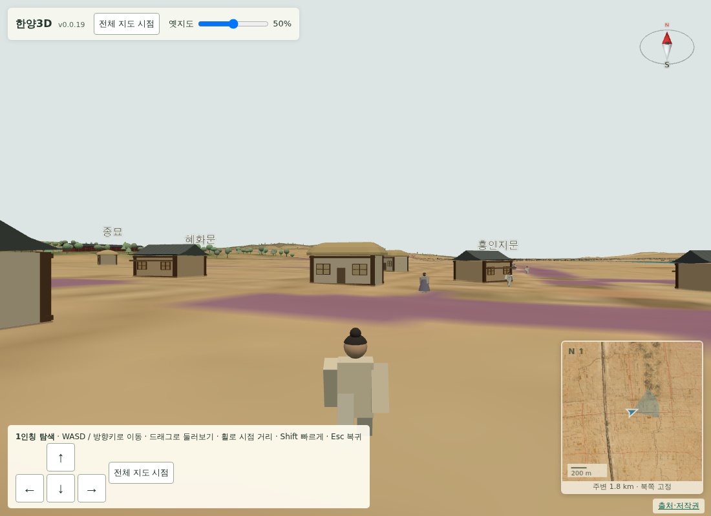

# 059 — 걷기 시점의 내 캐릭터와 두 배 빠른 걸음

사용자 요청으로 걷기 모드를 MMORPG처럼 내 캐릭터가 보이는 3인칭 시점으로 바꾸고, 걷는 속도를 두 배로 올렸다.

## 내 캐릭터

`pedestrians.js`에 `createWalker`를 추가했다. 기존 보행자와 같은 비례·색으로 만든 단독 모형이며, 인스턴스 메시가 아니라 일반 메시 묶음이다. 다리와 팔은 엉덩이·어깨 지점을 축으로 매달아 걸음 주기를 회전 하나로 처리한다. 걸은 거리에 따라 팔다리를 흔들고, 멈추면 흔들림이 잦아들어 선 자세로 돌아온다.

캐릭터는 걷는 위치의 지면에 서고 카메라 방향을 향한다. 시점을 바꾸면 캐릭터도 같이 돈다.

## 카메라

걷기 모드의 기준점을 카메라 위치에서 눈높이 지점(`eye`)으로 분리했다. 눈높이는 이전과 같이 지면 위 1.65 m다. 카메라는 시선 반대 방향으로 기본 4.5 m 물러나며, 거리에 비례해 조금 들어 올려 캐릭터가 화면 아래쪽에 오고 앞이 가리지 않게 했다. 카메라가 지면에 파묻히지 않도록 지면 위 0.6 m로 막는다.

휠로 거리를 0~12 m 사이에서 조절한다. 0.8 m보다 가까우면 캐릭터를 숨겨 기존 1인칭 화면이 된다. 화면 안내에 `휠로 시점 거리`를 넣었다.

미니맵은 카메라가 아니라 캐릭터 위치를 따라간다.

## 걷는 속도

기본 1.5 m/s를 3 m/s로, Shift 달리기를 4 m/s에서 8 m/s로 올렸다.

## 검증

- `scripts/terrain/check_first_person_browser.py`: 눈높이 1.65 m 유지, 캐릭터가 걷는 지면에 서 있음, 카메라가 1 m 넘게 떨어져 있음, 휠로 0까지 당기면 캐릭터가 숨고 카메라가 눈높이 지점과 일치, 다시 밀면 캐릭터가 보임. 2초 걷기 거리는 3 m에서 6 m로 바뀐 값을 확인한다.
- `scripts/terrain/check_mobile_walk_browser.py`: 조이스틱 방향별 이동, 반만 민 아날로그 속도, 대각선 속도 상한을 두 배 속도 기준으로 확인한다.
- `deploy/check_public_browser.py`: 눈높이 측정을 카메라 대신 눈높이 지점 기준으로 바꾸고, 걷기 진입 시 캐릭터 표시와 카메라 거리를 확인한다.
- Django 11개 테스트 통과.

## 오래된 검사 정리

`check_first_person_browser.py`가 예전 화면을 기준으로 삼아 이번 작업 이전부터 실패하고 있었다. 사라진 `#compass-bearing` 대신 현재 나침반의 `data-yaw`를 읽고, 걷기에서 나와도 나침반이 계속 보이는 현재 동작에 맞췄다. 애니메이션 루프를 끈 검사이므로 나침반 값을 읽기 전에 `updateCompass()`를 호출한다.

`scripts/terrain/check_buildings_browser.py`의 건물 17개·이름표 8개 상수는 이번에도 고치지 않았다. 별도 작업으로 남긴다.

## 배포

- v0.0.20으로 배포했다. Docker Hub digest: `sha256:2b7382d4d6f806e662db73a1c2301a89f4bc769b53f793fb13610c32cfaab285`.
- 공개 healthz 정상: v0.0.20, resources 58.
- 운영 화면에서 `deploy/check_public_browser.py`와 모바일 조이스틱 검사가 통과했다. 눈높이는 높이 배율·지도 투명도·도로 표시를 바꿔도 1.65 m를 유지한다.
