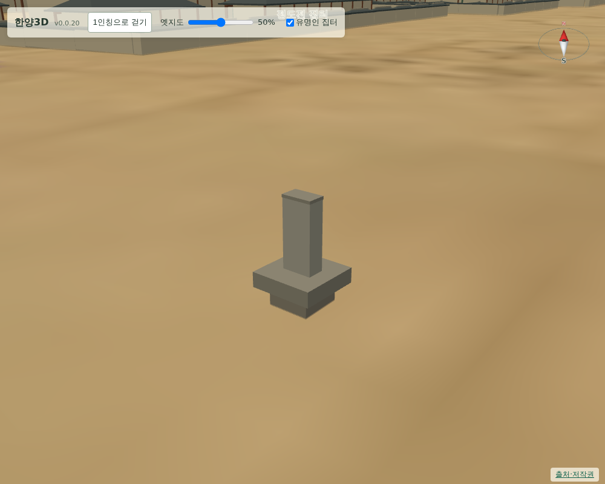

# 060 — 정도전·송시열 집터 표시와 설정 전환

사용자 요청으로 두 집터를 지도에 표석 모형으로 표시하고, 설정에서 껐다 켤 수 있게 했다.

## 위치를 정한 방법

정도전 집터는 사용자가 알려 준 what3words 주소 `///축구공.정성껏.연말`을 what3words 공개 주소 페이지에서 위경도로 변환했다. 결과는 `37.572539, 126.979405`이며 3 m 격자 기준이다. 종로구청 앞 정도전 집터 표석과는 약 100 m 차이가 있어, 판단 근거와 함께 `modern_position`에 기록했다.

송시열 집터는 what3words 주소가 없어 사용자 선택에 따라 지정 소재지 기준 개략 위치를 썼다. 국가유산포털의 지정 소재지는 종로구 명륜1가 2-22, 2-23, 5-99이며, OpenStreetMap의 `place=quarter` 명륜1가 좌표 `37.58861, 126.99689`을 개략 지점으로 삼았다. 증주벽립 각자 바위의 실측 위치가 아니고 수백 m 오차가 있을 수 있다는 점을 `precision_m`과 주석에 남겼다.

두 지점 모두 현대 좌표이며 도성대지도에 그려진 대상이 아니다. `temporal.depiction`을 `not_depicted_on_source_map`으로 두어 원도 판독 항목과 구분한다.

## 표시

`site_marker.js`의 `createSiteMarker`는 기단·비신·각자면·갓석 4개 부품의 표석 모형을 만든다. 건물 상자를 숨기고 그 자리에 놓으며, 이름표는 기존 건물 이름과 같은 방식으로 뜬다. 새 분류 `집터`를 색 표에 추가했다.

집은 남아 있지 않으므로 건물이 아니라 표석으로 표현했다. 집터의 실제 범위를 나타내지 않는다.

## 설정 전환

지도 설정에 `유명인 집터` 체크박스를 추가했다. 끄면 표석과 이름표가 함께 사라지고 다른 건물 표시는 그대로다. 이름표는 이제 해당 건물이 보일 때만 표시한다.

## 검증

- `scripts/terrain/check_site_markers_browser.py`를 추가했다. 두 집터의 이름·좌표·부품 수·접지 여부와 `modern_position` 기록을 확인하고, 설정을 껐을 때 표석과 이름표만 사라지는지 본다.
- Django 11개 테스트 통과. `/credits/`에 두 지점의 출처와 한계를 적었다.

## 배포

- v0.0.21로 배포했다. Docker Hub digest: `sha256:e98c7964b8d64ec75cb7e28e3605727ef19dfb5a6a2a11a5b26c36659ee80d7a`.
- 공개 healthz 정상: v0.0.21, resources 59. 새 `site_marker.js`도 공개 자원 목록에 포함했다.
- 운영 화면에서 집터 검사와 `deploy/check_public_browser.py`가 통과했다.
