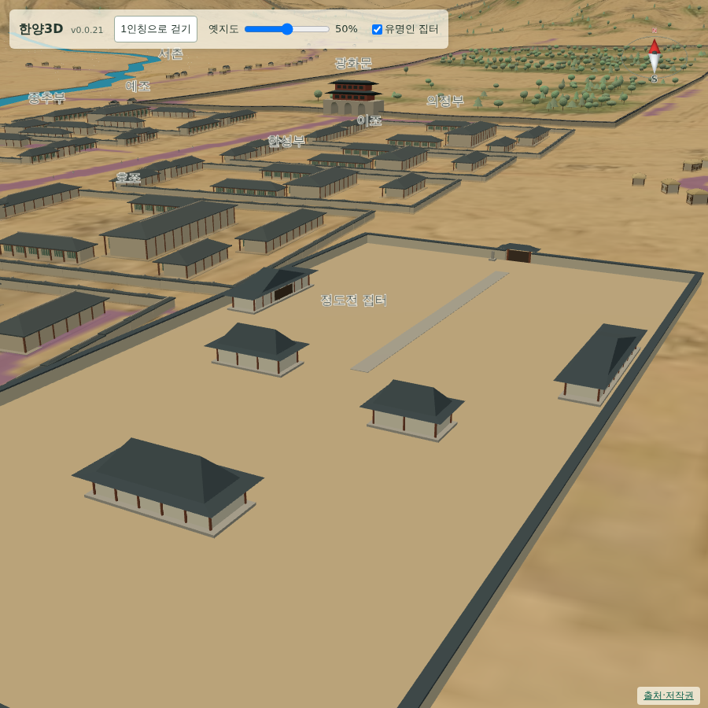
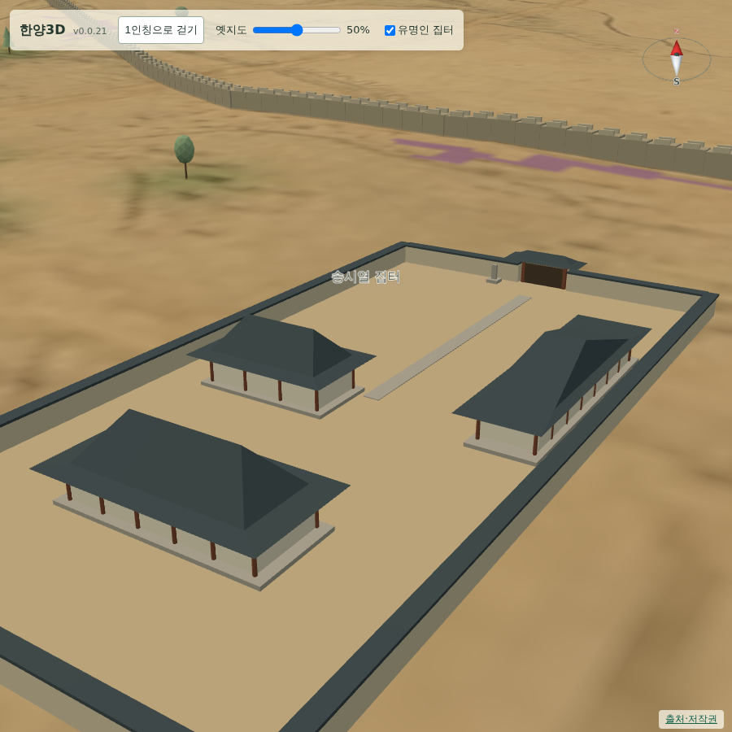

# 060 — 정도전·송시열 집터 표시와 설정 전환

사용자 요청으로 두 집터를 지도에 표석 모형으로 표시하고, 설정에서 껐다 켤 수 있게 했다.

## 위치를 정한 방법

정도전 집터는 사용자가 알려 준 what3words 주소 `///축구공.정성껏.연말`을 what3words 공개 주소 페이지에서 위경도로 변환했다. 결과는 `37.572539, 126.979405`이며 3 m 격자 기준이다. 종로구청 앞 정도전 집터 표석과는 약 100 m 차이가 있어, 판단 근거와 함께 `modern_position`에 기록했다.

송시열 집터는 what3words 주소가 없어 사용자 선택에 따라 지정 소재지 기준 개략 위치를 썼다. 국가유산포털의 지정 소재지는 종로구 명륜1가 2-22, 2-23, 5-99이며, OpenStreetMap의 `place=quarter` 명륜1가 좌표 `37.58861, 126.99689`을 개략 지점으로 삼았다. 증주벽립 각자 바위의 실측 위치가 아니고 수백 m 오차가 있을 수 있다는 점을 `precision_m`과 주석에 남겼다.

이 위경도를 그대로 쓰면 원도 화면에서 성곽 밖으로 나간다. 사용자 지시에 따라 성균관 표시 위치 `(2010, 770)`에서 북동쪽으로 선을 그어 성곽과 만나는 `(2111, 678)`까지의 절반인 `(2060, 724)`를 화면 배치 좌표로 삼았다. 현대 위경도는 참고값으로 남겼다.

두 지점 모두 현대 좌표이며 도성대지도에 그려진 대상이 아니다. `temporal.depiction`을 `not_depicted_on_source_map`으로 두어 원도 판독 항목과 구분한다.

## 표시

처음에는 표석 하나만 세웠으나, 조선시대에는 집이 있었으니 담장과 기와집을 그려 달라는 요청에 따라 집 모형으로 바꿨다. `house_site.js`의 `createHouseSite`는 직사각형 담장과 마당, 솟을대문, 안채·사랑채·별당·행랑채, 문 옆 표석을 만든다. 재질별 7개 메시로 합쳐 넓은 담장 안에서도 부담이 적다.

정도전 집 크기는 요청대로 이웃한 관청에서 따왔다. 호조 107 m와 훈국신영 75 m의 남북 범위를 더한 181 m를 남북 길이로, 그 절반인 90 m를 동서 폭으로 잡았다. 송시열 집은 그 절반 규모로 두었다. 두 값 모두 가정이며 실제 가옥 범위가 아니라는 점을 `size_status`와 `size_note`에 적었다.

## 설정 전환

지도 설정에 `유명인 집터` 체크박스를 추가했다. 끄면 표석과 이름표가 함께 사라지고 다른 건물 표시는 그대로다. 이름표는 이제 해당 건물이 보일 때만 표시한다.

## 검증

- `scripts/terrain/check_site_markers_browser.py`를 추가했다. 두 집의 이름·좌표·부품 수·접지 여부와 `modern_position` 기록을 확인하고, 설정을 껐을 때 집과 이름표만 사라지는지 본다.
- 같은 검사에서 정도전 집의 남북 길이가 호조와 훈국신영의 남북 범위 합과 3 m 안에서 맞는지, 동서 폭이 그 절반인지 본다. 송시열 집이 성균관 북동쪽이며 성곽 안인지도 확인한다.
- Django 11개 테스트 통과. `/credits/`에 두 지점의 출처와 한계를 적었다.

## 배포

- 표석 단계는 v0.0.21로, 담장·기와집 모형과 송시열 집 위치 보정은 v0.0.22로 배포했다.
- v0.0.22 digest: `sha256:8bd5b10105cb97280df87d9b50b9a10d4d802844c0910591eafa38571d06a7cd`.
- 공개 healthz 정상: v0.0.22, resources 59. 새 `house_site.js`도 공개 자원 목록에 포함했다.
- 운영 화면에서 집터 검사와 `deploy/check_public_browser.py`가 통과했다.
