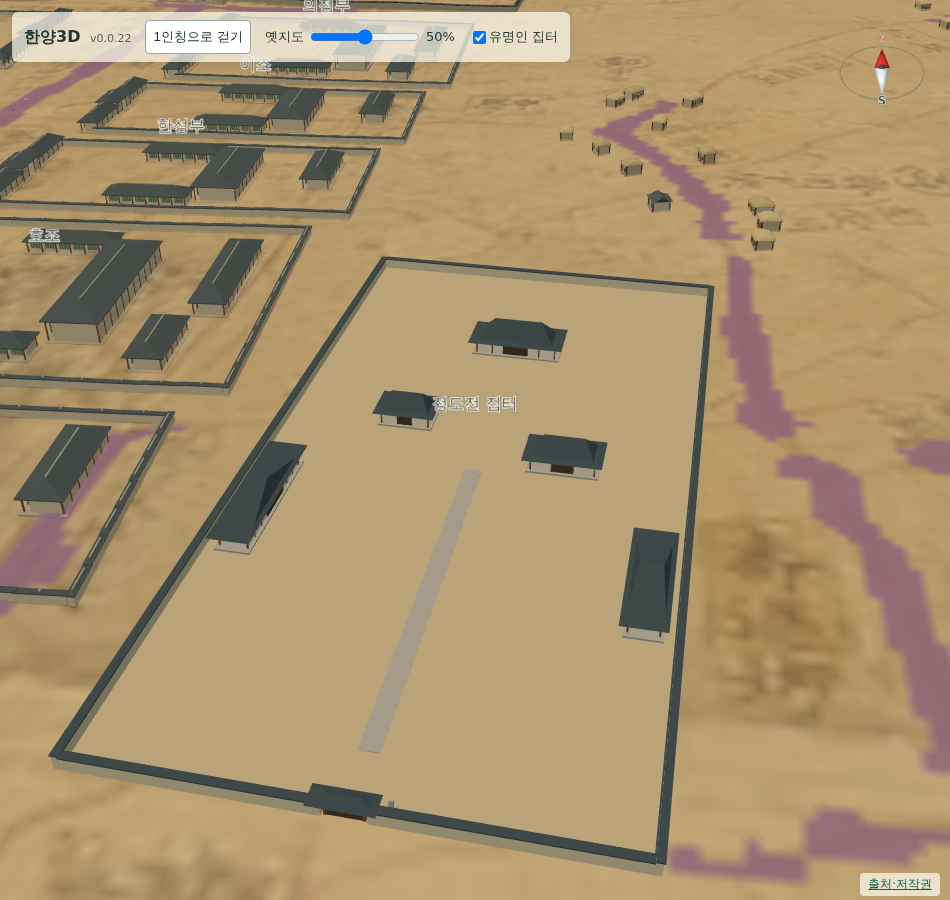

# 061 — 집터 모형의 남향 배치와 정도전 집 위치 보정

060에서 세운 두 집 모형이 북향으로 서 있고 대문도 북쪽에 있었다. 사용자 지적에 따라 남향으로 돌리고, 정도전 집을 육조거리 담장에서 띄웠다.

## 남향

모형은 대문과 마당이 로컬 +z 쪽에 있고 화면에서 +z는 남쪽이다. 그런데 두 집터 항목의 `display_yaw_deg`가 표석 단계에서 넣은 180으로 남아 있어 모형 전체가 반 바퀴 돌아 있었다. 두 항목을 0으로 고쳐 대문이 남쪽, 안채·사랑채·별당이 마당을 보고 남향으로 선다.

검사에 방향 확인을 넣었다. 모형 로컬 앞면을 세계 좌표로 옮겨 대문 쪽이 중심보다 남쪽인지, 뒤쪽이 북쪽인지 본다.

## 정도전 집 위치

집 모형이 육조거리 관청 담장에 거의 붙어 보여, 요청대로 북동쪽으로 20 m 옮겼다. what3words 지점의 위경도는 그대로 두고, 그 지점에서 북동쪽 20 m인 원도 좌표 `(1265, 1330)`을 `source_position`으로 기록해 화면 배치에만 쓴다. 정수 픽셀 반올림 때문에 실제 이동량은 19.3 m다.

검사에서 `source_position`이 what3words 지점의 북동쪽 18~22 m 안에 있는지 확인한다. 호조·훈국신영 중심과의 거리는 각각 138 m, 128 m다.

## 검증

- `scripts/terrain/check_site_markers_browser.py`: 남향 배치, 북동 20 m 이동, 기존 크기 규칙과 성곽 안 배치, 설정 전환을 모두 확인한다.
- Django 11개 테스트 통과.

## 배포

- v0.0.23으로 배포했다. Docker Hub digest: `sha256:f37e5045007b107e0f28deb7420419b7e4d63bf07854bf2ef56ee56b75b5a266`.
- 공개 healthz 정상: v0.0.23, resources 59. 운영 화면에서 집터 검사와 `deploy/check_public_browser.py`가 통과했다.
