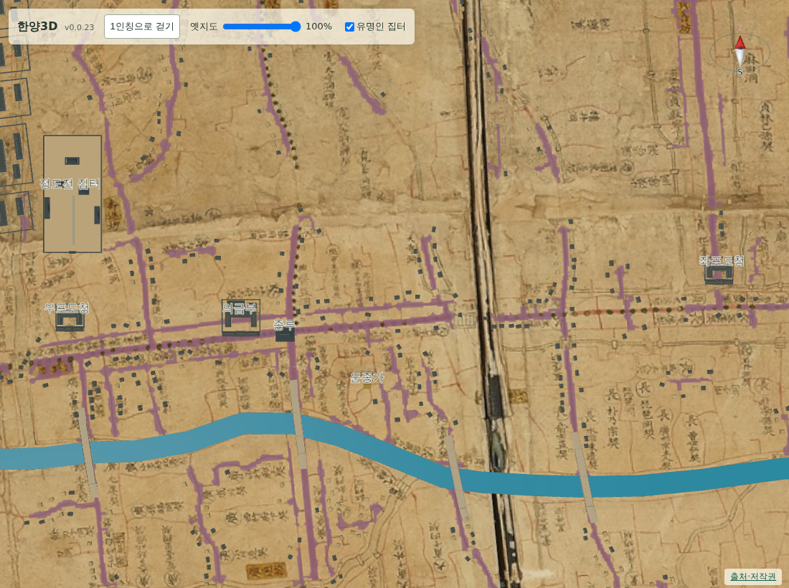
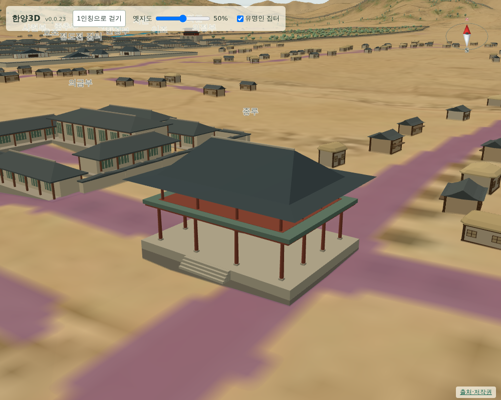
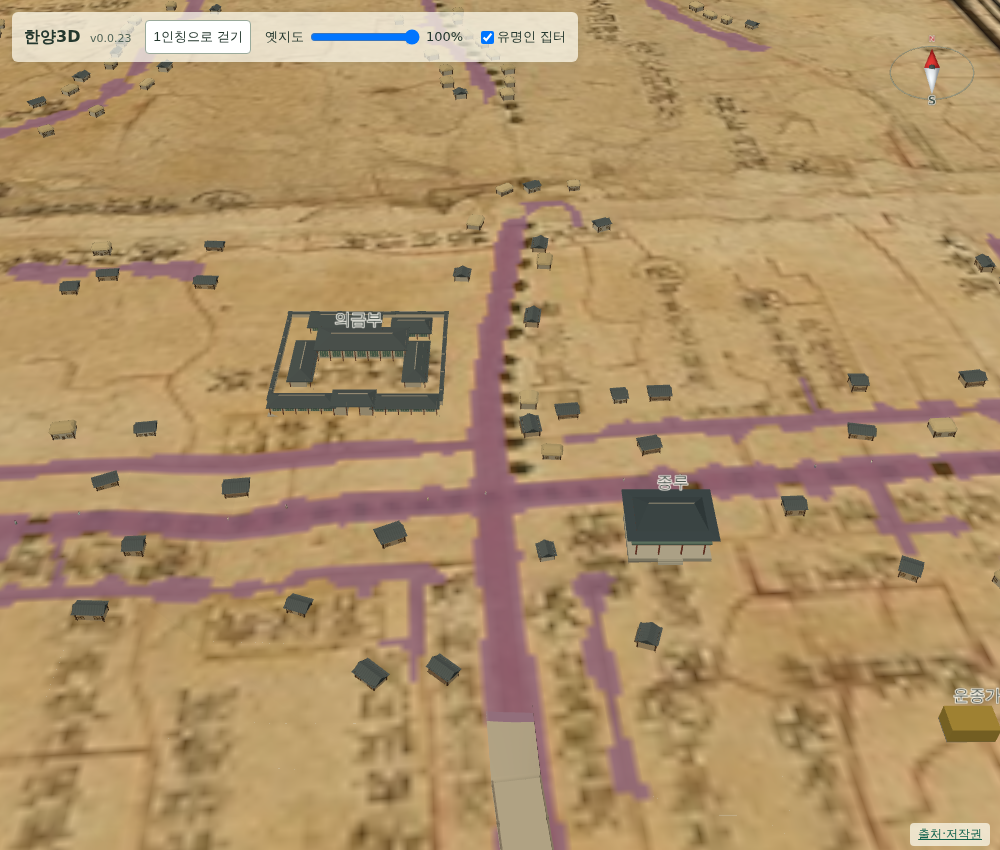

# 062 — 18세기 한양의 주요 건물 조사와 여섯 곳 추가

지도에 빠진 18세기 한양의 주요 건물을 일반 검색으로 조사하고, 도성 안에 있고 기존 분류와 맞는 여섯 곳을 추가했다.

## 조사

검색으로 확인한 후보는 종루와 육의전, 왕실 사당인 경모궁·육상궁·선희궁, 도성 안 삼군영(훈련도감·어영청·금위영)과 훈련원, 사법·치안의 의금부·좌우 포도청·전옥서, 생활 관청인 혜민서·전의감·사역원·관상감, 창고인 선혜청, 도성 밖의 동관왕묘·남관왕묘·활인서다.

이 가운데 도성 안이고 위치가 비교적 분명한 종루, 의금부, 좌포도청, 우포도청, 훈련원, 경모궁을 먼저 넣었다. 나머지는 다음 작업으로 남긴다.

## 위치 판독

사용자가 알려 준 대로 서울역사박물관의 도성대지도 부분도를 함께 썼다. 저장소에 이미 있는 `asset-0002`(부분도 8)는 전체 원도보다 글씨가 훨씬 잘 보인다.

부분도와 전체 원도를 잇는 기준으로 부분도에 그려진 모전교와 광통교를 썼다. 두 다리의 전체 원도 좌표는 물길 판독 자료에 있어, 두 점으로 축척 0.215와 회전 −0.84°의 닮음 변환을 세웠다.

- 운종가 네거리 `(1417, 1442)`: 부분도에서 네거리 곁의 鍾樓 글씨를 확인하고, 전체 원도에서 같은 교차점을 읽어 두 값을 평균했다. 종루와 의금부 배치의 기준점이다.
- 의금부 글씨 `(1385, 1428)`: 부분도의 노란 칸에 든 義禁府 글씨 중심을 읽어 환산했다. 네거리에서 서쪽으로 약 67 m, 북쪽으로 25 m다.
- 좌포도청 `(1732, 1405)`, 우포도청 `(1259, 1416)`: 원도 길 판독 자료에서 각 지점의 운종가 폭을 찾아 그 북쪽 약 40 m에 두었다. 관청 기호나 글씨는 확인하지 못했다.
- 훈련원, 경모궁: 현대 위치를 그대로 환산해 배치했다. 각각 흥인지문 안쪽 동촌과 창경궁 동쪽 빈 구역에 놓인다.

모든 항목의 `modern_position`과 `source_position`에 판독 방식·근거·한계를 적었다. 경모궁은 1764년에 세워 1750년 무렵 원도의 표현 대상이 아니라는 점을 `temporal`에 남겼다.

## 표시

- 종루는 `bell_tower.js`의 새 모형이다. 기단·계단·개방된 아래층·종·난간·중층 지붕으로 구성하며 재질별로 합쳐 그린다.
- 의금부·좌포도청·우포도청·훈련원은 육조거리 관청과 같은 `yukjo_compound` 모형을 쓴다. 의금부와 훈련원은 넓은 마당 쪽이다.
- 경모궁은 궁궐 모형의 단층 전각 형태를 쓴다.
- 분류에 `시설`을 더해 종루의 색을 구분했다.

## 검증

- `scripts/terrain/check_new_landmarks_browser.py`를 추가했다. 여섯 곳의 이름·모형·이름표·접지와 현대 좌표 기록을 확인하고, 종루가 판독한 네거리 좌표에 있고 성곽 안인지, 의금부가 종루 북서쪽인지, 두 포도청이 종루 동서로 갈라져 있는지 본다.
- 기존 집터·궁궐 검사와 Django 11개 테스트도 통과한다.

## 도로를 피해 다시 배치

첫 배포(v0.0.24)에서 종루가 종로1가 사거리를 걸치고 의금부가 길을 덮었다. 글씨 위치를 그대로 쓴 탓이다. 사용자 지적에 따라 원도의 길 판독 자료를 기준으로 도로에 닿지 않는 가장 가까운 자리를 찾아 옮겼다.

- 종루 `(1444, 1451)`: 네거리 남동쪽 블록.
- 의금부 `(1400, 1408)`: 네거리 북서쪽, 피맛길 북쪽 블록.

두 자리는 모형 크기에 2 픽셀 여유를 더한 범위가 길 판독 마스크와 겹치지 않는지 확인해 골랐다. 현재 도로와 옛 길은 다르지만 화면에서는 원도의 길에 맞춘다.

## 한계

좌·우포도청은 원도에서 해당 기호를 찾지 못해 길 기준으로 놓은 표시 위치다. 훈련원과 경모궁은 현대 좌표 환산값이라 원도 그림과 수십 m 어긋날 수 있다. 부분도는 현재 저장소에 한 장만 있어, 다른 구역의 글씨를 읽으려면 나머지 부분도를 더 받아야 한다.
