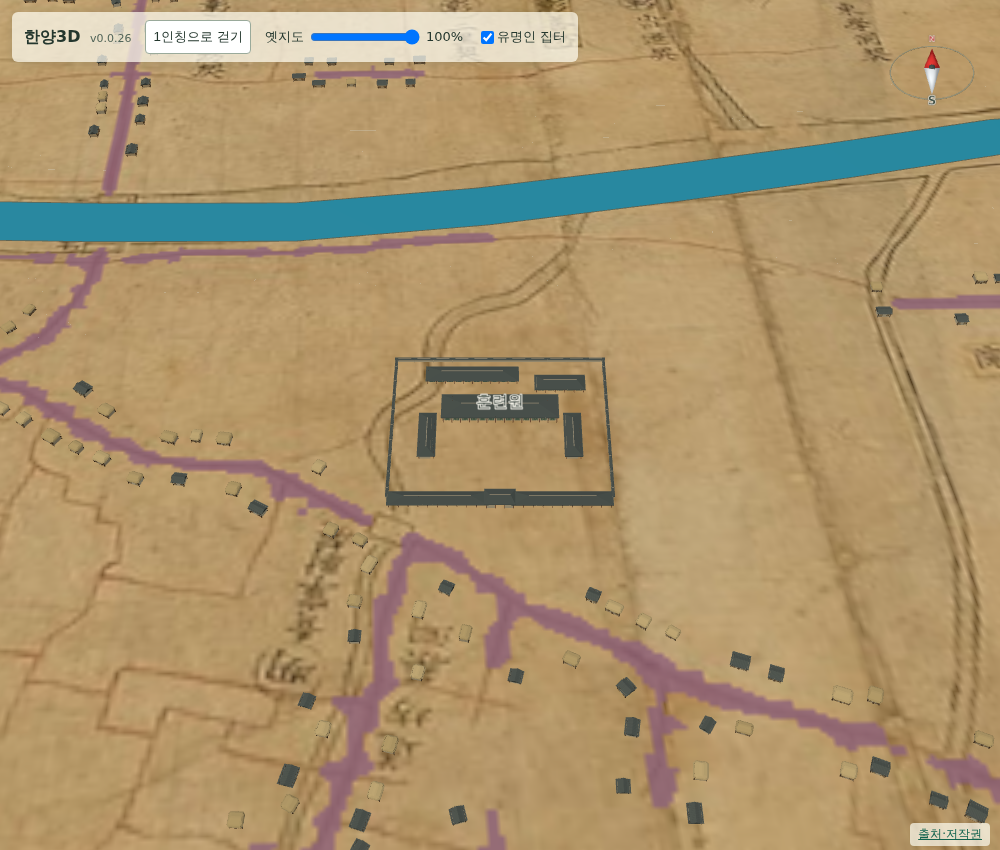

# 064 — 훈련원·좌포도청을 길 밖으로, 도로 겹침 검사 추가

화면의 길은 원도를 판독해 만든 것이라, 관청 모형이 그 위에 앉으면 원도와 어긋나 보인다. 사용자 지적에 따라 훈련원과 좌포도청을 길 밖으로 옮기고, 같은 문제를 자동으로 잡는 검사를 넣었다.

## 옮긴 자리

길 판독 마스크에서 모형 범위에 2 픽셀 여유를 더한 사각형이 도로에 닿지 않는 가장 가까운 자리를 골랐다.

- 훈련원 `(2266, 1652)` → `(2269, 1619)`: 현대 좌표 환산 지점이 길 위였다. 약 60 m 북쪽으로 옮겼다. 현대 좌표는 참고값으로 남기고 화면 배치는 원도 좌표를 쓴다.
- 좌포도청 `(1732, 1405)` → `(1714, 1405)`: 운종가 북쪽 골목에 걸쳐 있어 약 37 m 서쪽으로 옮겼다.

우포도청과 경모궁은 이미 도로에 닿지 않아 그대로 뒀다.

## 검사

`scripts/terrain/check_new_landmarks_browser.py`에 도로 겹침 검사를 추가했다. 길 판독 마스크 이미지를 캔버스로 읽어, 이번에 추가한 여섯 곳의 모형 범위 안에 도로 픽셀이 하나도 없는지 본다. 다섯 곳(경모궁은 원도 좌표가 없어 제외)이 모두 0이다.

## 남은 문제

정도전 집 모형은 범위 안에 도로 픽셀 5개가 들어온다. 이 모형은 what3words 지점에서 북동쪽 20 m라는 규칙으로 자리를 정해, 길을 피하려면 그 규칙을 바꿔야 한다. 별도로 판단할 일로 남긴다.
