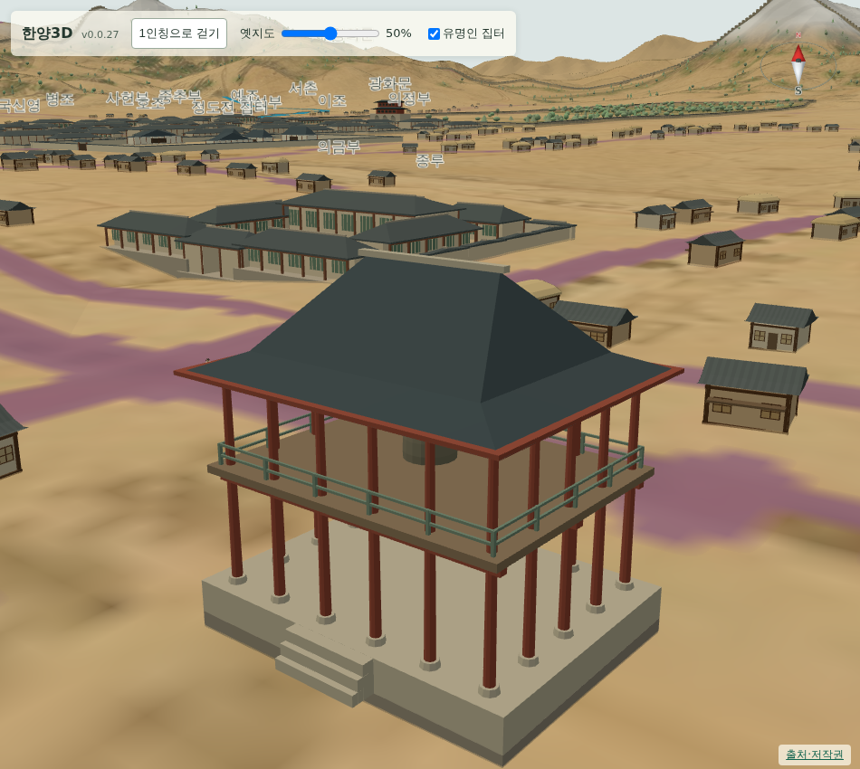
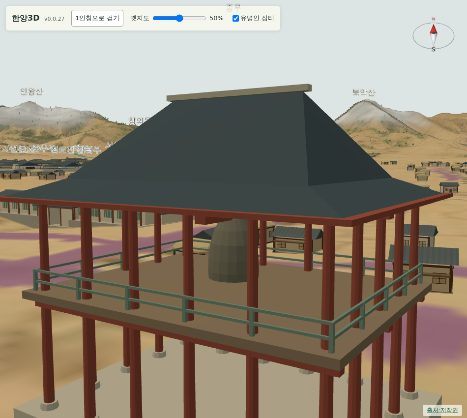

# 065 — 보신각을 조사해 다시 만든 종루

처음 만든 종루는 종이 아래층에 있고 원통을 반만 자른 모양이었다. 실제 형태를 조사해 다시 만들었다.

## 조사한 형태

- 보신각은 정면 5칸·측면 4칸의 중층 누각으로, 위층에 종을 걸고 아래층은 개방한다. 둥근 주춧돌 위에 원기둥을 세우고 지붕은 겹처마 팔작지붕이다. ([서울문화포털](https://culture.seoul.go.kr/culture/main/contents.do?menuNo=200147), [위키백과 보신각](https://ko.wikipedia.org/wiki/%EB%B3%B4%EC%8B%A0%EA%B0%81))
- 종은 1468년에 주조한 옛 보신각 동종으로, 높이 3.18 m·입지름 2.28 m·무게 19.66톤이다. 임진왜란 뒤 종루에 옮겨 걸었으므로 18세기에는 이 종이 걸려 있었다. ([국가유산포털](https://www.heritage.go.kr/heri/cul/culSelectDetail.do?ccbaCpno=1121100020000))

1979년 재건한 현재 건물은 철근 콘크리트 구조라 세부는 참고만 하고, 칸수·개방된 아래층·위층의 종·팔작지붕이라는 구성만 따랐다.

## 모형

`bell_tower.js`를 다시 썼다.

- 기단과 남쪽 계단, 둥근 주춧돌 위의 원기둥으로 아래층을 비웠다. 기둥은 정면 5칸·측면 4칸 간격의 둘레에 세운다.
- 위층은 마루와 계자난간을 두르고, 종을 대들보에 걸어 마루에서 0.45 m 띄웠다. 종은 회전체로 만들어 입에서 어깨로 좁아지는 범종 형태를 따르고, 꼭대기에 고리를 얹었다. 치수는 실제 종의 3.18 m·2.28 m다.
- 지붕은 처마를 네 방향으로 내리고 용마루 양 끝에 합각을 세워 팔작지붕을 나타냈다. 겹처마는 처마 밑 평고대 한 겹으로 대신했다.
- 표시 치수는 5칸·4칸에 맞춰 24×14×18 m에서 16×15×12 m로 줄였다.

## 검증

- `scripts/terrain/check_new_landmarks_browser.py`에 종루 검사를 더했다. 칸수 5×4, 종 높이 3.18 m·입지름 2.28 m, 기둥·주춧돌·난간·합각·종·고리 부품이 모두 있는지, 재질별 메시가 8개 이하인지 본다.
- Django 11개 테스트와 기존 검사가 통과한다.
