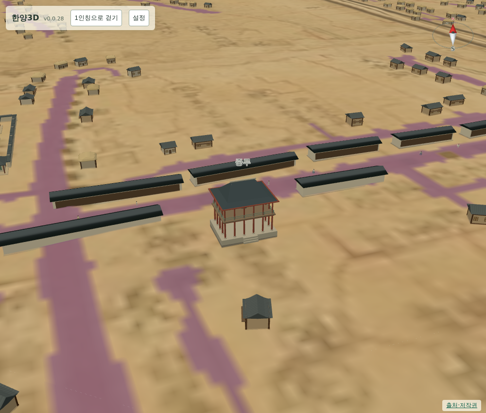
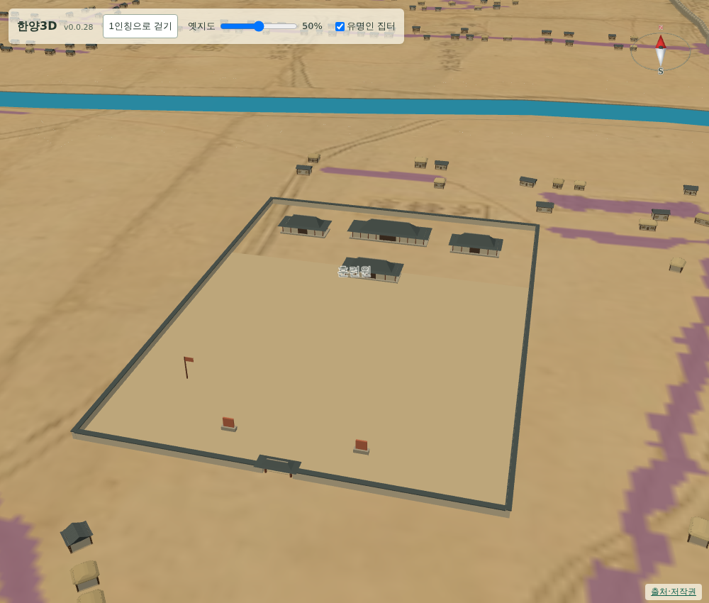
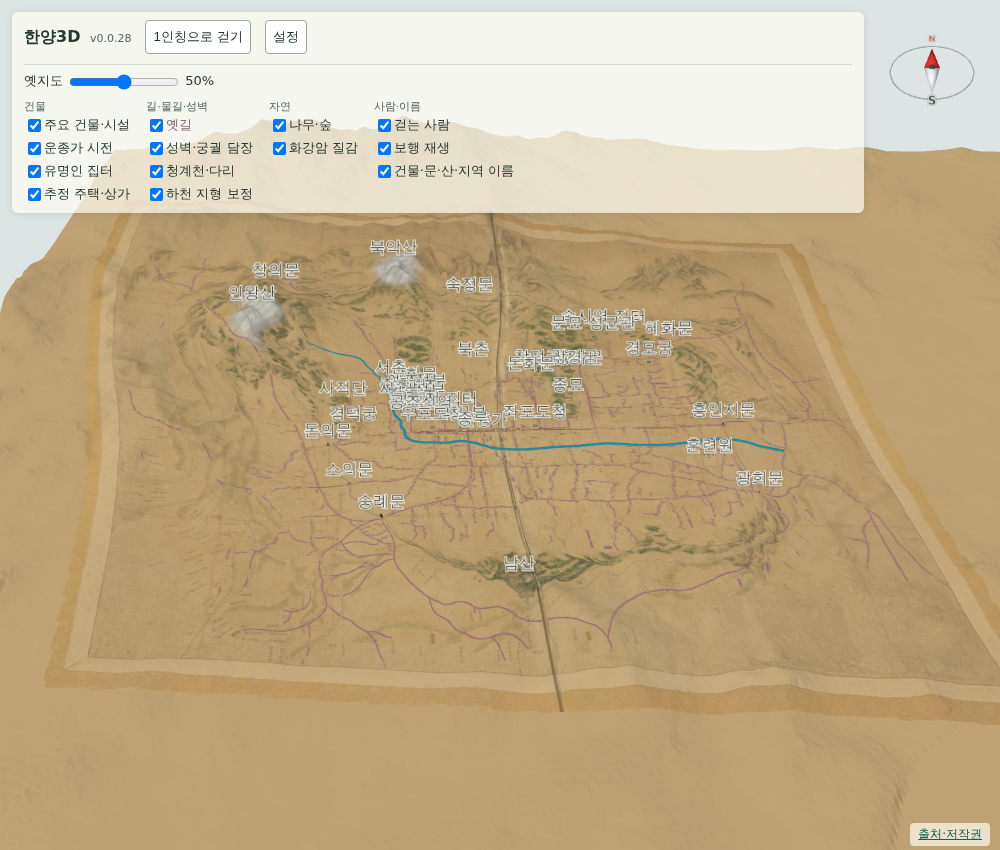

# 066 — 운종가 시전 행랑, 넓힌 훈련원, 설정 패널

## 운종가 시전

태종 12년 이후 세 차례 공사로 한양의 행랑 2,027칸을 지었고, 그 가운데 운종가–종묘 앞 누문 구간과 종루–광통교 구간을 시전 전용으로 썼다. 육의전 행랑은 100칸 안팎, 작은 시전도 20~30칸 규모로 전한다. ([우리역사넷 조선 전기 신도의 시전 상업](https://contents.history.go.kr/front/km/view.do?levelId=km_003_0040_0020_0010), [도가와 시전 행랑](https://contents.history.go.kr/mobile/km/view.do?levelId=km_003_0040_0040_0050_0010))

원도에는 행랑 한 채씩은 그려져 있지 않다. 그래서 판독한 길 선형과 폭만 원도에서 가져오고, 행랑 자체는 표시용 가정으로 세웠다.

- `scripts/terrain/build_sijeon.py`가 종로 보행 경로와 길 판독 마스크에서 운종가 중심선 35개 점과 각 지점의 길 반폭을 뽑아 `gis/buildings/doseong_sijeon.json`에 적는다. 구간은 육조거리 교차부에서 종묘 앞까지다.
- `sijeon.js`는 그 선을 따라 양쪽에 한 칸 2.7 m, 깊이 5.5 m, 높이 3.4 m의 행랑 블록을 늘어놓는다. 블록은 8~18칸이고 사이에 5~9 m 골목을 둔다. 이름이 붙은 건물과 겹치는 블록은 건너뛴다.
- 결과는 57블록 740칸이다. 기단·벽·지붕·전면 네 종류의 인스턴스 메시로 그려 높이 배율이 바뀌어도 다시 배치만 한다.
- 추정 주택·상가는 시전 블록 범위를 피하도록 `createSettlement`에 차단 목록을 넘긴다.

## 훈련원

원도에 訓鍊院 글씨가 `(2396, 1597)`에 있다. 이전 위치는 그보다 서쪽이어서 글씨 자리를 기준으로 옮겼다.

훈련원은 태조 원년 훈련관으로 두었다가 태종 때 이 자리로 옮기고, 청사 남쪽에 활쏘기와 무과 시험을 보던 사청을 지었다. ([서울시 내 손안에 서울](https://mediahub.seoul.go.kr/archives/180498)) 이에 맞춰 범위를 110×95 m에서 130×180 m로 넓히고, 북쪽에 청사·사청, 남쪽에 연병장을 둔 `training_ground` 모형을 새로 만들었다. 과녁 둘과 깃대도 세웠다. 표시 범위 중심은 `(2389, 1647)`이며 길 판독 마스크에서 도로에 닿지 않게 맞췄다.

## 설정 패널

지도 위 조작부에 있던 항목을 [설정] 버튼으로 펼치는 패널에 모았다. 조작부에는 제목과 설정 버튼만 남는다. 패널은 옛지도 슬라이더와 네 묶음의 표시 전환을 담는다.

- 건물: 주요 건물·시설, 운종가 시전, 유명인 집터, 추정 주택·상가
- 길·물길·성벽: 옛길, 성벽·궁궐 담장, 청계천·다리, 하천 지형 보정
- 자연: 나무·숲, 화강암 질감
- 사람·이름: 걷는 사람, 보행 재생, 건물·문·산·지역 이름

체크박스 묶음은 `terrain3d_layers.html` 한 곳에 두고, 전체 화면에서는 설정 패널에, 도구 화면에서는 기존 상단 도구줄에 넣는다. 아이디가 겹치지 않도록 둘 중 한 곳에만 렌더링한다.

## 검증

- `deploy/check_public_browser.py`가 설정 패널을 열고 닫으며 슬라이더와 네 묶음을 확인한다. 화면이 계속 그려지는 환경에서 Playwright의 요소 안정성 대기가 시간 초과하던 문제를 피하려고, 설정 버튼은 클릭 이벤트를 보내고 캔버스 크기는 페이지 안에서 읽는다.
- 집터·궁궐·새 관청·모바일 걷기 검사와 Django 11개 테스트가 통과한다.

## 배포

- v0.0.29로 배포했다. Docker Hub digest: `sha256:b8547e202c1d77229ea73f05e6e9125b1e63fd897273e59ce6d4075fb1505f63`.
- 공개 healthz 정상: v0.0.29, resources 63. 운영 화면에서 공개 브라우저 검사와 관청 검사가 통과했다.
- 서버 이미지는 v0.0.29와 직전 v0.0.28만 남겼다.
