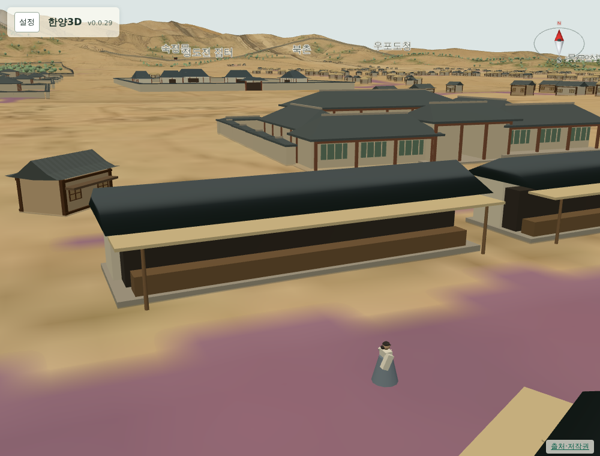
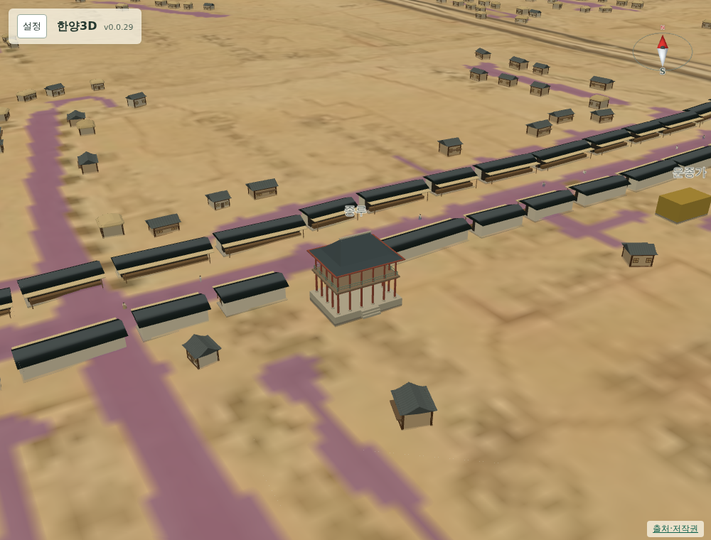

# 067 — 시전 구간 축소, 넓힌 대로, 열린 가게 앞

v0.0.29의 시전은 종묘 앞까지 이어지고, 길이 좁고, 가게가 모두 닫힌 모습이었다. 세 가지를 고쳤다.

## 구간

태종 12년 이후 혜정교에서 창덕궁 동구까지 행랑을 세웠다는 기록을 구간 근거로 삼아, 동쪽 끝을 원도 `x` 1860에서 1720으로 당겼다. 종묘 앞 누문 구간과 종루–광통교 남북 구간은 이번 판독 선형에 넣지 않는다. 시전 동쪽 끝은 종묘 모형에서 340 m 못 미친다.

## 대로 폭

원도에 그려진 길은 실제 대로보다 좁다. 판독 폭만 쓰면 행랑 사이가 10 m도 되지 않아 건물에 비해 길이 좁아 보였다. 중심선에서 최소 8.5 m를 띄우도록 `min_half_width_m`을 넣어, 마주 본 행랑 사이가 27 m 이상 벌어진다.

## 열린 가게

시전은 장사하는 곳이므로 닫힌 상자 대신 앞을 연 모습으로 바꿨다. 뒤쪽 절반만 벽을 세우고, 길 쪽에는 어두운 내부와 나무 좌판을 두고 그 위에 기둥 두 개로 받친 차양을 걸었다. 한 채를 8~18칸에서 4~9칸으로 끊고 골목 간격도 좁혀, 작은 시전 여럿이 늘어선 모습이 되게 했다. 96채 627칸이다.

## 검증

`scripts/terrain/check_new_landmarks_browser.py`에 시전 검사를 더했다. 채 수와 칸 수, 차양·좌판·내부·기둥 메시의 존재, 마주 본 행랑 사이가 17 m 이상인지, 동쪽 끝이 종묘에서 150 m 이상 떨어졌는지 본다. Django 11개 테스트와 기존 검사도 통과한다.
