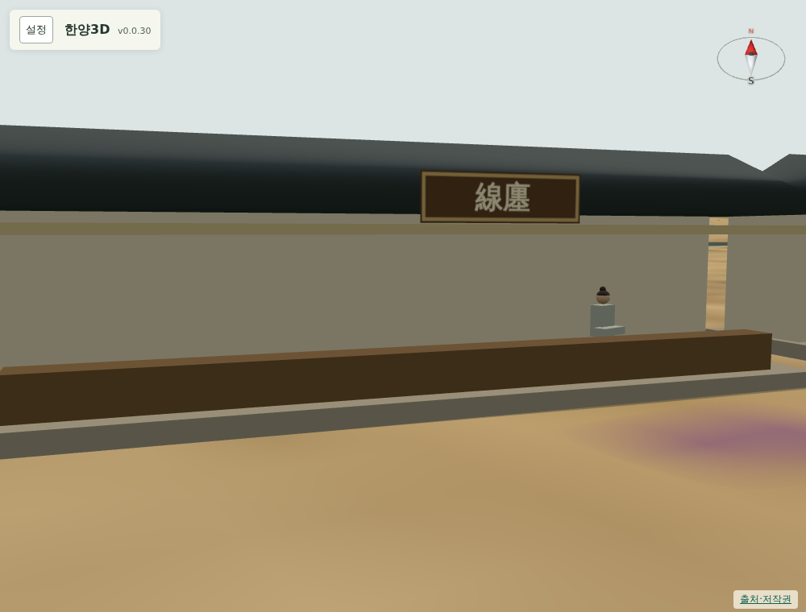
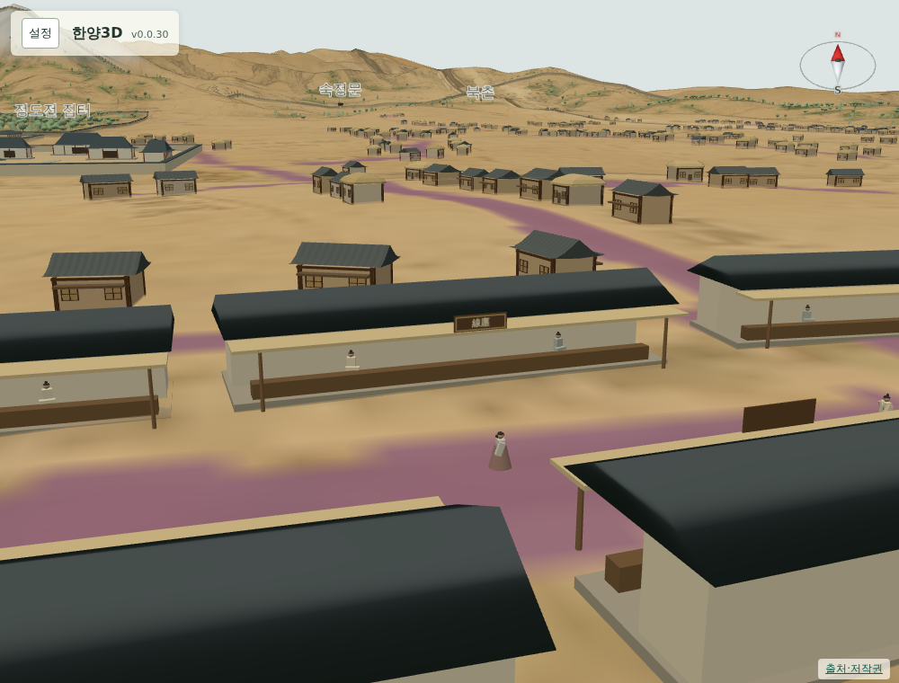

# 068 — 시전 가게 주인과 간판, 시전 종류 조사

좌판 뒤의 어두운 갈색 상자가 장롱처럼 보인다는 지적에 따라 없애고, 가게 주인과 간판을 넣었다.

## 시전의 종류

육의전은 국역 부담이 큰 시전을 여섯 주비로 묶은 것이라 시기마다 구성이 달랐다. 『동국문헌비고』, 『만기요람』, 『육전조례』의 목록이 조금씩 다르다. ([우리역사넷 육의전](https://contents.history.go.kr/front/km/view.do?levelId=km_003_0040_0030_0010), [한국민족문화대백과사전 시전](https://encykorea.aks.ac.kr/Article/E0032450))

| 시전 | 판 물건 | 위치 |
| --- | --- | --- |
| 선전(線廛, 입전) | 중국 비단 | 광통교 주변 |
| 면포전(綿布廛) | 무명, 은 | 광통교와 종루 주변 |
| 면주전(綿紬廛) | 국산 명주 | 종루 주변 |
| 지전(紙廛) | 종이 | 남대문로 1가 |
| 저포전(苧布廛) | 모시 | 종로 3가 근처 |
| 내어물전(內魚物廛) | 말린 어물 | 종루 주변 |
| 외어물전(外魚物廛) | 말리고 절인 어물 | 서소문 밖 |
| 포전(布廛) | 삼베 | 남대문로 1가 |
| 청포전(靑布廛) | 중국 면포, 모자 | 1794년 육의전에서 빠짐 |

## 간판

운종가 선상에 있는 다섯 시전만 간판에 썼다. 지전·포전은 남대문로, 외어물전은 서소문 밖이라 이번 구간에 없다.

`doseong_sijeon.json`의 `signs`에 종루로부터 운종가를 따라 잰 거리 구간을 적었다. 서쪽부터 선전, 면포전, 면주전, 내어물전, 저포전 순이다. 네 채마다 한 채꼴로 해당 구간 이름의 한자 간판을 차양 위에 단다. 24개다.

간판을 단 가게와 간판 모양은 표시용 가정이며, 문헌은 시전 이름과 대략의 위치만 따랐다. 글씨는 길 쪽에만 있고 뒤는 나무판이어서 반대편에서 글자가 뒤집혀 보이지 않는다.

## 가게 주인

어두운 내부 상자를 없앴다. 좌판은 높이 0.8 m, 폭 0.8 m로 낮추고, 그 바로 뒤에 주인을 세웠다. 4~5칸 가게는 한 명, 그보다 긴 가게는 두 명이며 몇 곳은 비워 둔다. 145명이다. 옷 색 네 가지와 고개 방향을 조금씩 달리했다.

## 검증

`scripts/terrain/check_new_landmarks_browser.py`에서 내부 상자가 없는지, 주인이 가게 수보다 많은지, 간판이 5개 이상이고 가게 수의 3분의 1 이하인지, 간판 이름이 운종가의 다섯 시전 안에 드는지 본다.

## 배포

- v0.0.31로 배포했다. Docker Hub digest: `sha256:9d99525715e074a5876d46e8fecd8f0c7224715195acfdb5daea3758cbaa8fa0`.
- 공개 healthz 정상: v0.0.31, resources 63. 운영 화면에서 가게 주인·간판 검사가 통과했다.
- 서버 이미지는 v0.0.31과 직전 v0.0.30만 남겼다.
