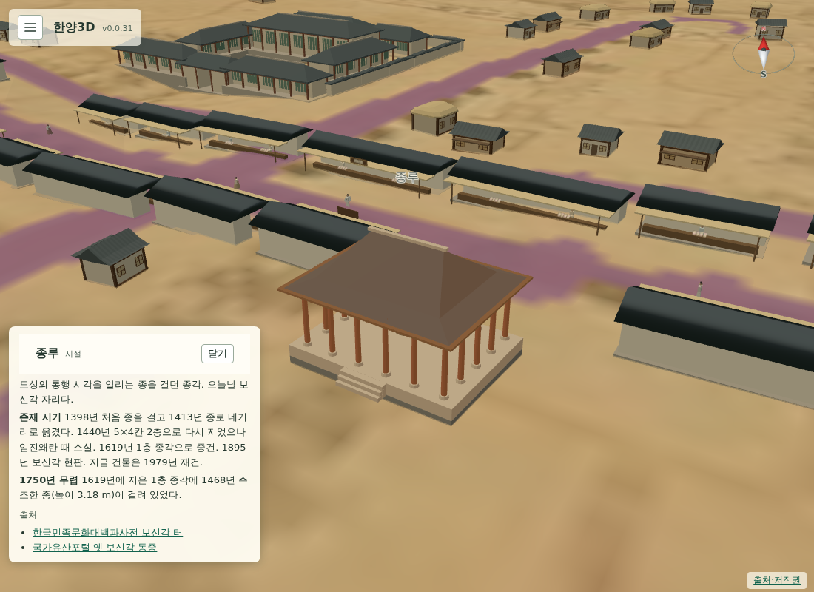

# 069 — v0.1.0: 건물 안내 문서·팝업, 걷기 충돌, 1층 종루, 시전 물건 그림

## 건물 안내 문서

`docs/landmarks.md`에 지도에 올린 건물·시설마다 간략한 소개, 존재 시기, 1750년 무렵의 상태, 출처를 정리했다. 연대는 출처에서 확인한 것만 적고 나머지는 미확인으로 뒀다. 끝에 1750년과 맞지 않는 표시를 표로 모았다.

조사하면서 종루가 1619년 광해군 때 **1층 종각**으로 중건됐다는 사실을 확인했다. 1440년의 5×4칸 2층 누각은 임진왜란 때 소실됐다. 사용자 결정에 따라 종루 모형을 1층으로 바꿨다.

## 건물 정보 팝업

같은 내용을 `1750_landmarks.json`의 각 항목 `info`(소개·존재 시기·1750년 무렵·출처)에 넣었다. 건물을 클릭하면 화면 왼쪽 아래에 카드가 뜨고, 닫기 버튼이나 빈 곳 클릭으로 닫힌다. 37개 항목 모두 `info`가 있다.

## 1층 종루

`bell_tower.js`를 1층 종각으로 다시 만들었다. 기단·둥근 주춧돌·원기둥 위에 팔작지붕을 얹고, 1468년 종을 가운데에 걸었다. 칸수는 기록이 남은 1440년의 5×4칸을 그대로 쓰고 높이를 15 m에서 11 m로 낮췄다. 1619년 건물의 실측 규모는 확인하지 못해 데이터에 적어 뒀다.

## 걷기 충돌

새 `collision.js`는 지면 위의 회전된 사각형을 격자에 담아 겹침을 판정한다. 막힌 방향으로 걸으면 축별로 미끄러진다.

- **내 캐릭터**: 주요 건물, 도성·경복궁 담장, 시전 행랑, 추정 주택·상가에 막힌다. 담장이 있는 집터·훈련원은 담장만 막고 남쪽 대문은 열어 둔다. 성문과 궁궐 문은 지나갈 수 있다. 꺼 둔 표시 층은 막지 않는다. 걷는 사람과도 부딪친다.
- **걷는 사람**: 가까운 다른 보행자와 내 캐릭터를 피해 길 폭 안에서 옆으로 비킨다. 비키는 양은 조금씩 커지고 줄어든다.

키 입력 처리에서 `event.target`이 요소가 아닐 때 오류가 나던 부분도 고쳤다.

## 시전 물건 그림

가게마다 좌판 위에 파는 물건을 그린 카드를 한두 장 기울여 올렸다. 3D 모형이 아니라 캔버스로 그린 그림이다. 선전은 색색 비단 필, 면포전은 무명 두루마리, 면주전은 옅은 명주 필, 내어물전은 멍석 위 북어, 저포전은 모시 필이다. 가게의 시전 종류는 간판과 같은 구간 규칙을 따른다.

## 그 밖

- 경복궁 담장 한가운데에 ‘경복궁’ 이름을 띄웠다. 건물·지역 이름 설정을 따른다.
- PC 화면의 설정 버튼도 햄버거 아이콘으로 바꿨다.

## 검증

- `scripts/terrain/check_walk_collision_browser.py`: 설정 버튼, 경복궁 이름, 종루 클릭 팝업의 소개·존재 시기·출처, 시전으로 걸어갈 때 앞면에서 멈추는지(중심선에서 3.55 m), 보행자가 내 캐릭터를 피해 1 m 넘게 비키는지, 45 cm 안으로 붙은 보행자 쌍이 없는지 확인한다.
- `scripts/terrain/check_new_landmarks_browser.py`: 종루가 1층이고 종이 홀 안에 있는지, 다섯 시전 모두 물건 그림이 있고 가게 수 이상인지 확인한다.
- Django 11개 테스트.
