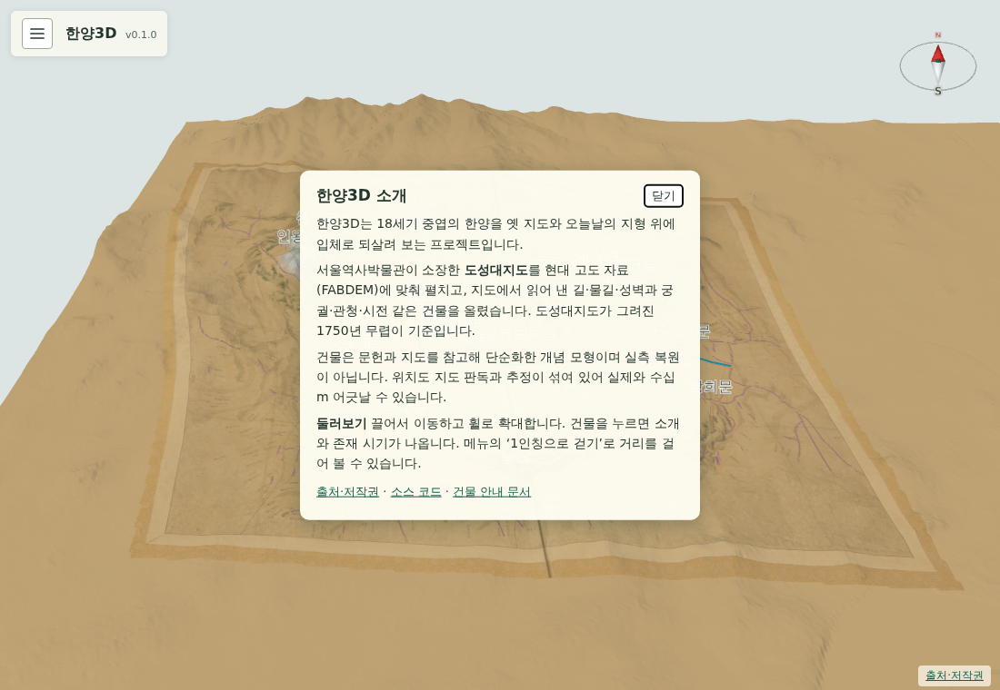

# 070 — 메뉴의 About 소개창

햄버거 메뉴 맨 아래에 링크 모양의 About 버튼을 추가했다. 누르면 메뉴가 닫히고 지도 가운데에 프로젝트 소개창이 뜬다.

## 내용

- 한양3D가 무엇인지: 18세기 중엽 한양을 옛 지도와 오늘날 지형 위에 입체로 되살려 보는 프로젝트.
- 바탕 자료: 서울역사박물관 소장 도성대지도를 FABDEM 고도 자료에 맞춰 펼치고, 판독한 길·물길·성벽과 건물을 올렸다. 기준 시점은 1750년 무렵.
- 한계: 건물은 단순화한 개념 모형이고 위치는 판독과 추정이 섞여 수십 m 어긋날 수 있다.
- 사용법: 끌어서 이동·휠이나 두 손가락으로 확대, 건물을 누르면 소개, 메뉴의 1인칭 걷기.
- 링크: 출처·저작권 페이지, GitHub 소스 코드, `docs/landmarks.md` 건물 안내 문서.

닫기 버튼이나 Esc로 닫는다. 도구 화면에서는 장면을 불러오는 동안 도구줄 버튼이 잠기는데, About 버튼은 그 동안에도 누를 수 있게 뺐다.

## 검증

`scripts/terrain/check_walk_collision_browser.py`에서 메뉴를 열고 About을 누르면 소개창이 뜨고 메뉴가 닫히는지, 닫기 버튼으로 닫히는지 확인한다. PC와 모바일 폭에서 화면을 확인했다.

