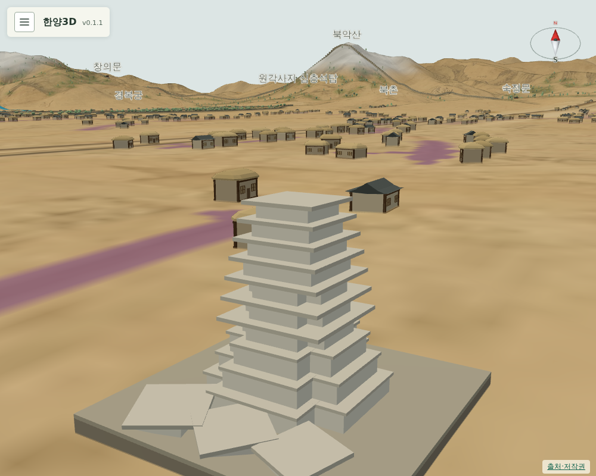
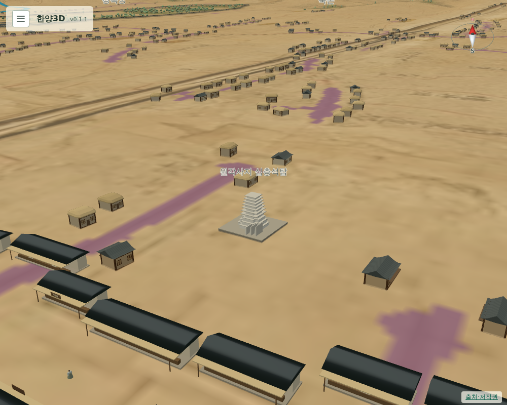

# 071 — 건물 추가 목록과 원각사지 십층석탑

## 추가 목록

`docs/landmark_backlog.md`를 만들어 1750년 무렵에 있었던 후보를 순서대로 적었다. 원각사지 십층석탑, 금위영, 어영청, 육상궁, 혜민서, 관상감·관천대, 동관왕묘 순이다. 한 번에 하나씩 원도에서 위치를 읽고 모형·팝업·검사를 갖춰 배포한다. 1750년 이후에 생긴 선희궁·규장각·장용영은 넣지 않는다.

## 원각사지 십층석탑

세조가 1465년 세운 원각사의 대리석 탑으로 1467년에 건립했다. 절은 1504년에 없어졌지만 탑이 남아 조선 후기에 백탑으로 불렸다. ([국가유산포털](https://www.heritage.go.kr/heri/cul/culSelectDetail.do?ccbaCpno=1111100020000), [우리역사넷](https://contents.history.go.kr/mobile/kc/view.do?levelId=kc_r300756&code=kc_age_30))

맨 위 3층은 임진왜란 무렵 떨어져 탑 옆에 놓여 있다가 1947년에 다시 올렸다. ([위키백과](https://ko.wikipedia.org/wiki/%EC%84%9C%EC%9A%B8_%EC%9B%90%EA%B0%81%EC%82%AC%EC%A7%80_%EC%8B%AD%EC%B8%B5%EC%84%9D%ED%83%91)) 그래서 1750년 무렵 모습대로 일곱 층만 세우고 세 층은 곁에 눕혔다.

### 위치

부분도 8과 전체 원도 모두 탑골 일대가 찢겨 탑 기호나 글씨가 없다. 현대 탑골공원 석탑 위치를 원도 좌표 `(1637, 1395)`로 환산해 배치했고, 길 판독 마스크와 겹치지 않는다.

### 모형

`pagoda.js`의 `createPagoda`는 亞자 평면의 3층 기단, 1~3층은 亞자·4층부터는 사각인 탑신과 층마다 옥개석을 쌓는다. 서 있는 높이는 약 9 m다. 떨어진 세 층은 탑 남쪽 바닥돌 위에 옥개석이 비스듬히 얹힌 채 한 줄로 누워 있다. 처음에는 옆으로 세워 두어 벽처럼 보였기에 눕혀 쌓은 모습으로 고쳤다. 조각은 표현하지 않았다. 새 분류 `탑`을 색 표에 넣었다.

## 좌포도청 위치 보정

찢긴 구역을 살피다 부분도 8에서 左捕廳 글씨를 찾았다. 환산값 `(1723, 1379)`는 기존 좌포도청 자리에서 약 50 m 떨어져 있어, 길 판독 마스크와 겹치지 않는 가장 가까운 `(1714, 1379)`로 옮겼다. 같은 조사에서 시전을 감독한 평시서(平市署) 글씨도 `(1593, 1419)`에서 찾아 추가 목록에 적었다.

## 검증

- `scripts/terrain/check_new_landmarks_browser.py`: 탑이 일곱 층 서 있고 세 층이 누워 있는지, 서 있는 높이가 7~12 m인지, 기단·탑신·옥개석·떨어진 층 부품이 있는지, 성곽 안이고 길에 닿지 않는지 확인한다. 좌포도청도 길에 닿지 않는다.
- Django 11개 테스트 통과.

## 배포

- v0.1.2로 배포했다. Docker Hub digest: `sha256:e51bb7f2bd56b8a107f90a32cbb7a2c00e9464141a6cf185856cbc4461101064`.
- 공개 healthz 정상: v0.1.2, resources 65. 운영 화면에서 탑(일곱 층 서 있음, 세 층 누움, 9.1 m)과 도로 겹침 0을 확인했다.
- 서버 이미지는 v0.1.2와 직전 v0.1.1만 남겼다.
