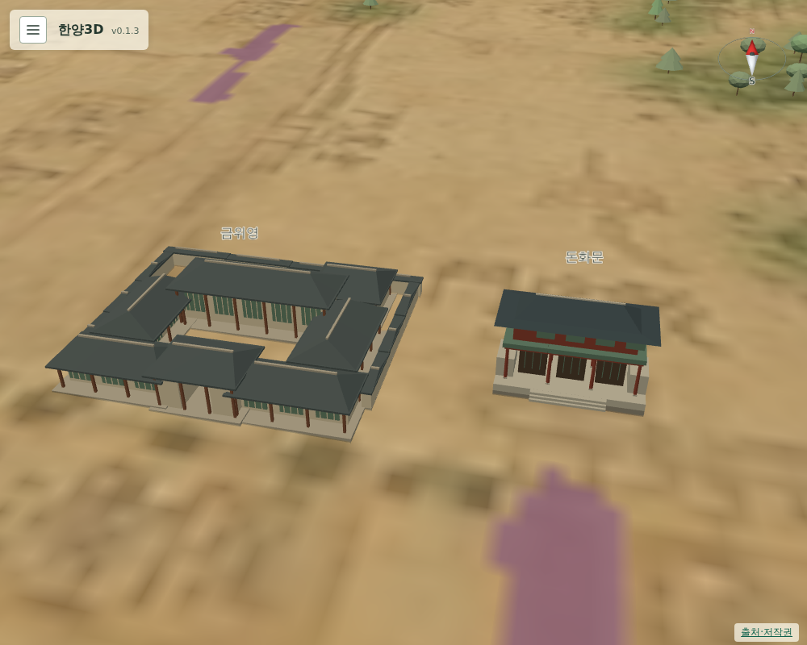

# 072 — 금위영

건물 추가 목록의 두 번째 항목이다.

## 조사

금위영은 1682년(숙종 8) 김석주의 건의로 병조의 정초군과 훈련도감의 훈련별대를 합쳐 만든 군영이다. 도성 방어와 창덕궁·창경궁 수비, 국왕 행차 호위를 맡았다. 1881년 장어영에 흡수되고 1895년 폐지됐다. ([한국민족문화대백과사전 금위영](https://encykorea.aks.ac.kr/Article/E0007930), [우리역사넷 금위영 1682~1895](https://contents.history.go.kr/mobile/kc/view.do?levelId=kc_o300110&code=kc_age_30))

본영은 중부 정선방, 지금의 운니동에 있었고 창덕궁 돈화문 서쪽 30여 m 지점으로 전한다. ([종로구 문화관광 금위영서영터](https://tour.jongno.go.kr/tour/tour/indvdlz/view.do?nttId=26815&viewType=BODY&dongCode=1111014900), [위키백과 금위영](https://ko.wikipedia.org/wiki/%EA%B8%88%EC%9C%84%EC%98%81))

## 위치

전체 원도에서 돈화문 서쪽에 노란 칸 글씨가 여럿 보이지만, 확대·선명화해도 글자를 읽을 수 없었다. 부분도 8은 이 구역까지 닿지 않는다.

그래서 원도에서 이미 판독한 돈화문 `(1717, 1064)`를 기준으로 문헌 설명대로 서쪽 30 m를 재고, 길 판독 마스크와 돈화문 모형에 닿지 않는 가장 가까운 자리 `(1697, 1064)`에 두었다. 기준점보다 12.5 m 더 서쪽이다.

## 모형

육조거리 관청과 같은 담장·문·마당·대청 모형을 40×36 m로 썼다. 군영의 실제 배치는 복원하지 않았다. 건물을 누르면 소개·존재 시기·출처가 나온다.

## 검증

`scripts/terrain/check_new_landmarks_browser.py`에서 금위영이 돈화문 서쪽 25~60 m, 남북으로 15 m 안에 있고 돈화문 모형과 닿지 않는지, 성곽 안이며 길과 겹치지 않는지 확인한다.

## 배포

- v0.1.3으로 배포했다. Docker Hub digest: `sha256:214387d337957086416f83e97645436a448e83c20f15d98a43c950545a7b2971`.
- 공개 healthz 정상: v0.1.3, resources 65. 운영 화면에서 금위영이 돈화문 서쪽 42 m, 돈화문과 13 m 떨어져 있고 길과 겹치지 않음을 확인했다.
- 서버 이미지는 v0.1.3과 직전 v0.1.2만 남겼다.
