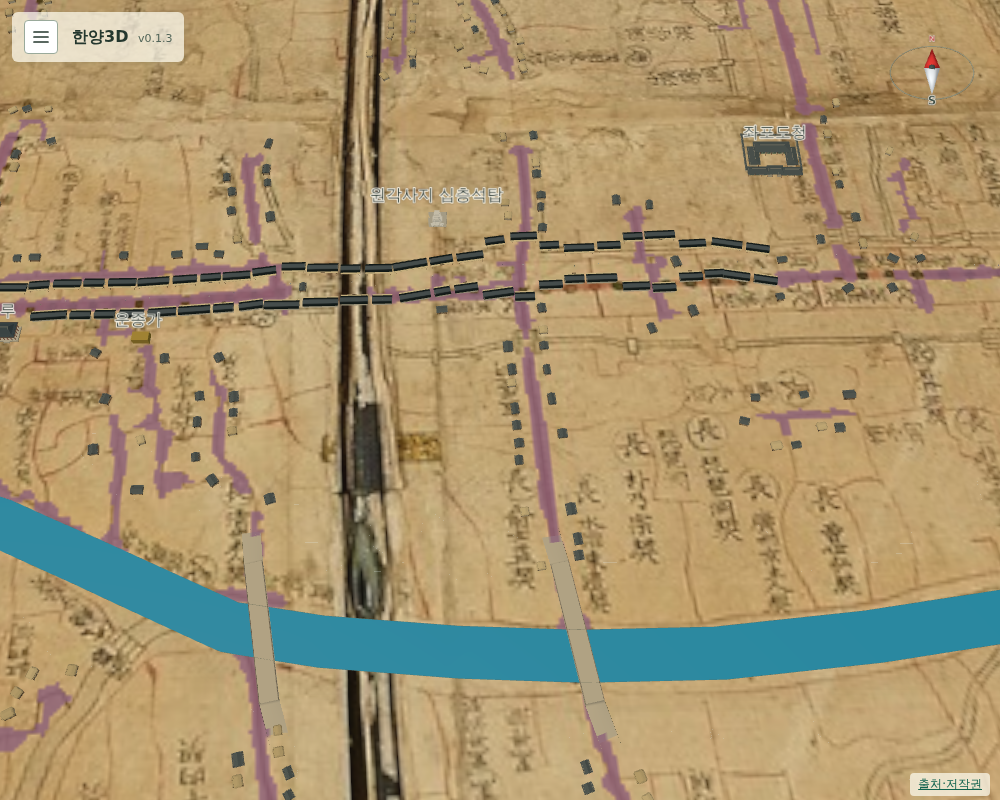

# 073 — 원각사지 십층석탑을 수표교 서쪽으로

사용자 지적: 원각사지는 수표교보다 서쪽에 있어야 한다.

## 원인

071에서 탑은 현대 탑골공원 위치를 원도 좌표로 환산해 `(1637, 1395)`에 두었다. 그런데 원도에서 판독한 수표교는 `(1625, 1565)`여서 탑이 수표교보다 동쪽에 놓였다. 실제로는 탑이 장통교와 수표교 사이, 수표교 서쪽에 있다.

두 다리의 현대 위치를 OSM에서 찾아 같은 방식으로 원도 좌표로 환산하고, 원도에서 판독한 다리 위치와 비교했다.

| 다리 | 현대 위치 환산 | 원도 판독 | 차이 |
| --- | --- | --- | --- |
| 장통교 | (1524, 1542) | (1523, 1554) | 서 2.6 m, 남 22.6 m |
| 수표교 | (1707, 1556) | (1625, 1565) | 서 171.2 m, 남 16.8 m |

원도의 수표교가 현대 환산값보다 171 m 서쪽에 그려져 있다. 이 구간의 원도 변형이 커서, 현대 위치를 그대로 옮기면 다리와 탑의 순서가 뒤바뀐다.

광통교는 복원 때 원래 자리보다 상류로 옮겨 세워, OSM의 광통교 위치를 보정 기준으로 쓰지 않았다.

## 보정

탑은 현대 경도로 장통교에서 수표교 쪽으로 0.56 지점에 있다. 두 다리의 차이를 그 비율로 보간해 탑의 환산값에 더한 `(1591, 1406)`에 옮겼다. 원도의 수표교보다 약 71 m 서쪽, 장통교보다 동쪽이며, 운종가 중심선 북쪽이고 길 판독 마스크와 겹치지 않는다.

## 출처

- 다리 현대 위치: OpenStreetMap 장통교 `37.5683785, 126.9856799`, 수표교 `37.5681965, 126.9901521`
- 수표교 원래 자리: 종로구 관수동 20번지와 중구 수표동 40번지 사이 ([국가유산포털 수표교](https://www.heritage.go.kr/heri/cul/culSelectDetail.do?ccbaCpno=2111100180000&pageNo=1_1_2_0), [위키백과 수표교](https://ko.wikipedia.org/wiki/%EC%88%98%ED%91%9C%EA%B5%90))

## 검증

`scripts/terrain/check_new_landmarks_browser.py`에서 탑이 원도의 수표교보다 20 m 넘게 서쪽, 장통교보다 20 m 넘게 동쪽, 수표교보다 100 m 넘게 북쪽에 있는지 확인한다.

## 배포

- v0.1.4로 배포했다. Docker Hub digest: `sha256:2fb3d4e1f58b8086bed06dea825934b62ae6641a18faefe15958381bbb67c4f1`.
- 공개 healthz 정상: v0.1.4, resources 65. 운영 화면에서 탑이 수표교보다 95 m 서쪽, 장통교보다 101 m 동쪽에 있고 길과 겹치지 않음을 확인했다.
- 서버 이미지는 v0.1.4와 직전 v0.1.3만 남겼다.
