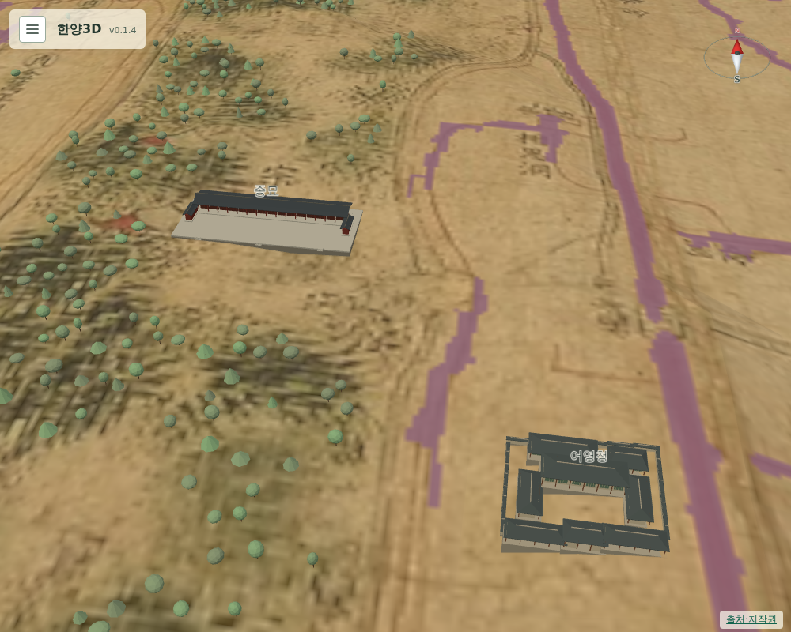

# 074 — 어영청

건물 추가 목록의 세 번째 항목이다.

## 조사

어영청은 1623년(인조 1) 국왕 친위대로 신설되어 1652년(효종 3) 북벌을 위해 크게 개편됐다. 1881년 총융청·금위영과 합쳐 장어영이 되고 1884년 총어영으로 바뀌었다가 1894년 폐지됐다. 본영은 종묘 정문 동쪽 연화방에 505칸 규모로 있었다. ([위키백과 어영청](https://ko.wikipedia.org/wiki/%EC%96%B4%EC%98%81%EC%B2%AD), [우리역사넷 어영청](https://contents.history.go.kr/mobile/nh/view.do?levelId=nh_030_0040_0050_0010_0020), [우리역사넷 오군영 1593~1884](https://contents.history.go.kr/mobile/kc/view.do?levelId=kc_o300820&code=kc_age_30)) 어영청 터 표석은 종로구 인의동에 있다.

## 위치

부분도 8은 이 구역까지 닿지 않는다. 전체 원도에는 종묘 담장 동쪽 남북 대로 곁에 세로 글씨가 몇 개 있지만, 12배로 확대해도 御營廳으로 읽어 내지 못했다. 원도에서 蓮花坊 노란 칸은 `(2072, 1298)`, 종묘 남문은 `(1850, 1343)`에서 찾았다.

그래서 현대 위치를 원도의 종묘 남문에 맞춰 보정했다.

| 지점 | 현대 위치 환산 | 원도 |
| --- | --- | --- |
| 종묘 정문 | (1898, 1388) | 남문 기호 (1850, 1343) |
| 인의동(OSM 동 좌표) | (2000, 1338) | 보정 (1952, 1293) |

보정 지점이 원도의 남북 대로 위여서, 길 판독 마스크와 겹치지 않는 가장 가까운 `(1939, 1293)`에 두었다. 종묘 담장과 대로 사이이며 종묘 남문에서 동쪽으로 약 185 m다. 동 좌표를 쓴 만큼 오차가 크다.

## 모형

관청 담장·대청 모형을 505칸 규모에 맞춰 56×48 m로 썼다. 건물을 누르면 소개·존재 시기·출처가 나온다.

## 검증

`scripts/terrain/check_new_landmarks_browser.py`에서 어영청이 종묘보다 동쪽이고 종묘 모형과 닿지 않는지, 성곽 안이며 길과 겹치지 않는지 확인한다.

## 배포

- v0.1.5로 배포했다. Docker Hub digest: `sha256:e18803d6538db066db8819a08a2c5b0e02b826dcf3c7186f75cfb421c6f88e6b`.
- 공개 healthz 정상: v0.1.5, resources 65. 운영 화면에서 어영청이 종묘보다 159 m 동쪽이고 종묘 모형과 84 m 떨어져 있으며 길과 겹치지 않음을 확인했다.
- 서버 이미지는 v0.1.5와 직전 v0.1.4만 남겼다.
