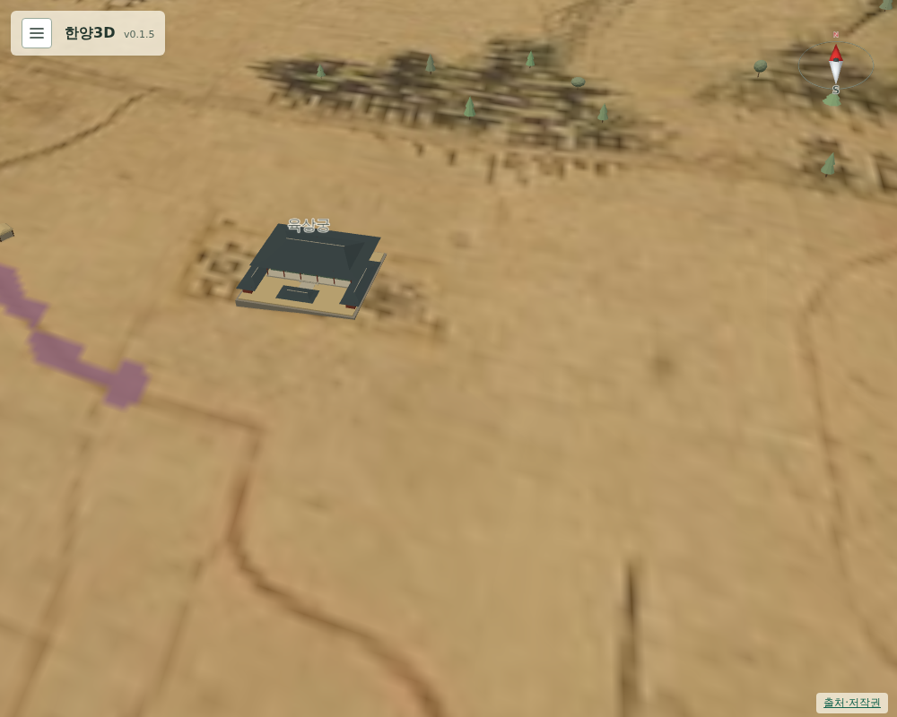

# 075 — 육상궁과 도성대지도 제작 시기

건물 추가 목록의 네 번째 항목이다.

## 조사

육상궁은 영조의 생모 숙빈 최씨의 사당이다. 1725년(영조 1) 숙빈묘로 세우고 1744년 육상묘, 1753년 육상궁으로 올렸다. 1882년 불타 1883년 중건했고, 고종·순종 때 다른 후궁 사당들이 옮겨 와 1929년 덕안궁까지 들어오며 칠궁이 됐다. ([궁능유적본부 칠궁 소개·역사](https://royal.khs.go.kr/ROYAL/contents/R107010000.do), [우리역사넷 육상궁 1725](https://contents.history.go.kr/mobile/kc/view.do?levelId=kc_r300763&code=kc_age_30))

## 원도에서 찾은 글씨

경복궁 담장 서북쪽에서 노란 테 가로 글씨 毓祥宮을 찾았다. 중심은 `(1023, 757)`이다. 칠궁의 현대 위치(OSM `37.5853169, 126.9738851`)를 원도로 옮기면 `(1071, 769)`로 글씨보다 약 100 m 동쪽이라, 화면 배치는 원도 글씨를 따랐다. 이 자리는 길 판독 마스크와 겹치지 않고 경복궁 담장에서 175 m 떨어져 있다.

## 지도 제작 시기

1750년에는 이 사당이 아직 육상묘였다. 그런데 원도에는 1753년 이후 이름인 毓祥宮이 적혀 있다. 한양도성박물관은 이를 근거로 도성대지도를 1753년 이후, 그리고 1760년의 변화가 보이지 않는다는 점에서 1760년 이전인 1753–1760년 제작으로 본다. ([한양도성박물관 도성대지도](https://museum.seoul.go.kr/scwm/relic/RelicView.do?mcsjgbnc=PS01003026001&mcseqno1=014165&mcseqno2=00000&cdLanguage=KOR))

그래서 이름은 원도대로 육상궁으로 표시하고, `temporal.depiction.start_year`를 1753으로 두었다. `docs/landmarks.md`의 읽는 법에도 이 제작 시기 추정을 적었다. 프로젝트 전체의 기준 표기 ‘1750년 무렵’은 바꾸지 않았다.

## 모형

경모궁과 같은 단층 사당 모형(정당과 앞뜰)을 44×40 m로 썼다. 건물을 누르면 소개·존재 시기·출처가 나온다.

## 검증

`scripts/terrain/check_new_landmarks_browser.py`에서 육상궁이 원도 글씨 좌표에 있고, 표시 시작 연도가 1753이며, 성곽 안이고 길과 겹치지 않는지 확인한다.

## 배포

- v0.1.6으로 배포했다. Docker Hub digest: `sha256:347d991f5116ce9ed354cd818ffd8141315cd1aea099f979a6d432d6a6e18eee`.
- 공개 healthz 정상: v0.1.6, resources 65. 운영 화면에서 육상궁이 원도 글씨 좌표에 있고 길과 겹치지 않음을 확인했다.
- 서버 이미지는 v0.1.6과 직전 v0.1.5만 남겼다.
