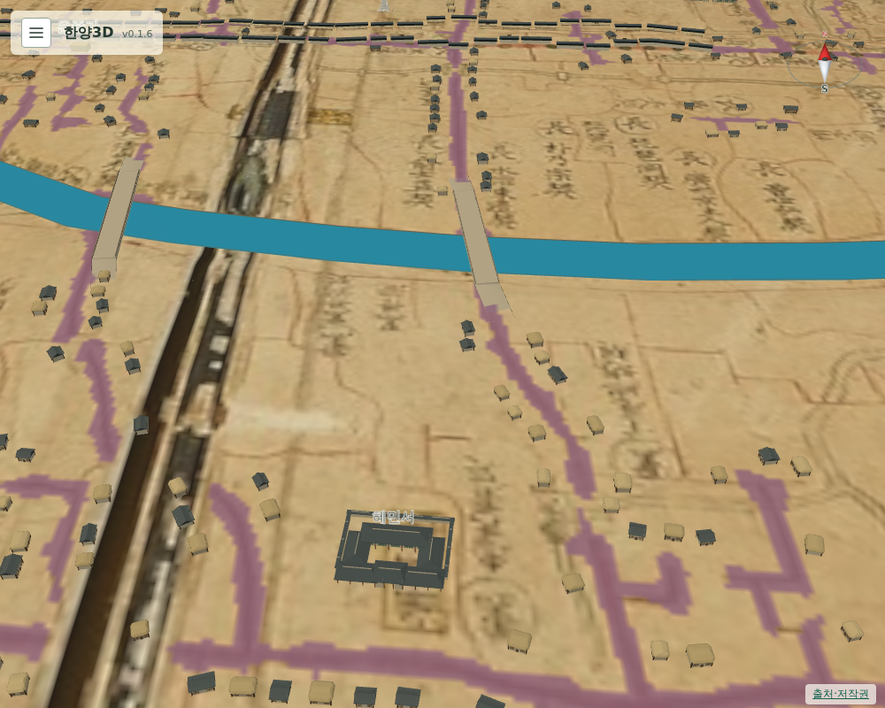

# 076 — 혜민서

건물 추가 목록의 다섯 번째 항목이다.

## 조사

혜민서는 서민의 병을 치료하고 약을 나누며 의녀를 가르치던 의료 관청이다. 1392년 혜민고국으로 설치해 1414년 혜민국, 1466년(세조 12) 혜민서로 고쳤고 1882년 폐지됐다. 터는 지금의 중구 을지로3가 65이며 을지로3가역 근처에 표석이 있다. ([위키백과 혜민서](https://ko.wikipedia.org/wiki/%ED%98%9C%EB%AF%BC%EC%84%9C), [우리역사넷 혜민서](https://contents.history.go.kr/mobile/nh/view.do?levelId=nh_025_0040_0010_0020_0050), [우리역사넷 교과서 용어해설 혜민서](https://contents.history.go.kr/front/tg/view.do?levelId=tg_003_0730))

## 위치

을지로3가역 3번 출구(OSM `37.5665588, 126.9924393`)를 원도로 옮기면 `(1792, 1647)`이다. 원도의 장통교·수표교로 보정하려 해도 이 지점은 수표교보다 동쪽이라 보간이 아닌 외삽이 되어 믿기 어려웠다(`(1668, 1655)`).

대신 부분도 8에서 노란 칸 글씨 惠民署를 찾았다. 모전교·광통교 기준으로 환산하면 `(1604, 1660)`, 전체 원도에서 같은 글씨를 읽으면 `(1612, 1662)`로 서로 8 픽셀 안에서 맞는다. 두 값의 가운데 `(1608, 1661)`에 두었고, 길 판독 마스크와 다리에 닿지 않는다. 원도에서 청계천 남쪽, 수표교의 남서쪽이다.

현대 위치 환산값은 글씨보다 약 380 m 동쪽이다. 이 구간의 원도 변형이 크다는 073의 관찰과 맞는다.

## 모형

관청 담장·대청 모형을 40×34 m로 썼다. 건물을 누르면 소개·존재 시기·출처가 나온다.

## 검증

`scripts/terrain/check_new_landmarks_browser.py`에서 혜민서가 원도 글씨 좌표에 있고, 수표교보다 100 m 넘게 남쪽이며 서쪽인지, 성곽 안이고 길과 겹치지 않는지 확인한다.

## 배포

- v0.1.7로 배포했다. Docker Hub digest: `sha256:5453a2a126d356dd0e339c08b6bc022eeee3389531bf48db14e4573f880c6ea3`.
- 공개 healthz 정상: v0.1.7, resources 65. 운영 화면에서 혜민서가 원도 글씨 좌표에 있고 수표교보다 209 m 남쪽이며 길과 겹치지 않음을 확인했다.
- 서버 이미지는 v0.1.7과 직전 v0.1.6만 남겼다.
