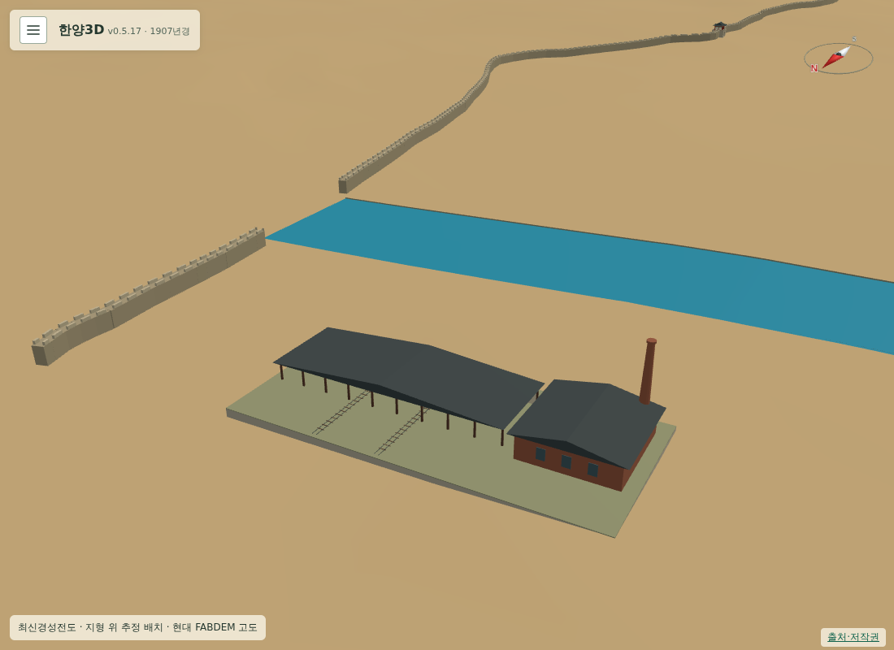
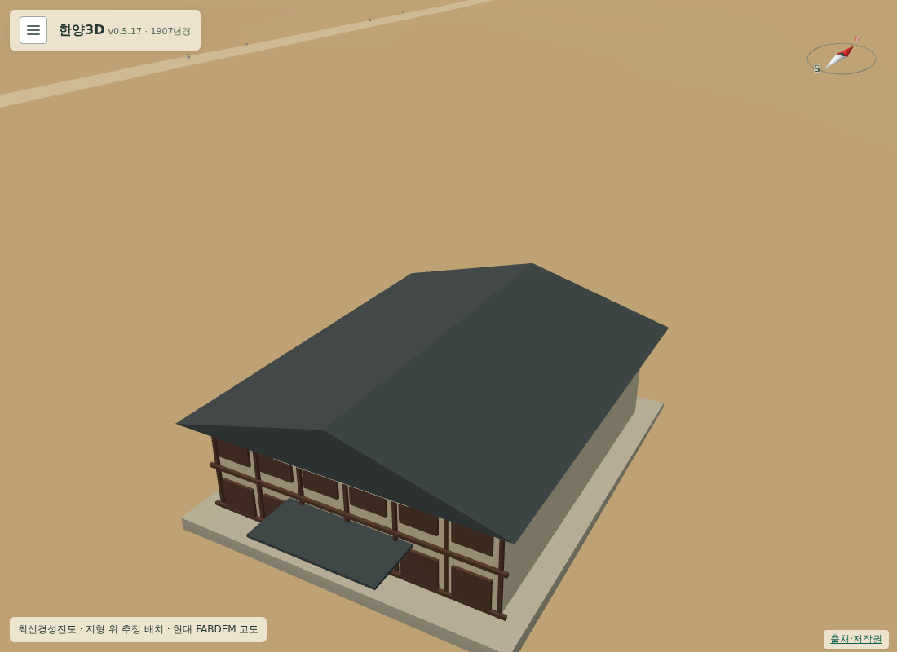
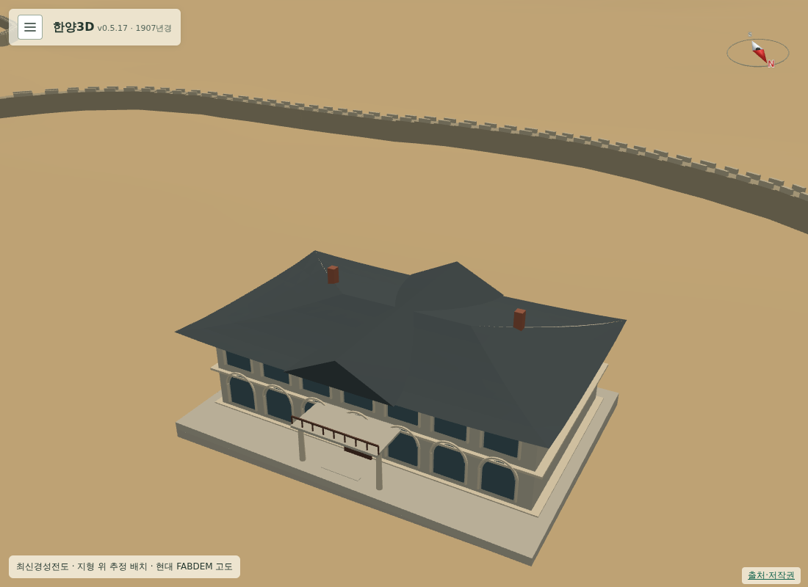

# 183 — 1907년 전차 차고·단성사·손탁호텔

v0.5.17 배포 후 다음 건물 제작을 진행했다. 원도 전기회사 표기와 1899년 사진을 참고한 동대문 전차 차고·발전소, 1907년 목조 2층 공연장 단성사, 1902년 신축한 손탁호텔의 개념 모형을 추가했다. 1907년 객체는 73개, 전체 콘텐츠 건물은 187개다.

시대별 존속·표현 연도와 추정 위치, 외관 불확실성을 각 항목에 기록했다. 차고 진입선은 개념 표현이며 운행 중인 전차 경로와 연결하지 않았다. 단성사는 1918년 이후 영화관과 구분했고, 손탁호텔 사진은 촬영연도 미상임을 명시했다. 외부 GLB를 사용하지 않은 직접 제작 모형이다. 한·영 설명·출처·LOD를 연결했다.

Django 63개 테스트 통과. PC·모바일 7개 신규 건물군의 실물 메시 선택, 클릭 후 시점 유지, LOD, 투명도 변경 시 높이 유지, 건물 간 비중첩 검사 통과. 세 모델의 전체 외형을 별도 시점에서 확인했고 전차 이동·정지·회차·충돌·레일 회귀 검사도 PC·모바일 통과했다. 상세 좌표와 출처는 [후보·구현 기록](../docs/seoul1907_next_landmarks.md)을 따른다.

이번 세 건물은 아직 운영 미배포다. 현재 운영은 앞선 네 건물을 포함한 v0.5.17이다.

