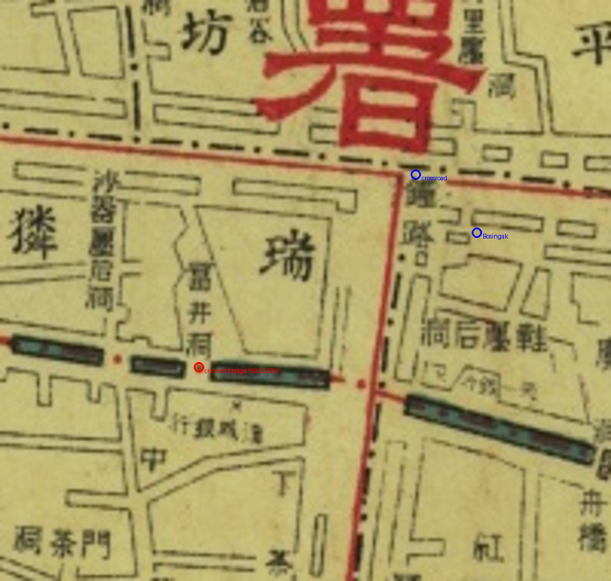

# 186 — 1907년 광통교 원위치 교정

사용자가 보신각 남쪽 도로 연결을 지적하여 원도와 현재 좌표를 대조했다. 기존 [935,2300]은 서쪽의 다른 횡단 틈을 잘못 골랐고, 보신각 사거리 [1006,2237]에서 남쪽으로 내려가는 도로의 청계천 횡단 지점 [990,2307]으로 수정했다. 기존 하천·도로 선형은 이 지점을 지나므로 교량 좌표만 수정했다.

서울역사박물관의 복원 광통교 상류 155m 이전 설명과 한국민족문화대백과의 광교 해설을 출처에 추가했다. 광교는 옛 광통교의 다른 이름이고 현재 광교는 옛 대광통교 자리에 놓인 현대 교량이다. 현대의 광교·복원 광통교를 1907년의 서로 다른 두 다리로 소급하지 않는다.

PC·모바일 실제 장면에서 수정 좌표 반영·7개 교량 유지·지도 투명도 변경 시 높이 유지와 브라우저 오류 없음을 확인했다. 픽셀은 원도 수동 판독의 추정치다. 아직 운영 미배포.

자세한 출처는 [기반시설 기록](../docs/seoul1907_infrastructure.md)에 보관했다.
