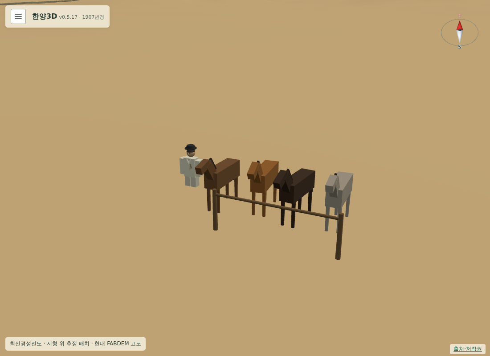

# 187 — 1907년 말 장수

사용자 요청에 따라 수표교 북쪽에 1907년 복식의 가상 말 장수와 네 필을 추가했다. 당시의 정확한 말시장 위치는 확인되지 않아 가상 배치·표현 연대를 기록하고, 옛 우마전이 같은 자리에서 계속 영업했다고 단정하지 않았다. 1907년 전용 한·영 대사와 거래·승마 안내를 작성했다.

공유 말 모형에 인물 교체 옵션을 추가하고 기존 1750년 기본 인물은 유지한다. 설정에 말 장수 보기 버튼을 추가하고 사람 레이어에 연결하여 물길을 숨겨도 보이게 했다. 기존 서버 거래와 봇짐을 사용하며 모바일 쓰기로 승하마한다.

Django 테스트 14개 통과. 별도 임시 DB의 PC·모바일 브라우저에서 인물 클릭·탭, 카메라 유지, 실제 구입(900문), 서버 재조회, 쓰기 승하마를 검증했다. 건물 비중첩, 선로 이격, 물길 표시 독립, 투명도 변경 시 고도 유지도 통과했다. JS 구문과 diff 공백 검사 통과.

[배치·근거·검증 상세](../docs/seoul1907_people_and_walking.md). 운영 배포는 아직 하지 않았다.

