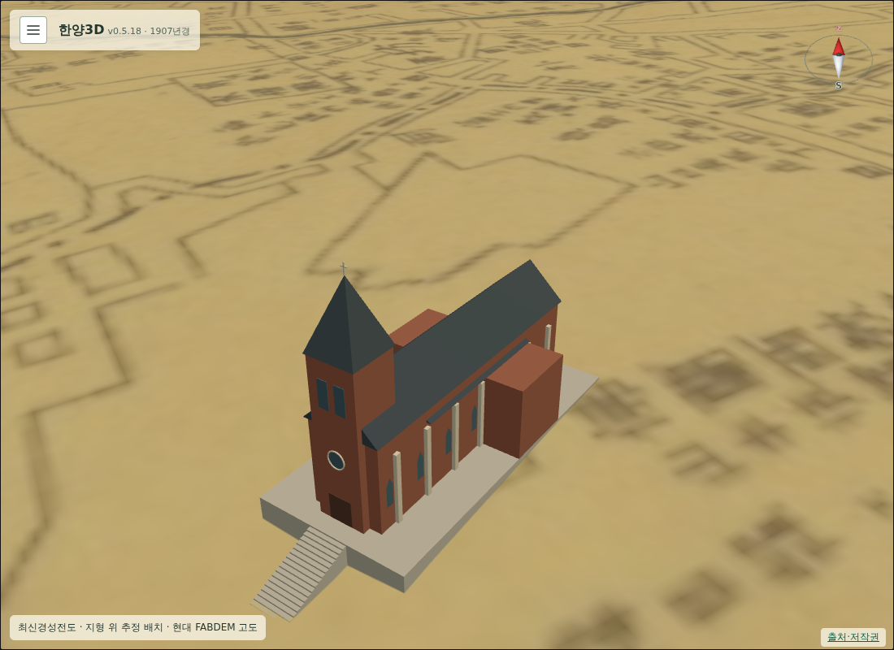

# 190 — 1907년 건물 진입 계단과 월대 보행

근정전과 명동성당의 높은 받침에 올라갈 수 없다는 요청을 반영했다. 1907년은 다리만 보행 표면으로 등록했고 건물 부지 전체를 평면 장애물로 막고 있어, 기존 궁궐 월대 계단이 있어도 진입할 수 없었다.

## 변경

- 근정전·중화전·인정전·명정전·숭정전과 명동성당·정동교회: 지면에서 건물 받침으로 이어지는 진입 계단을 생성한다. 현재 FABDEM과 모형의 평탄한 받침 높이에 맞추며, 단 높이 0.3m·디딤판 0.8m를 기본으로 한다.
- 궁궐 정문의 앞뒤에 중간 계단을 놓고, 마당·중앙 길·정문 기단·월대·계단·전각 바닥을 별도 보행 표면으로 등록한다. 계단 입구의 난간 기둥은 비운다.
- 궁궐의 회랑 벽·전각 벽·정문 기둥, 교회의 본당·익랑·종탑만 장애물로 등록한다. 건물 내부는 아직 구현하지 않았으며 문 앞/월대까지 접근한다.
- 받침은 다리와 달리 아래로 통과할 수 없도록 높은 측면도 막는다. 건물을 숨기면 받침·계단의 보행 및 벽 충돌도 해제한다.
- 디딤판 경계에서 Float32 오차로 발이 지면까지 떨어지지 않도록 2cm 겹침을 둔다. 접근 계단은 LOD 교체와 무관하게 유지한다.
- 새 모듈 `building_access1907.js`를 정적 파일 허용 목록에 등록했다.

진입 계단의 위치·치수는 현재 배치 모형에 접근하기 위한 추정 표현이다. 당시 계단을 실측 복원했다는 뜻은 아니다. 특히 경사지 부지의 평탄화 때문에 생긴 높은 받침 자체는 이번에 바꾸지 않았다.

## 검증

`scripts/terrain/check_1907_stairs_browser.py`는 임시 SQLite DB·임시 계정을 사용한다. PC 키보드와 모바일 CDP 터치 조이스틱으로 일곱 건물의 계단을 왕복했고, 도착 오차 0.35m 미만·눈높이 1.65m 유지·높은 받침 측면 차단·건물 벽 차단·레이어 숨김 시 지형 높이 복귀를 확인했다. PC·모바일 상세 LOD 화면도 확인했다. Django 시대·번역 테스트 14개 통과.

설정 패널 정리와 이 계단 변경은 아직 운영 미배포다. 현재 운영 버전은 v0.5.18이다.

후속: [v0.5.19 배포](20260918_191_deploy_v0519.md)로 운영 반영 및 공개 화면 검증을 완료했다.
