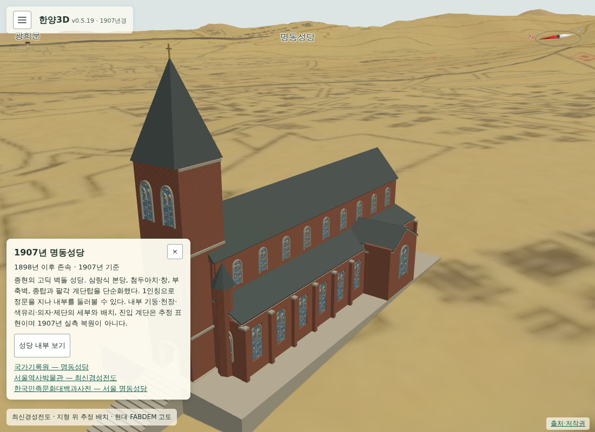
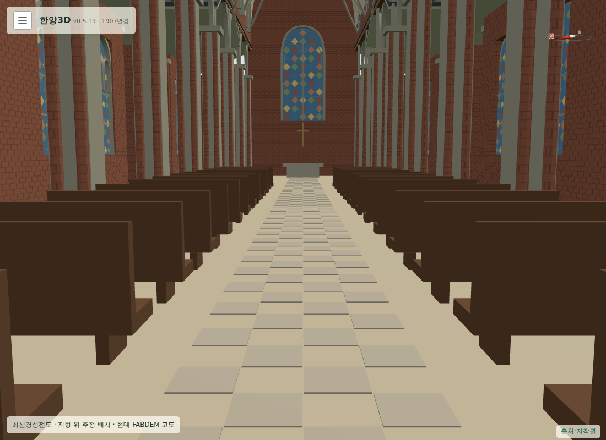

# 192 — 명동성당 근거리 세부와 걸어 들어가는 내부

가까이서 볼 때 명동성당의 세부를 더 표현하고 내부에도 들어가 보고 싶다는 요청을 반영했다. 기존 속이 꽉 찬 상자 본당을 정문이 열린 건축 외피로 교체했다.

## 참고

[한국민족문화대백과사전 「서울 명동성당」](https://encykorea.aks.ac.kr/Article/E0018240)의 삼랑식 본당, 창·열주·부축벽과 팔각 계단탑 설명을 참고했다. 사용자 제공 [AZTechnology의 모델링 영상](https://www.youtube.com/watch?v=_S4SaiNBlRk)은 명동성당 자료가 아닌 가우디 성당 제작 영상이다. 영상 전반의 표본 프레임과 9분 지점 내부 렌더를 확인하고, 내부 열주·천장·색유리·좌석을 가까이서 볼 수 있는 표현 방식을 참고했다. 가우디의 분기 기둥이나 외형을 명동성당에 적용하지 않았다.

모형은 직접 만든 Three.js 코드이며 외부 메시·사진 텍스처를 쓰지 않는다. 내부 기둥 간격, 궁륭·리브, 색유리 기하 문양, 의자·제단 배치와 바닥 타일 문양은 추정이다. 1907년 실측 복원으로 표시하지 않으며 건물 설명·출처 페이지와 [모형 문서](../docs/myeongdong_cathedral_1907_model.md)에 범위를 기록했다.

## 구현

- 외관: 부축벽, 첨두 창, 창틀·창살·기하 색유리, 종탑·팔각 계단탑, 정문 몰딩과 열린 문짝.
- 내부: 삼랑식 열주·아치, 높은 궁륭과 천장 리브, 좌석 열, 중앙·측면 통로와 추정 제단.
- 실제 보행: 지면에서 계단을 올라 정문을 지나 제단 앞까지 왕복한다. 벽·기둥·의자·제단에는 충돌하고, 뒤쪽 시점의 카메라는 벽 앞에서 짧아진다.
- 빠른 보기: 건물 설명에 **성당 내부 보기** 버튼을 추가했다. 건물 자체의 클릭은 기존대로 시점을 유지한다.
- LOD: 원거리 실루엣, 중거리 건축 외피, 260m 기준 근거리 장식·가구. 세부 경계에 여유 구간을 둔다. 벽돌 줄눈은 셰이더에서 화면 크기에 맞춰 완화한다.
- 리소스 허용 목록·한영 설명·출처 페이지를 갱신했다. 새 모듈에 맞춰 가져오기 검사의 리소스 수는 131개로 갱신했다.

## 검증

전체 Django 테스트 64개 통과. 임시 DB·계정의 PC 키보드와 모바일 터치 조이스틱 검사에서 정문 입장·퇴장, 눈높이 1.65m, 실내 벽 카메라 충돌, 근·중·원거리 LOD 전환을 확인했다. 모형은 바닥·계단·원거리 대체 모형을 포함해 메시 23개이며, 수만 개 삼각형의 근거리 장식을 재질별로 병합한다. 기존 일곱 건물 계단 왕복 검사도 통과했다.

재현: `scripts/terrain/check_1907_cathedral_browser.py`, `scripts/terrain/check_1907_stairs_browser.py`.

현재 운영은 v0.5.19이며 이 작업은 아직 미배포다. 지하 묘역·상층 계단실은 구현하지 않았다.
