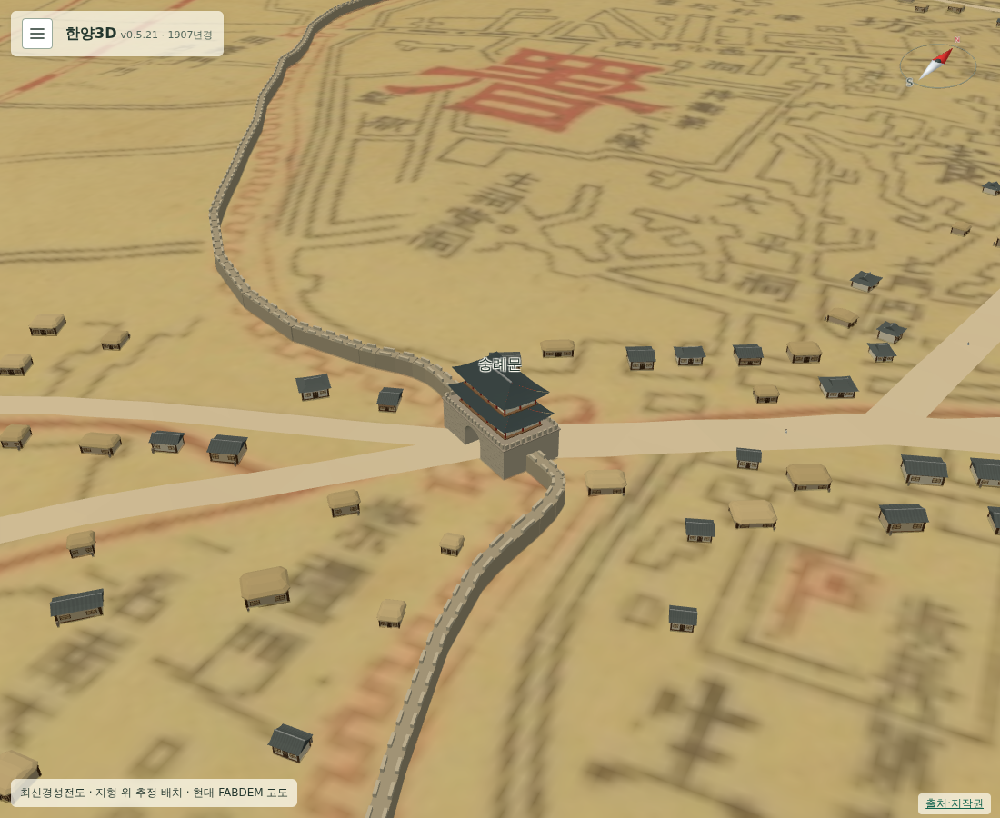
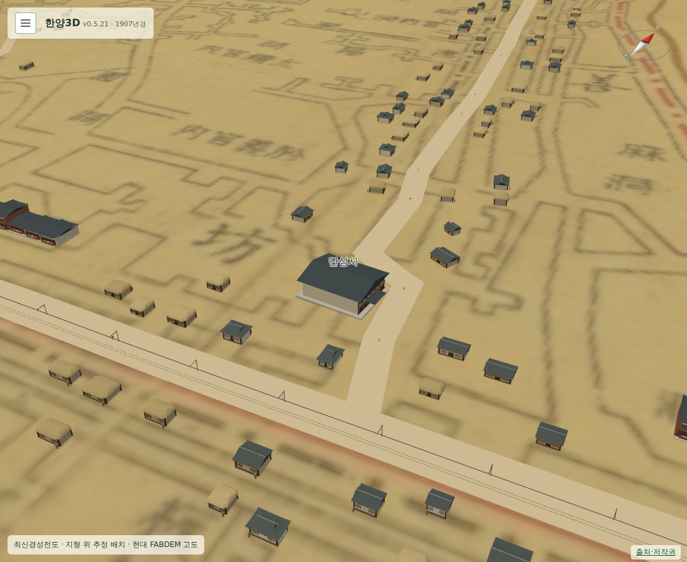

# 197 — 1907년 도로 확장과 추정 민가

도로 12개를 더해 총 20개 구간을 표시하고, 길 주변에 1750년과 같은 기와·초가 모형을 이용한 추정 민가·점포 1,600동을 배치했다. 숭례문 일대 원도의 작은 도형 49개 중심을 읽어 우선 배치했으며 도로·성벽·경사 등의 여유 공간 검사를 통과한 29곳을 채택했다. 일반 구획을 개별 건물의 정확한 윤곽으로 해석하지 않았다. [데이터·알고리즘·한계](../docs/seoul1907_settlement.md).

고정 시드로 기기·새로고침 간 같은 위치를 유지한다. 도로·하천·성벽·주요 건물·궁궐/종묘 권역을 제외하며 이웃 가옥과 겹치지 않게 한다. 설정에 추정 민가·점포 체크박스를 추가했고, 숨길 때 충돌도 해제한다. 인스턴싱 메시 10개와 800m LoD로 처리한다. 도로 굴곡의 끝단을 공유해 삼각형 틈이 생기지 않게 했다.

Django 64개 테스트, PC 1100×900·모바일 390×844의 배치 동일성·개수·충돌/표시 전환·LoD, 1750년 민가 렌더링 회귀 통과. 민가 추가 후 PC·모바일 성당 입퇴장·자동 하마·실내 재탑승 차단·카메라 충돌 회귀도 통과. 최초 도로 연결부 수정에서 하천 ribbon 코드까지 바뀌어 로딩 오류가 발생했으며 해당 변경을 도로에만 제한하고 재검증했다.

운영 미반영. 기록 196의 돈화문 행인 경로 교정을 포함해 배포할 때 웹·멀티플레이 이미지를 함께 갱신해야 한다.

후속: 2026-09-19 웹·멀티플레이 v0.5.22 운영 반영. [배포 기록](20260919_198_deploy_v0522.md).
