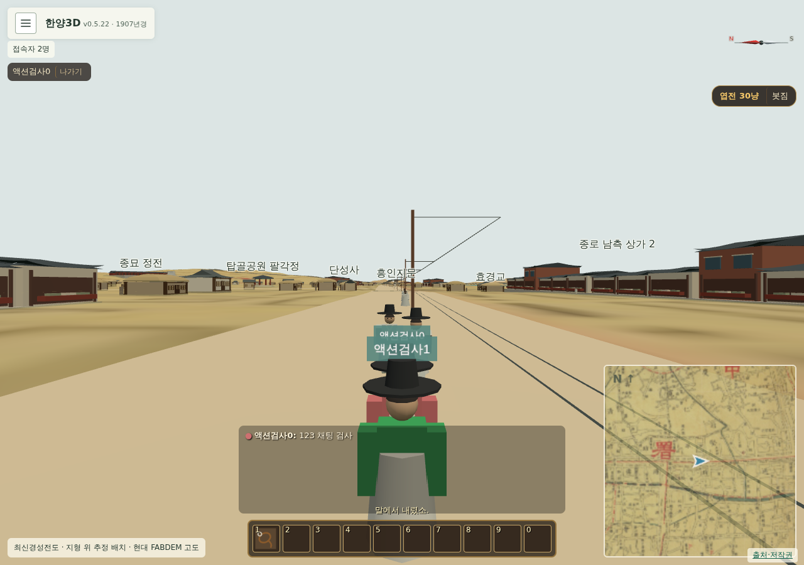
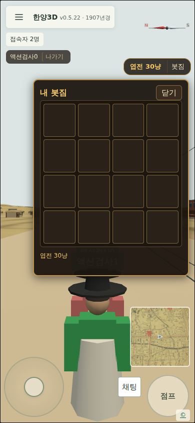

# 걷기 HUD·액션바·봇짐·채팅과 포커스 이동

1750년과 1907년이 공유하는 UI를 변경했다. 이름은 접속자 수 아래, 엽전·봇짐은 나침반 아래로 분리했다. 봇짐은 오른쪽 4×4 16칸이며 종류가 더 많으면 페이지로 전환한다. PC 하단에는 1부터 0까지 액션바를 두고 사용 가능한 물건을 드래그해 등록한다. 말고삐는 키나 클릭으로 승마/하마한다. 계정별 브라우저 저장으로 배치를 기억하며 서버 소유 물품이 없으면 사용할 수 없다. 우클릭으로 슬롯을 비운다. 모바일 액션바는 아직 표시하지 않는다.

실제 동시 접속 채팅은 액션바 위 반투명 기록창으로 표시한다. Enter로 입력 시작, 다시 Enter로 전송/입력 종료, Esc로 취소한다. 입력 중 액션키가 실행되지 않는다. PC 미니맵은 화면 폭에 따라 240~320px로 확대했다.

창 포커스를 잃으면 마지막 이동 벡터와 달리기 상태를 보존한다. 돌아와 이동키를 누르거나 놓으면 직접 입력으로 복귀한다. 채팅·로그인 등 명시적인 입력 초기화와 걷기 종료에서는 멈춘다. 브라우저가 숨긴 탭의 렌더링을 중단하거나 OS가 앱을 정지하는 동안까지 실시간 이동을 보장하지는 않는다.

브라우저 검사는 임시 DB·계정과 실제 멀티플레이 서버를 사용한다. 액션바 드래그·승하마·저장, 16칸 가방, 두 사용자 채팅, 배치 겹침, PC 미니맵 크기, 포커스 상실 후 이동 및 채팅 진입 시 정지를 확인한다. 운영 배포는 별도 요청 전까지 하지 않았다.

검사 결과: 포커스 유지·채팅 중 정지, PC HUD/액션/실시간 채팅, 저장 복원·모바일 가방 모두 통과했다.

