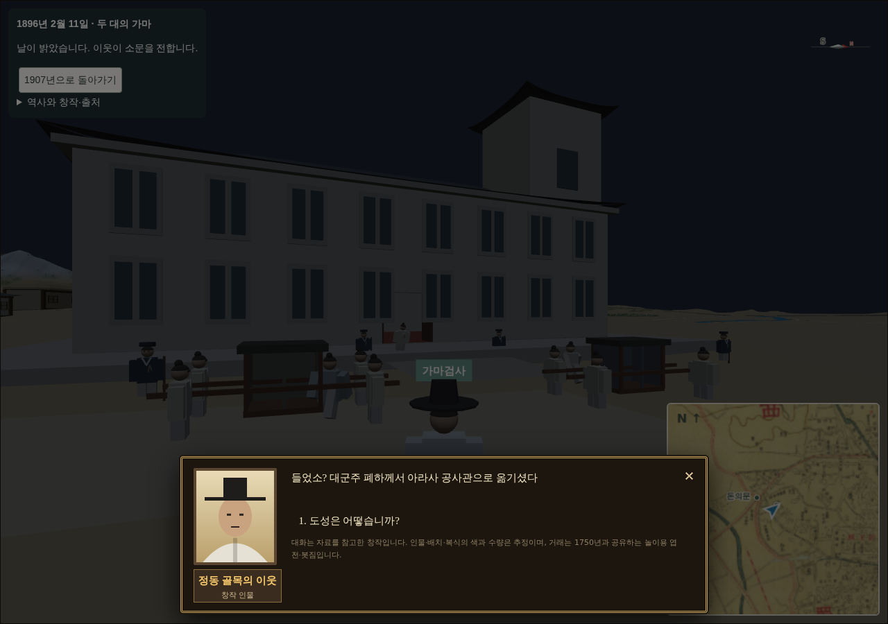
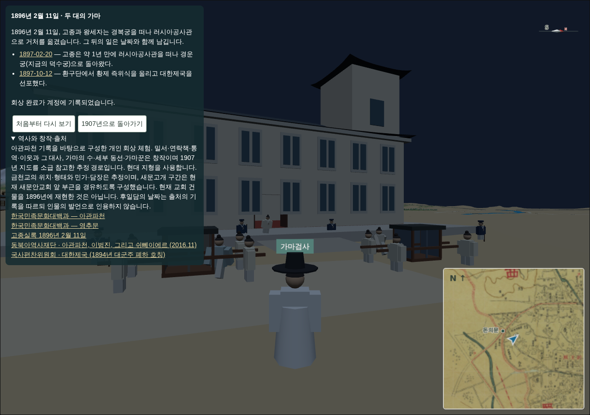

# 251 — 아관파천 회상: 밀서·서쪽 문·후일담

[P02 설계](20260920_P02_agwanpacheon_event.md)의 여섯 단계 중 첫 체험(가마 따라가기·도착·복귀)에 앞뒤 단계를 붙였다. '길을 살펴라' 답사와 검문 회피는 이번 범위에서 제외했다.

## 진행 구조

서버 `EventProgress.checkpoint` 하나로 모든 단계를 순서대로 기록한다. 0 시작 → 1 밀서 전달 → 2 영추문 밖 연락책 → 3~12 경로 확인 지점 10곳 → 13 후일담. `webapp/events.py`의 `last_checkpoint()`가 정의 파일의 `stages_before`·`route`·`stages_after`에서 마지막 번호를 계산하고, 완료는 13에서만 허용한다. 정의 `version`을 3으로 올려 이전 진행은 새로 시작한다. 새 열이나 migration은 없다.

## 단계

- **새벽의 밀서**: 러시아공사관 앞에서 시작해 정동 입구의 연락책에게 봉인된 밀서를 건넨다. 밀서는 패널에 '임무 물품(거래 불가)'로만 표시하고 봇짐·엽전에 넣지 않는다.
- **궁궐의 서쪽 문**: 정동에서 영추문 밖까지 약 1.3km를 직접 걸어가 연락책을 만난다. 이름을 밝히지 말고 조용히 기다리라는 부탁을 받으면 문이 열리고 기존 가마 행렬이 시작된다. 패널에 남은 거리와 '목적지 방향 보기' 버튼을 두었다.
- **아관**: 가마 하차 연출 뒤 공사관 통역이 탑승자가 고종과 왕세자였음을 밝히고 출처(아관파천 항목·고종실록)를 연다. 이어 정동 이웃이 같은 날의 소문(김홍집 내각 붕괴, 김홍집·정병하 피살)을 전한다. 그동안 조명이 새벽에서 아침으로 바뀐다.
- **후일담**: 완료 메시지에 1897-02-20 경운궁 환궁, 1897-10-12 대한제국 선포를 날짜·출처 링크와 함께 나열한다. 인물의 발언으로 인용하지 않는다.

대화는 1907년의 `npc_dialogue.js` 창을 그대로 쓴다. `walk1907.js`에 `event:` 접두 행동을 회상 모듈로 넘기는 `setEventAction` 훅을 추가했다. 연락책·통역·이웃은 모두 '창작 인물' 부제를 달았고 화면 출처 설명에도 창작 범위를 추가했다. 연락책이 서는 자리는 데이터 픽셀이 담장과 겹치면 가까운 통행 가능 지점으로 옮긴다.

## 검증

- Django 테스트 88개 통과. 회상 테스트는 마지막 확인 지점 13과 중간 완료 거부를 확인한다.
- `scripts/terrain/check_agwanpacheon_browser.py`: 밀서 단계 시작(가마 숨김·연락책 표시·임무 물품 표시), 대화 조기 닫기 시 진행 없음과 3초 후 재개, 두 연락책 대화 후 확인 지점 1·3 저장, 행렬 중단·재개, 도착 후 통역·이웃 대화, 확인 지점 13·완료 메시지·후일담 날짜 2건, 새벽 조명 전환, 기존 액션바·위치 복귀 검사 통과.

2026-09-21 웹 v0.5.40으로 운영 반영했다([기록 254](20260921_254_deploy_v0541.md)). 답사·검문 단계는 후속 범위로 남긴다.
