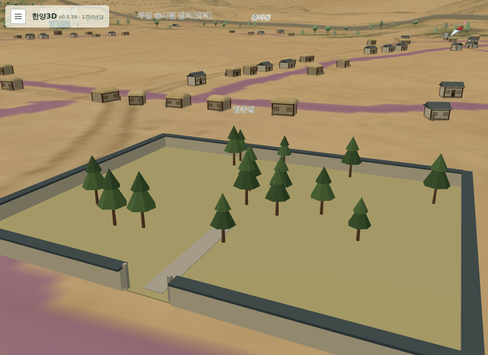

# 253 — 1750년 건물 재검토 반영

[기록 252](20260921_252_landmarks_1750_existence_review.md)의 D·C 등급과 이름 항목을 데이터에 반영했다.

- **경모궁 → 함춘원**: `id`는 `gyeongmogung`을 유지하고 이름·설명·연혁을 함춘원으로 바꿨다. 새 표시 모형 `walled_garden`(담장·남쪽 문·소나무 숲, 원거리 실루엣 포함)을 `webapp/static/walled_garden.js`로 추가하고 담장 충돌·리소스 목록에 등록했다. 근거는 한국민족문화대백과 「함춘원지」(성종 대 원유 조성, 인조 대 절반을 사복시 방마장으로 사용, 1764년 수은묘 이건). 말·방마장 시설은 표현하지 않았다.
- **사온서 → 사온서 터**: 실록사전의 17세기 초 이전 혁파 추정을 따라 관청 모형 대신 표석(`site_marker`)만 둔다. 원도 글씨는 옛 자리 이름으로 본다.
- **송시열 집터 → 송시열 집터(옛터)**: 담장·기와집 모형을 표석으로 바꿨다. 사후 60년이며 원도에 표시가 없다.
- **태평관**: 모형을 축소하고 잔존 규모 미확인·지명 가능성을 설명에 적었다.
- **숙정문**: 문루 여부 미확인이라 `gate_tiers: 0`(홍예만)으로 바꿨다. 도성대지도 도상 판독 후 갱신한다.
- **육상궁 → 육상묘(1753년 육상궁)**: 1750년 이름으로 표시한다.
- **만리창**: 설치 연도 미확인을 설명에 남겼다.

`docs/landmarks.md`의 해당 절 제목·1750년 설명과 차이표를 맞췄다. 상세 설명은 건물 이름과 절 제목으로 연결되므로 이름을 바꾼 항목은 제목도 함께 바꿨다.

## 검사

- `webapp/test_content.py`에 `SceneYearTests`를 추가했다. 1750·1907년 목록에서 `existence.start_year`가 장면 연도보다 늦거나 `end_year`가 이르면 실패한다(표석 제외). 리소스 수 기대값 144.
- Django 테스트 89개 통과. 임시 DB 브라우저 렌더에서 함춘원 담장·소나무 모형, 사온서·송시열 표석, 숙정문 홍예 확인. `check_site_markers_browser.py`는 송시열 표석에 맞춰 갱신했고 이름표 확인은 각 표석 위 시점에서 읽도록 바꿨다(기존 기본 시점에서는 내 변경 전에도 실패했다).

운영 반영 전이다. DB 모드 배포 시 이름·설명이 바뀐 건물은 동기화에서 갱신으로 잡히며, 운영에서 편집한 항목이 있으면 충돌로 보고된다.
