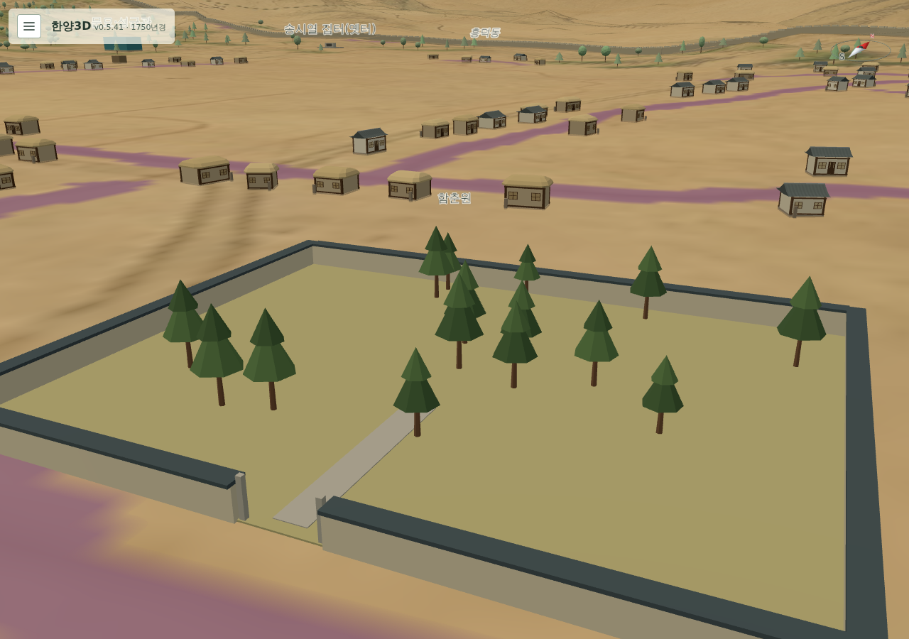

# 254 — v0.5.40·v0.5.41 배포

2026-09-21 dolfinid에 아관파천 밀서·서쪽 문·후일담([251](20260921_251_agwanpacheon_letter_gate_aftermath.md))과 1750년 건물 재검토 반영([253](20260921_253_landmarks_1750_review_applied.md))을 배포했다. 멀티플레이 v0.5.31 유지.

## v0.5.40

- 빌드 revision `082411d`, digest `sha256:9c382bcec69b1ab239c568bce2487f33f0365b672fb333c485acf6bbf393e1e3`. 이미지 테스트 89개 통과.
- 배포·동기화: 갱신 7(함춘원·사온서 터·송시열 집터·태평관·숙정문·육상묘·만리창), 충돌 0. 검증 DB 백업 `content_v0.5.40_20260921_091446.sqlite3`.
- 운영 검사에서 함춘원의 이름·설명은 바뀌었으나 모형이 기본 상자로 그려졌다. 새 표시 모형 `walled_garden`을 `webapp/model_resources.py`에 등록하지 않아 DB 모드가 `box`로 대체한 것이다. 파일 모드 테스트와 브라우저 검사는 이 차이를 잡지 못했다.

## v0.5.41

- 수정: `MODEL_RESOURCES`에 `walled_garden` 등록(`a9c2c51`). 목록의 모든 `display_model`이 등록된 생성기인지 확인하는 `DisplayModelRegistryTests`를 추가했다. 리소스 수 기대값 145.
- 빌드 revision `8185fe6`, digest `sha256:c03a178482d49037745b867169002a0629a0fac1f856957c6d4b6fa8d5ff09ac`. 이미지 테스트 90개 통과.
- 배포·동기화: 갱신 1(함춘원 모형 리소스), 충돌 0, migration 없음. 검증 DB 백업 `content_v0.5.41_20260921_092133.sqlite3`, 설정 백업 `backups/config/pre-v0.5.41/`. `.env`(버전 항목 외)·`.env.django` 보존 확인.
- 호스트 묶음은 v0.5.39와 동일해 다시 설치하지 않았다. 두 번 모두 개발 호스트 m710q에서 빌드·push, 운영에서는 데이터 묶음 검증·pull·교체만 수행.

## 운영 확인

공개 HTTPS PC 1280×900·모바일 390×844에서 함춘원 담장·소나무 모형, 사온서 터·송시열 집터 표석, 숙정문 홍예만(문루 없음), 육상묘 이름, 회상 페이지의 정의 version 3과 밀서·서쪽 문·후일담 단계·임무 물품 표시를 확인했다. 웹·멀티플레이 healthy. 운영 계정이나 사용자 데이터를 만들거나 바꾸지 않았다.

