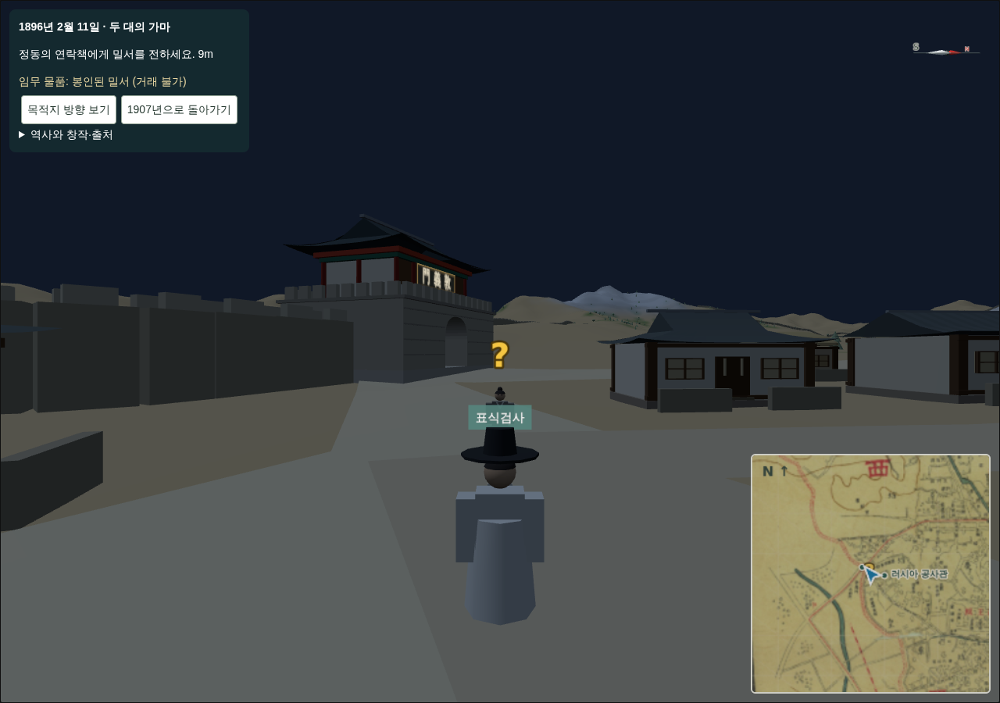

# 255 — 아관파천: 관리인의 꾸러미, 연락책 물음표, 수병 기단 정렬

## 관리인의 꾸러미

1907년 러시아공사관 문지기 대화의 「1896년 가마 행렬을 따라가 보겠습니다」를 없애고, 「아관파천 이야기를 듣고 싶습니다」로 바꿨다. 관리인은 창고에서 나온 낡은 꾸러미가 아관파천과 관련이 있다는 소리만 있고 무엇인지는 모른다며, 관심을 보이는 사람에게 살펴보라고 건넨다.

- 물건 `legation_keepsake` "낡은 밀봉 꾸러미"를 `gis/characters/npcs.json`에 추가했다. 어느 가게에도 없고 1개만 보유하며, `use: flashback`이라 팔 수 없다(`economy.trade`가 거부). 값 1문은 모델 최소값이며 거래에 쓰이지 않는다.
- 지급은 `/api/events/agwanpacheon/`의 `keepsake` 행동으로 서버가 1회만 한다. 이미 받았으면 관리인은 봇짐에서 써 보라고만 한다.
- 1인칭 봇짐·액션바에서 꾸러미를 쓰면 회상으로 들어간다. 회상 시작·재시작은 서버에서도 꾸러미 보유를 요구한다(없으면 409). 회상 패널은 "봇짐의 낡은 밀봉 꾸러미가 봉인된 밀서로 돌아갔다"로 표시하고, 회상 안에서 쓰면 밀서라는 안내만 한다.
- `Item.use` 선택지에 `flashback`을 더한 migration 0014(선택지 변경만, 데이터 이동 없음). 관리인 대사·꾸러미 문구는 `npcs.json` 파일에서 읽으므로 장면 데이터 갱신이 필요 없다.

## 연락책 물음표

밀서·서쪽 문 단계에서 다음에 만나야 할 연락책 머리 위에 노란 물음표(`quest_marker.js`, 스프라이트)가 떠서 흔들린다. 연락책까지 250 m 안에 들어오면 미니맵과 전체 지도(M)에도 작은 물음표를 그린다. 대화를 열면 사라지고, 중간에 닫으면 다시 나타난다. 단계가 끝나면 다음 연락책으로 옮겨 간다. 미니맵·전체 지도의 표식 목록은 `navigation.questMarkers`로 공유한다.

## 수병 기단 정렬

러시아공사관 수병 4명과 통역이 지형 높이에 서 있어 건물 기단(`terrain-foundation`) 속에 묻혔다. 건물 발자국 안에서는 모형의 바닥(기단 윗면)에, 발자국 밖에서는 지형에 서도록 `standing()`으로 바꿨다. 가마에서 내린 일행도 기단 위를 걷는다.

## 기타

- `landmarks1907.js`·`palace.js`의 빈 `add(...[])` 호출이 건물마다 THREE 콘솔 오류를 냈다(91건). 인자가 있을 때만 호출한다.
- `gable()`이 메시를 돌려주지 않아 교회 익랑 지붕을 날개 그룹에 옮기지 못하고 있었다. 반환하도록 고쳐 정동교회의 십자형 지붕이 나타난다.
- 리소스 기대값 146.

## 검증

Django 테스트 90개 통과(꾸러미 미보유 시작 거부·1회 지급·판매 거부 포함). `check_agwanpacheon_browser.py`: 꾸러미 없이 시작 거부 → 지급 → 시작, 연락책 물음표와 지도 표식, 두 연락책 대화, 행렬·도착, 수병·통역 기단 위 배치, 후일담, 관리인 대화로 꾸러미 받기 → 봇짐 우클릭으로 회상 진입 → 1907년 위치 복귀 통과. 1907년 페이지 콘솔 오류 0.

2026-09-21 웹 v0.5.42로 운영 반영했다([기록 257](20260921_257_deploy_v0542.md)).
