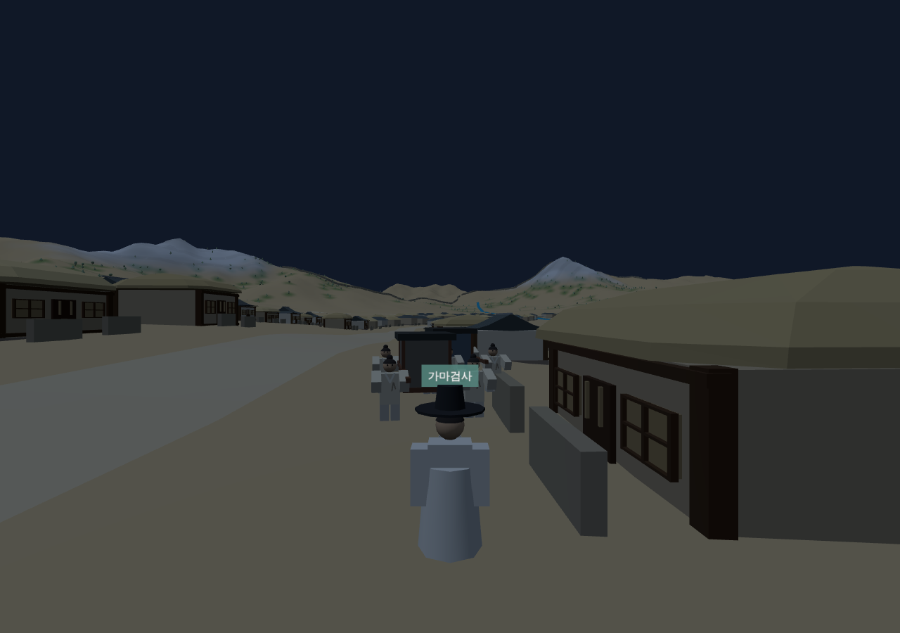

# 256 — 아관파천: 일본군 순찰과의 조우(창작 연출)

가마를 따라가는 도중에 사건이 없다는 점을 보완했다. 새문고개 방면 확인 지점 앞에서 일본군 순찰 3명이 길을 따라 내려오고, 주인공은 앞서 나가 순찰을 발견한 뒤 가마꾼에게 골목에 숨으라고 이른다. 기록에 없는 창작 연출이며 1896년 2월 서울에 일본군 수비대가 있었다는 사실만 참고했다. 화면 출처 설명과 정의 파일 `patrol.note`에 창작임을 적었다.

## 흐름

1. 가마가 숨을 지점(`hideAt`, 새문고개 확인 지점 30 m 앞) 60 m 앞에 이르면 순찰이 100 m 앞에서 나타나 2.4 m/s로 다가온다.
2. 주인공이 순찰 80 m 안에 들어가 순찰을 보면 그 사실이 유지된다(`patrol.seen`). 가마 8 m 안으로 돌아오면 패널에 「가마꾼에게 숨으라고 이르기」 버튼이 나타난다.
3. 누르면 가마 두 대가 길 옆의 통행 가능한 골목 지점(길에서 9~15 m, 두 방향 중 먼저 안전한 쪽)으로 4초 동안 들어가 멈춘다. 이르지 않으면 가마가 숨을 지점에 닿거나 순찰이 40 m 안으로 오는 순간 가마꾼들이 스스로 숨고 "다음에는 먼저 알려 주세요"라고 한다. 설계 원칙대로 플레이어 실패가 체포로 이어지지 않는다.
4. 순찰이 숨을 지점을 35 m 지나가면 가마가 길로 돌아와 다시 출발한다. 주인공이 순찰 5 m 안에 있으면 "힐끗 보고 지나간다"는 문구만 나온다.

숨어 있는 동안 행렬 진행 거리는 멈추고 확인 지점은 새로 만들지 않아 서버 변경이 없다. 재개 시 진행 거리가 숨을 지점을 지났으면 순찰은 다시 나오지 않는다. 최악의 경우 대기 시간은 약 55초, 검사에서 52초였다.

## 검증

Django 테스트 90개 통과. `check_agwanpacheon_browser.py`에 순찰 시나리오를 추가했다: 순찰 등장·골목 지점이 길 밖인지·멀리서 본 뒤 가마 옆에서 버튼 표시·경고 후 숨기·숨은 동안 제자리 유지·통과 후 복귀·순찰 소멸·대기 700프레임 미만. 이어지는 행렬·도착·후일담 검사도 통과.

2026-09-21 웹 v0.5.42로 운영 반영했다([기록 257](20260921_257_deploy_v0542.md)).
