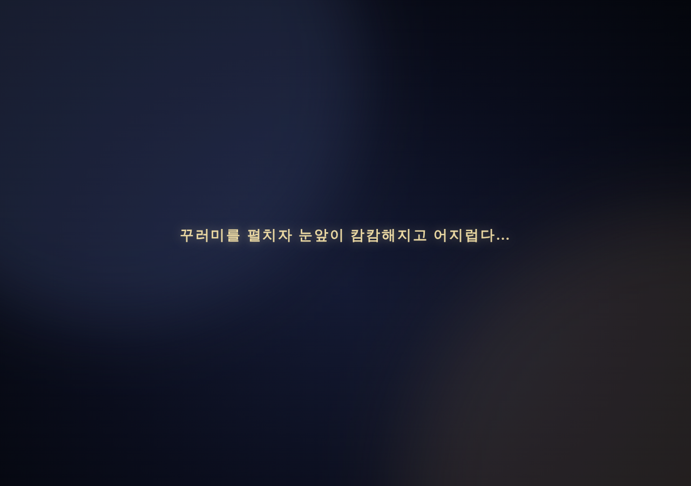

# 258 — 회상 전환 커튼과 역사적 사건 퀘스트 틀

## 몽환적 전환

회상 진입 때 1907년 화면을 새로 불러오면서 조감 시점이 잠깐 보이던 것을 없앴다. 떠나는 페이지는 남색 안개가 흐르고 자막이 숨 쉬는 커튼(`scene_curtain.js`)으로 서서히 덮이고 화면이 흐려지며 기울어진다("꾸러미를 펼치자 눈앞이 캄캄해지고 어지럽다…"). 다음 페이지는 템플릿의 인라인 스크립트가 첫 그리기 전에 같은 커튼을 세워 두고("정신을 차려 보니 — 1896년 2월 11일 새벽, 정동"), 장면이 준비되면 곧바로 1인칭으로 회상을 시작한 뒤에야 커튼을 걷는다. 돌아올 때도 같다. 로그인이 필요하거나 꾸러미가 없으면 커튼을 내리고 안내를 보여 준다. `prefers-reduced-motion`이면 움직임을 끈다.

## 퀘스트 틀

아관파천 전용이던 `agwanpacheon.js`를 공통 틀 `historical_event.js`와 모듈 `events/procession.js`로 나눴다. 정의 파일은 schema 2로 바꿔 단계(`talk`·`talks`·`module`)의 나열로 표현하고, 꾸러미·전환 문구·장면 설정·후일담을 정의로 옮겼다. 관리인 대화도 정의의 `keepsake` 블록으로 옮겨 `npcs.json`에는 물건만 남는다. 서버는 `gis/events/*.json`을 모두 읽어 slug로 제공하고(`/events/<slug>/`, `/api/events/<slug>/`), 단계별 확인 지점을 합산하며 정의 검증 함수를 둔다. 1907년 페이지는 자기 장면에서 시작하는 회상 요약 목록을 받아 꾸러미를 주는 인물 대화와 봇짐 사용 진입을 일반화했다.

절차와 스키마는 [docs/historical_events.md](../docs/historical_events.md)에 있다. 확인 지점 번호는 이전과 같아 정의 `version` 3을 유지했고 기존 진행은 그대로 이어진다.

## 검증

Django 테스트 91개 통과(정의 검증·404·기본 장면 요약 포함). 회상 브라우저 검사에 커튼 진입·1인칭 유지·복귀와 후일담 중 재개(모듈 조용한 복원)를 추가해 전 구간 통과.

2026-09-22 웹 v0.5.43으로 운영 반영했다([기록 259](20260922_259_deploy_v0543.md)).
