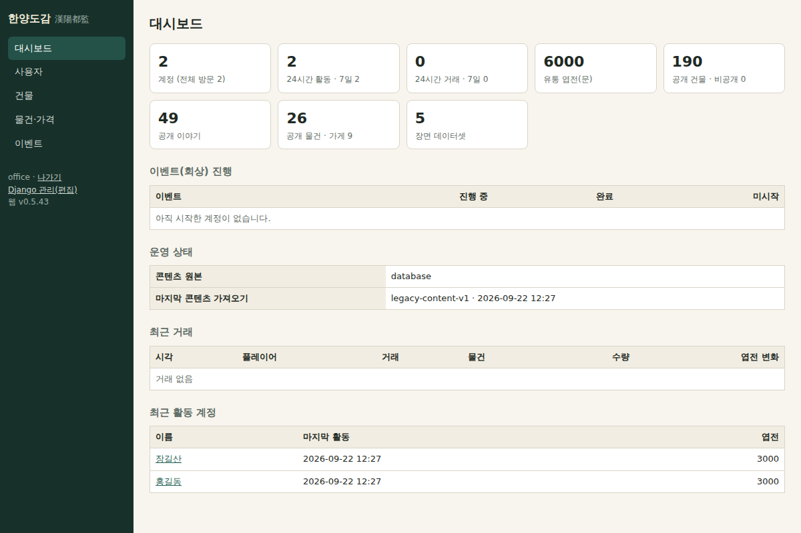
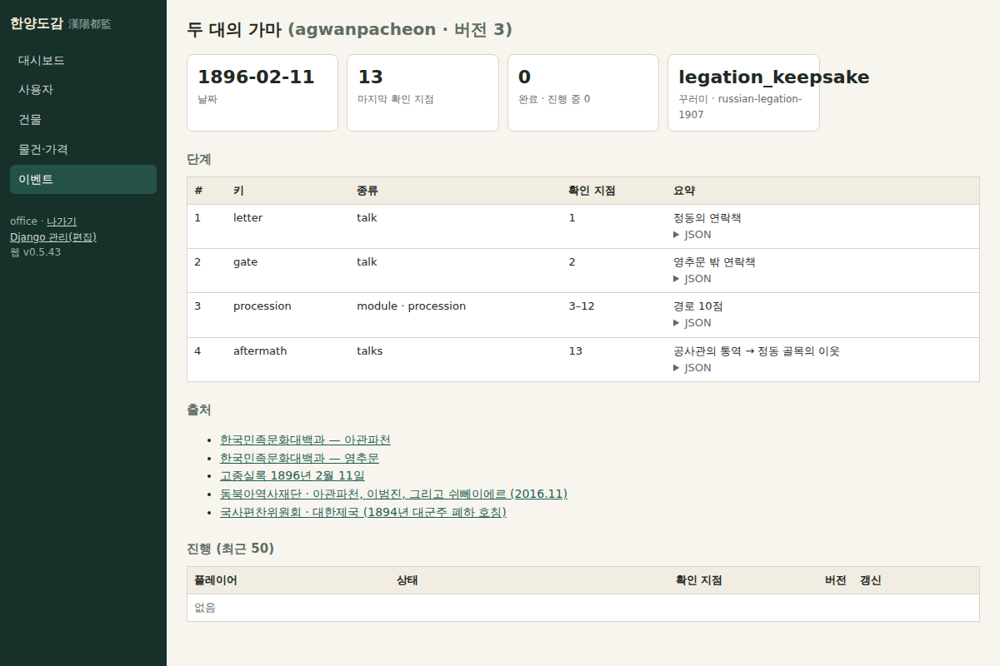

# 260 — 한양도감(漢陽都監): 독자 백오피스 뼈대

Django 관리 화면과 별도로 한양3D 운영에 맞춘 관리 화면을 `/office/`에 시작했다. 이름은 한 사업을 맡아 세우고 관리하던 조선의 임시 관청 ‘도감(都監)’에서 땄고, ‘한양을 그린 도감(圖鑑)’으로도 읽힌다. 설계와 모듈별 다음 단계는 [docs/office_design.md](../docs/office_design.md)에 있다.

## 이번 범위

- `webapp/office/`: staff 전용 접근 데코레이터(익명은 로그인으로, staff 아니면 403, 쓰기는 모델 권한), 자체 로그인/로그아웃, 좌측 모듈 내비게이션의 기본 템플릿(외부 의존성 없음, 폰 너비 대응).
- **대시보드**: 계정·활동(24시간·7일)·거래·유통 엽전·공개 건물·이야기·물건·장면 데이터 수, 이벤트 진행 집계, 콘텐츠 원본과 마지막 가져오기, 최근 거래·계정.
- **사용자**: 이름 검색 목록과 상세(봇짐·이벤트 진행·거래 50건). 비밀번호 해시·토큰은 내지 않는다.
- **건물**: 시대·검색 필터, 모형·이야기 수·공개 여부, 관리 화면 편집 링크.
- **물건·가격**: 목록(가게·쓰임·플레이어 보유)과 첫 쓰기 기능인 **값 수정**. `webapp.change_item` 권한이 있어야 폼이 보이고 저장되며 `LogEntry`에 이전·이후 값을 남긴다.
- **이벤트(퀘스트)**: `gis/events` 정의의 검증 결과·버전·확인 지점·꾸러미·진행 집계, 상세의 단계 표(종류·확인 지점 범위·요약·JSON)·출처·진행 목록. 편집기와 DB 저장은 설계만 했다.
- Nginx 호스트 묶음에 `/office/login/` 요청 제한을 관리 화면과 같게 추가했다(다음 배포에서 사이트 설정 갱신 필요).

## 검증

`webapp/test_office.py` 3개 포함 Django 테스트 94개 통과. 임시 DB(DB 모드·superuser)에서 여섯 화면을 렌더해 확인했다.

운영 반영 전이다. 배포 시 Nginx 사이트 설정을 호스트 묶음의 것으로 바꾸고 `nginx -t` 후 reload한다.
