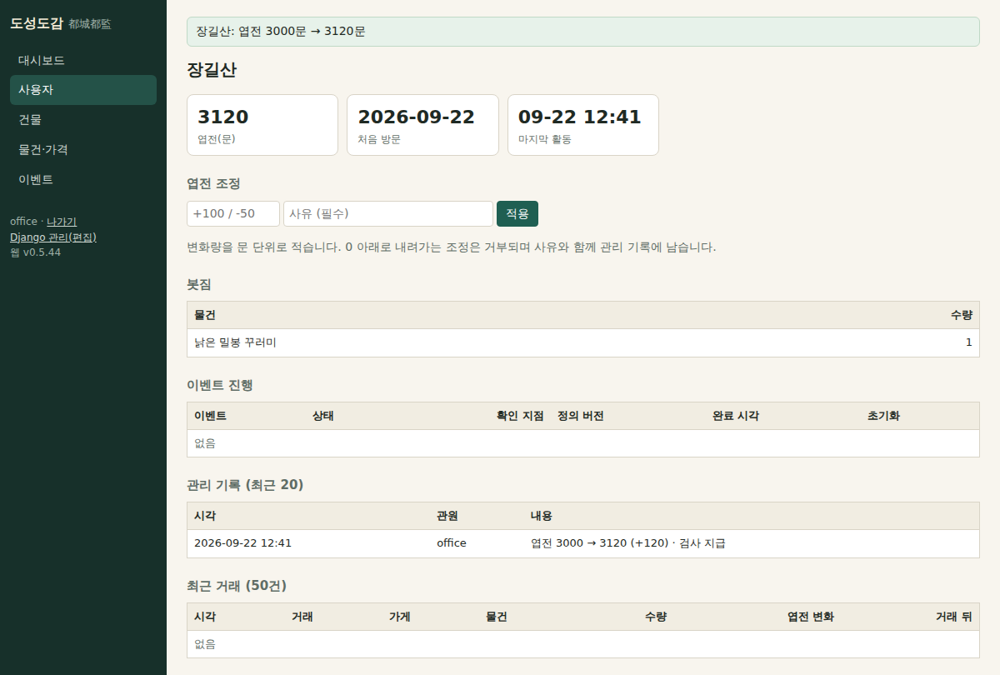

# 262 — 도성도감 사용자 모듈: 엽전 조정·진행 초기화

사용자 상세 화면에 첫 쓰기 기능 둘을 붙였다.

- **엽전 조정**: 변화량(문, ±1,000,000 이내, 0 제외)과 사유(필수)를 적어 적용한다. 행 잠금 트랜잭션에서 더하고, 0 아래로 내려가는 조정은 거부한다. `webapp.change_player` 권한이 있어야 폼이 보이고 저장된다.
- **회상 진행 초기화**: 이벤트 진행 행마다 사유를 적고 '처음으로'를 누르면 상태 미시작·확인 지점 0·완료 시각 없음으로 되돌린다. 이전 상태·확인 지점·완료 시각은 기록에 남긴다. `webapp.change_eventprogress` 권한 필요.
- 두 작업 모두 브라우저 확인 대화상자를 거치고 `LogEntry`에 평문 메시지로 남는다(관리 화면 이력과 같은 곳). 상세 화면 아래에 **관리 기록(최근 20)** 표를 두어 관원·시각·내용을 본다. 물건 값 수정 기록도 같은 평문 형식으로 바꿨다.

## 검증

`test_office.py`에 권한 없는 사용자 403, 사유 없음·0·잔액 초과 거부, 지급·초기화 반영, 기록 2건과 화면 표시를 확인하는 테스트를 추가해 Django 테스트 95개 통과. 임시 DB 브라우저에서 지급 후 화면을 확인했다.

운영 반영 전이다.
