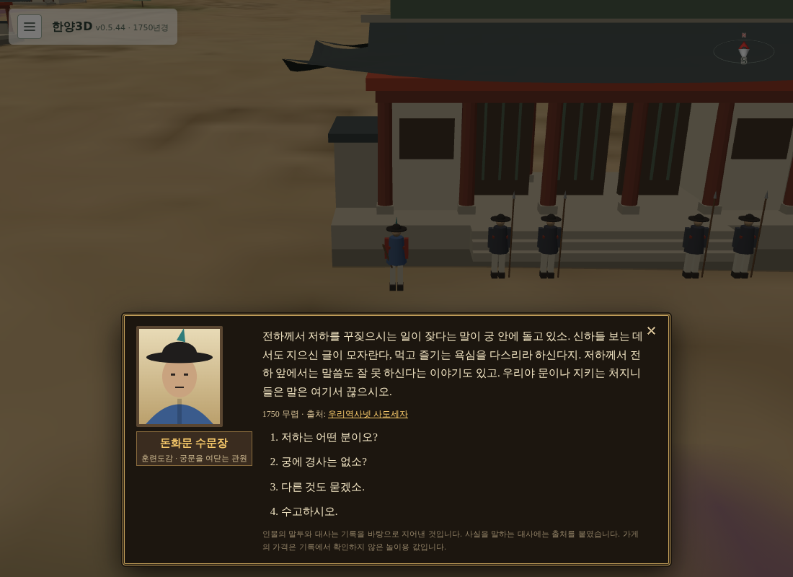

# 263 — 창덕궁 수문장의 궁중 소식: 영조와 세자

1750년 장면의 창덕궁 문(돈화문·금호문) 수문장 대화에 「요즘 궁 안 소식은 어떻소?」를 더했다. 창경궁 홍화문·경덕궁 흥화문 수문장에게는 붙지 않는다.

## 내용

수문장이 목소리를 낮추어 전하는 네 대목이며 대사는 창작, 사실은 출처를 따른다.

- **대리청정**: 1749년 정월부터 세자가 시민당에서 신하를 만나 정무를 보되 큰일은 왕에게 여쭌다. 왕은 쉰을 넘겼고 세자는 열여섯.
- **두 분 사이**: 왕이 신하들 앞에서도 세자의 글과 식색의 욕심을 꾸짖고, 세자가 왕 앞에서 말을 잘 못한다는 궁중의 소문. "들은 말은 여기서 끊으시오"로 문지기의 처지를 지킨다.
- **세자의 성향**: 활·말·병서를 좋아해 군사들이 반기고, 왕은 학문을 재촉한다는 어긋남.
- **경사**: 1750년 8월 세자의 첫아들(의소세손) 출생과 왕의 기쁨.

1762년의 일은 1750년의 인물이 알 수 없으므로 말하지 않는다. 출처는 우리역사넷 「사도세자」와 국가유산청 조선왕릉 「의령원」.

## 구현

`gis/characters/npcs.json`에 `officer_changdeok` 블록(대상 문 ID·추가 선택지·노드, 한/영)을 두고, `terrain3d.js`의 수문장 NPC 구성에서 해당 문이면 공통 수문장 대사에 선택지와 노드를 합친다. 장면 데이터나 DB 변경은 없다.

## 검증

Django 테스트 95개 통과. 임시 서버에서 한·영으로 돈화문·금호문 수문장에 선택지 4번이 있고 홍화문에는 없음을 확인했다.

2026-09-22 웹 v0.5.45로 운영 반영했다([기록 264](20260922_264_deploy_v0545.md)).
