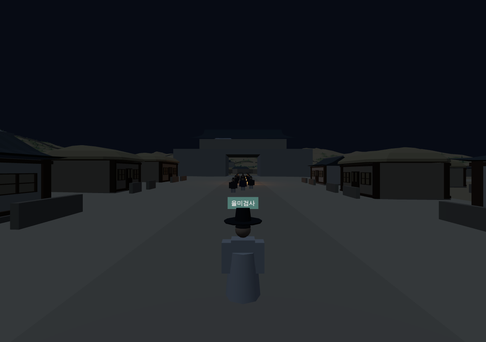
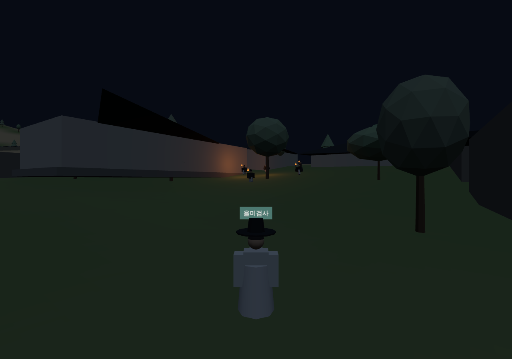
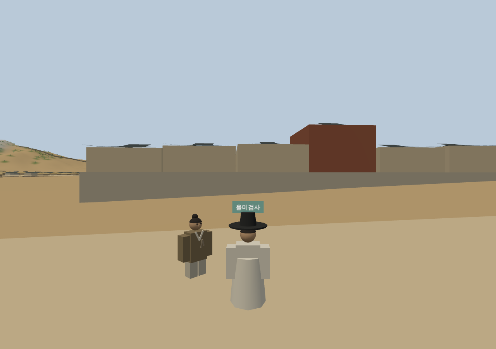

# 269 — 을미사변 회상: 밤 산책에서 저잣거리까지

[P03](20260923_P03_eulmi_to_agwan_questline.md) 설계대로 을미사변 회상(`/events/eulmi/`)을 만들었다. 아관파천 회상과 한 줄로 이어지는 퀘스트 라인의 앞부분이다.

## 흐름

1. **시작**: 1907년 광화문 앞 경복궁 관리인에게 「을미년 일을 들려주십시오」 → 그을린 노리개(창작 물건, 판매 불가)를 받는다. 봇짐에서 쓰면 "노리개를 쥐자 먼 데서 총소리 같은 것이 울리고…" 커튼 → "정신을 차려 보니 — 1895년 10월 8일 새벽, 서대문 안".
2. **밤 산책**: 서대문 안 골목의 야경꾼이 등불 든 무리가 들어왔다고 알려 준다.
3. **따라가기**(`shadow`): 무리 12명(등불 넷, 불빛 둘)이 돈의문 밖에서 문을 지나 들어와(아래 '사료 대조 후 조정') 돈의문 안 → 정동 길목 → 새문고개 → 개천 다리 → 황토현 → 육조거리 → 광화문 → 흥례문 동쪽 → 근정전·경회루 동쪽 → 향원지 동쪽 → 건청궁 앞(약 2.2 km, 확인 지점 15). 7 m 안으로 2.5초 붙으면 "누군가 뒤를 돌아보았다" 하며 골목 그늘로 물러나고, 55 m 넘게 떨어지면 무리가 멈춘다. 미니맵에 앞장선 등불이 표시된다.
4. **광화문**: 무리가 멈추고 문 앞을 막아선 이가 외친다 → 섬광 두 번 → 그가 쓰러진다 → "훈련대 연대장 홍계훈이었다고 한다" → 문이 열리고 무리가 들어간다. 멀리서 실루엣으로만.
5. **건청궁에 숨어서**(`hide`): 향원지 북쪽에 건청궁 개념 모형(담장·남문·전각 셋)을 두었다. 무리를 따라 문 안으로 들어가 남서쪽 어두운 구석(반경 3 m)에 몸을 숨긴다. 60초 동안 횃불 다섯이 흩어지고 모이고 떠나며, 문 부서지는 소리 → 궁녀들의 비명과 고함 → 누군가 막아서다 쓰러졌다는 외침 → 한 전각 앞에 몰린 횃불과 긴 침묵 → 무언가를 들고 동쪽 숲으로 → 여명과 연기가 문자로 전해진다. 시해 장면은 보이지 않는다. 구석을 벗어나면 진행이 멈추고, 4초 넘게 벗어나면 "횃불이 이쪽을 비추었다" 하며 되돌린다.
6. **이튿날 종로**: 커튼 "이튿날 · 종로 저자거리" 뒤 낮 조명, 종로 상가 사이에 선 포목전 상인·지게꾼·아낙·늙은 선비를 차례로 찾아가 소문을 듣는다(홍계훈 전사, 왜인 무리를 봤다는 말, 중전마마 소식 없음, 대원군 입궐과 새 내각). 확인된 사실에는 출처를 붙였다.
7. **후일담**: 1895-10-08 새 내각·왕후 폐위 조칙 강요, 1895-12-30 단발령과 을미의병, 1896-02-11 아관파천. 끝에 "넉 달 뒤… 1907년 정동 러시아공사관의 관리인을 찾아가 보시오"로 다음 회상을 안내한다(선행 조건으로 막지 않는다).

확인 지점은 야경꾼 1, 경로 15, 숨기 1, 저자 1로 모두 18이다. 당일·다음 날 대사는 1897년 추존 호칭 대신 '중전마마'를 쓴다. 창작·추정·확정의 범위는 화면 출처 설명(`note`)에 적었다.

## 틀 확장

- 모듈 `shadow`·`hide`, 공유 경로 도우미 `events/route.js`(procession도 이것을 쓴다. 막힌 구간 이름을 오류에 표시).
- 조명 프리셋에 이름(`start`·`dawn`·`day` 등)을 붙이고 즉시 전환·서서히 전환을 지원. 단계 `transition`(커튼·장소 이동·조명·민가 표시), `talks` 화자의 고정 자리(`pixel`·`stay`)와 물음표.
- 섬광 `flash`, 소리 단서 `cue`(정의의 `sounds`에 파일이 있고 보는 사람이 켰을 때만 재생 — 지금은 비어 있어 문자만), 다음 회상 안내 `next`, 저작용 통행 검사 `probe(px,py)`.
- 대화를 끝까지 마치면 다음 사람과의 대화 대기 시간을 없앴다(연달아 말을 걸 수 있게).
- 1907년 지도에 새문안 길과 백운동천이 만나는 자리의 다리가 없어, 정의에 체험용 추정 다리를 두었다. 경로 곁 민가 모형이 길이 0인 구간에서 NaN 정점을 만들던 문제도 고쳤다.

## 검증

Django 테스트 97개 통과(을미사변 확인 지점 18·꾸러미·다음 안내·아관파천 비선행 확인). 새 `scripts/terrain/check_eulmi_browser.py`: 노리개 없이 시작 거부 → 야경꾼 → 너무 붙으면 물러남 → 13.6분(모의 시간) 따라가기와 광화문 연출(멈춤·쓰러짐·홍계훈 문구) → 건청궁 구석, 벗어나면 되돌림, 타임라인·여명·연기 → 커튼 뒤 종로 낮, 네 사람 대화 → 확인 지점 18·후일담 3건·다음 안내 → 1907년 경복궁 관리인에게 노리개 받기·봇짐 사용·커튼 진입 후 1인칭으로 야경꾼 단계. 기존 아관파천 검사도 통과.

## 사료 대조 후 조정

사료는 무리가 도성 밖 공덕리에서 와서 서대문(돈의문)에서 훈련대와 합류해 광화문으로 갔다고만 전하고, 그 사이 거리 동선은 적지 않는다. 이를 반영해:

- 무리가 문 **밖**에서 출발한다. 경로 첫머리를 돈의문 바깥 문턱 → 문 → 안쪽 문턱 → 문 안으로 바꿨다(확인 지점은 모두 21).
- 플레이어가 돈의문 안쪽 30 m 안으로 다가가기 전에는 무리가 보이지 않고 문 밖에서 기다린다. 다가가면 "돈의문 밖에서 등불이 흔들린다 — 무리가 문을 지나 들어온다"와 함께 문을 지나 들어온다. 그 전에는 패널에 돈의문까지 남은 거리를, 미니맵에 문 자리를 보인다.
- 무리 속도 2.7 → 3.6 m/s(보통 걸음 3 m/s보다 빨라 가끔 달려야 한다). 따라가기 모의 시간 13.6분 → 10.5분. 놓침 판정 거리 55 → 70 m, 가장 가까운 사람 기준으로 잰다.
- 가마는 넣지 않았다.
- 출처 설명에 "서대문과 광화문 사이 거리 동선과 궁 안 경로는 사료로 확인한 것이 아니라 추정"을 더했다.

## 출발점을 새문고개로

체험 시간을 줄이려고 따라가기를 새문고개에서 시작한다. 들어가면 "새문안 길"에서 깨어나 동쪽의 야경꾼과 이야기하고, 서쪽 새문고개로 25 m 안까지 가면 무리가 서대문 쪽에서 고개를 넘어온다. 서대문 합류 장면은 보여 주지 않으며 출처 설명에 그렇게 적었다. 경로는 약 1.85 km(확인 지점 14), 전체 확인 지점 17. 따라가기는 모의 시간 8.5분(광화문 멈춤 10초 포함)이고, 야경꾼·새문고개까지 걷기·건청궁(약 1.5분)·저자 네 사람 대화를 더하면 한 번에 13~14분 정도다.

2026-09-23 웹 v0.5.48로 운영 반영했다([기록 270](20260923_270_deploy_v0548.md)). 건청궁 모형은 개념 표현이며 지붕 형태가 거칠다. 따라가기가 13분 남짓으로 길어 실제 체감에 따라 속도·경로를 조정할 수 있다.
