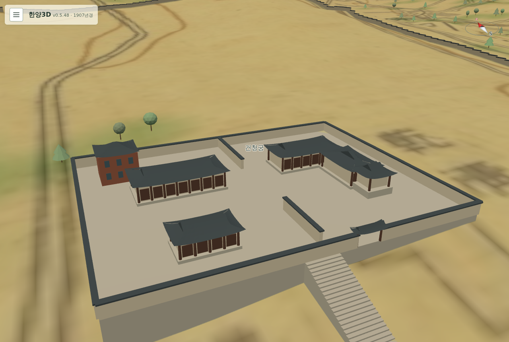
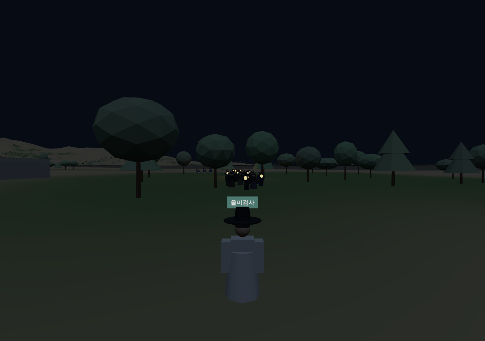

# 271 — 을미사변 회상 1차 수정: 1907년 거리, 건청궁, 저항, 무리

v0.5.48 을미사변 회상([269](20260923_269_eulmi_visit.md))을 해 본 사용자 요청을 반영했다.

## 1907년 거리를 그대로

경복궁 안과 육조거리에 회상용 추정 민가가 늘어서던 것을 없앴다. 회상 정의에 `retain_up_to_year: 1895`와 `show_settlement: true`를 두어 1907년 장면의 민가를 그대로 보이고, 1907년 건물 가운데 1895년에 이미 있던 것만 남긴다(건립 연도 미상은 남김, 1899년 전차 차고 같은 뒤의 건물은 숨김). 따라가기 모듈은 `neighborhood: false`로 경로 곁 추정 민가를 만들지 않는다. 같은 규칙을 지도 이름표에도 쓴다(`visitKeeps`).

## 건청궁

1907년 원도에서 향원지 바로 북쪽에 乾淸宮·觀文閣이 적힌 자리를 읽어 1907년 건물 `geoncheonggung-1907`로 추가했다(1873 건립·1909 철거, 1907년 장면에도 보인다). 단청 없는 사대부가 방식으로 서쪽 장안당, 동쪽 곤녕합과 남쪽으로 내민 옥호루, 복수당, 북서쪽 양관 관문각(1891)을 담장 안에 개념적으로 배치했다. 건물 수 191(1907년 77). 숨기 단계는 이제 이 건물을 담장·문·충돌 그대로 쓰며, 복수당 옆 구석에 숨으면 곤녕합 앞마당을 바라보도록 돌려 세운다. 지형 경사 때문에 기단이 높게 보이는 한계가 있다.

## 궁 안의 저항과 무기

따라가기 모듈에 '멈춤'(`stops`)을 일반화했다. 광화문에 이어 흥례문 동쪽(시위대 셋)과 경회루 동북쪽(창 든 병사 둘)에서 무리가 멈추고, 총을 든 이들이 겨누어 쏘며(총구 섬광), 막아선 병사들이 쓰러지고, 무리는 다시 간다. "궁 안 시위대가 저항했으나 무기의 열세로 곧 무너졌다"는 서술을 바탕으로 한 연출이다. 무리는 칼(기모노·하카마 차림)과 총(수비대·훈련대)을 든다.

## 무리

24명으로 늘리고 복식을 나눴다: 기모노·하카마 차림 11, 양복·중절모 3, 일본군 수비대(감청 군복·띠 두른 모자) 6, 훈련대 4. 구성·복식은 개념 표현이다. 세 명씩 줄지어 걷던 것을 흩어진 무리로 바꿨다: 사람마다 앞사람과의 간격·길 위 좌우 자리가 무작위이고 천천히 흔들리며, 발걸음도 어긋난다. 벽·물에 걸리면 길 가운데로 붙는다. 방향도 한 번에 꺾지 않고 서서히 돈다.

무리 가까이(16 m) 가면 가장 가까운 사람이 "誰かつけて来てないか？(누가 따라오는 것 같지 않나?)" 같은 말을 하고, 평소에는 10~22초마다 누군가 "冷えるな。(쌀쌀하군.)" 같은 잡담을 한다. 말풍선에 일본어와 번역을 함께 보인다. 대사는 창작이다.

## 경로

- 다리의 두 끝을 잇는 점이 연달아 있으면, 오는 쪽에 가까운 끝을 먼저 잡는다. 전에는 다리를 건넜다가 되돌아와 다시 건너는 경로가 생겼다.
- 경로를 매끄럽게: 격자 우회 구간을 통행 가능한 직선으로 당긴 뒤, 2 m 간격으로 다시 나누고 모서리를 세 번 둥글게 깎는다(깎은 점이 막히면 원래 점을 쓴다). 확인 지점은 매끈해진 경로에서 각 점에 가장 가까운 곳이다. 아관파천 행렬도 같은 경로 도우미를 쓴다. 검사 기준: 되돌아가는 곳 0, 2 m마다 방향 변화 최대 51°.

## 커튼 진행 막대

커튼이 드리워진 동안 장면 불러오기 단계를 진행 막대로 보인다(불러오기 카드의 단계와 문구를 따라감).

## 검증

Django 테스트 97개 통과. `check_eulmi_browser.py`에 1907년 거리 유지(민가 보임·추정 민가 없음·건청궁 있음·전차 차고 없음), 무리 구성 24명, 경로 모양, 말풍선(가까울 때 의심·평소 잡담), 멈춤 세 곳의 겨눔·섬광·쓰러짐, 커튼 진행 막대를 더해 통과. 아관파천 검사도 통과.

