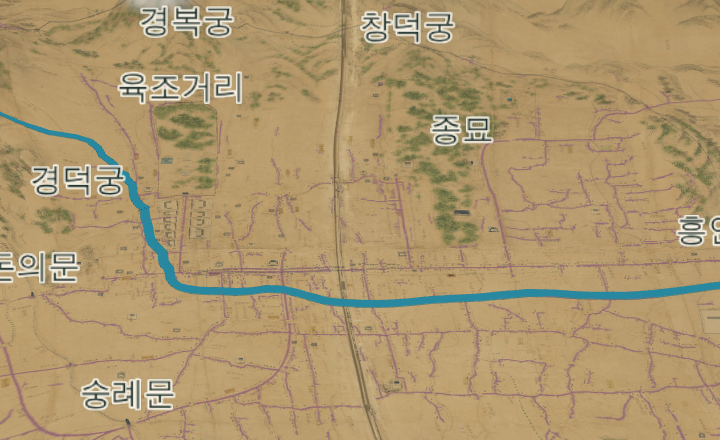
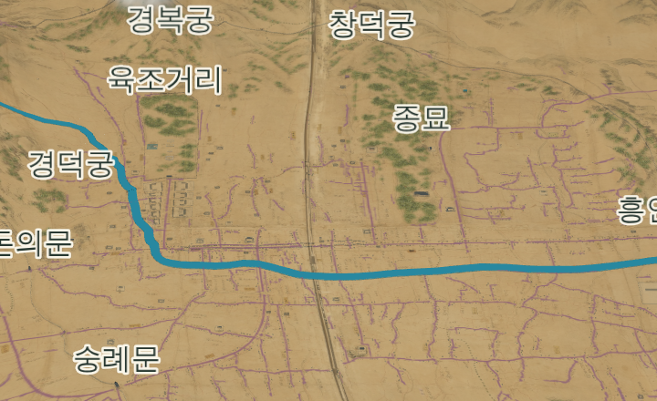

# 273 — 1750년 건물 이름을 1907년처럼 또렷하게

전체 시점에서 1907년 건물 이름은 또렷한데 1750년 이름은 흐릿하다는 지적을 확인했다.

## 원인

두 장면이 이름을 그리는 방식이 다르다. 1907년은 HTML 글자(`.building-label`, 16px)를 화면 위에 얹는다. 1750년은 이름을 캔버스 텍스처로 그려 3D 장면 속 스프라이트로 띄운다(`terrain3d.js`의 `nameSprite`). 이 텍스처가 높이 36px 캔버스에 24px 글꼴로 그려진 뒤 화면에서 24 CSS px 높이로 표시됐다. 고밀도 화면(기기 배율 2)에서는 48 기기 픽셀로 늘어나 확대되며 흐려졌고, 밉맵 필터링도 글자를 한 번 더 뭉갰다.

## 수정

- 텍스처를 렌더러의 픽셀 밀도(`renderer.getPixelRatio()`, 최대 2)로 그린다. 글꼴 16×k px, 캔버스 높이 24×k px라서 화면의 한 픽셀에 텍셀 하나가 대응한다. 화면상 크기(24px 칸에 16px 글자)는 이전과 같고 1907년 HTML 이름과도 같다.
- 밉맵을 끄고 선형 필터만 쓴다.
- 글자 둘레 흰 테두리 두께를 밀도에 맞췄다.

동네 이름·육조거리·산 이름 등 1750년 장면의 모든 이름표가 같은 함수를 쓰므로 함께 또렷해진다.

## 확인

기기 배율 2 브라우저에서 같은 시점을 수정 전후로 찍어 비교했다(아래). 수정 후 1907년 이름과 선명도가 비슷하다. 텍스처 크기에 의존하는 검사는 없다.

수정 전 · 후:

2026-09-23 웹 v0.5.50으로 운영 반영했다([기록 275](20260923_275_deploy_v0550.md)).
