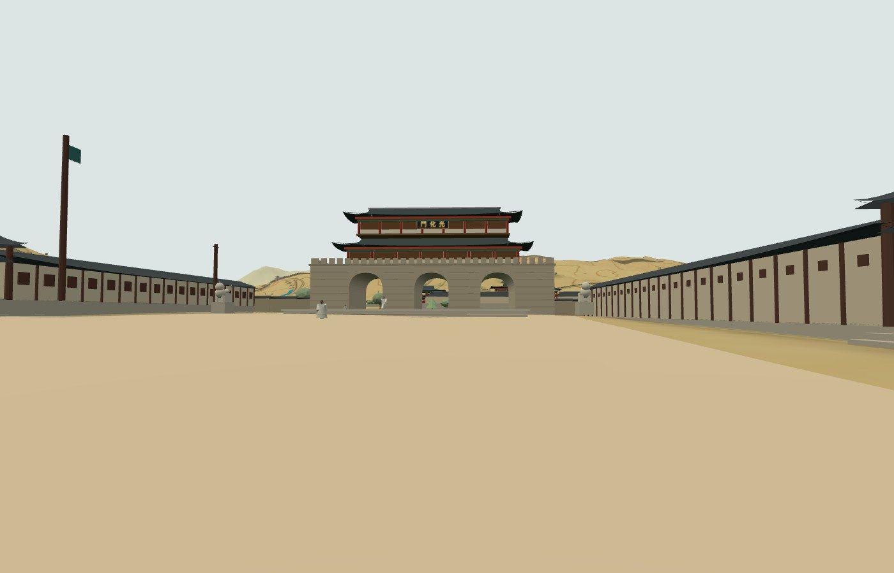

# 285 — 1907년 육조거리 정비

[P04](20260926_P04_yukjo_street_1907.md)를 진행했다. 근거 사진은 [docs/gwanghwamun_photo_sources.md](../docs/gwanghwamun_photo_sources.md), 사진과 모형 비교는 사진첩 페이지에 올렸다.

## 원도 판독과 배치

- 1907년 원도(1 px ≈ 2.08 m)에서 육조거리 양쪽 블록의 길 쪽 경계를 x≈743(서), x≈771(동)로 읽었다. 길 폭은 약 58 m다.
- 관아 10곳의 중심·크기를 원도 블록에 맞추고 전면을 길가에 붙였다. 길을 따른 길이는 블록 길이(42~150 m), 깊이는 73~110 m(추정).
  - 서쪽: 근위대대(원도 侍衛第一大隊 블록), 경시청·군부·법부(원도 한 블록 안의 警·軍·法 표기와 같은 순서), 통신관리국(원도 通信管理局).
  - 동쪽: 내부(원도 內部), 법무원·학부·탁지부(원도 學部·度支部·地契衙門 블록, 맨 위 표기는 판독이 불분명), 법관양성소(원도에는 農商工部).
- 기관명과 남북 순서는 기존대로 국가기록원 광화문외제관아실측평면도(1907~1909 추정)를 따랐다. 원도(1907년 초)와 다른 곳은 각 권역 `note`에 원도 표기를 적어 두었다. 원도 서쪽 두 번째 블록(憲兵司令部)은 실측평면도 기관 목록에 없어 비워 두었다.
- 기존 건물 키를 그대로 두고 위치·크기만 바꿨다(동기화에서 '갱신'). 새 건물은 없다.

## 모형

- `government_compound`: 길 쪽 전면 전체를 행랑(깊이 5 m)으로 막고 가운데에 솟을대문(너비 7 m)을 뒀다. 동쪽(`street_front: high`)은 높이 4.2 m에 작은 창이 위쪽에 줄지은 행랑(도판 4544), 서쪽(`low`)은 3.2 m에 살창 행랑. 옆·뒤 담으로 마당을 닫고, 주전각은 대문 축에 마당(최대 22 m) 뒤로, 긴 블록에는 옆 전각을 둔다. 먼 거리용 모형(`lod1907.js`)도 같은 틀로 바꿨다.
- 서쪽 관아 앞에 전신주 줄(1906년 사진), 근위대대 대문 옆에 깃대(1890년대 사진의 서쪽 깃대)를 뒀다. 전신주는 대문 앞 경비병 자리를 피한다.
- 광화문(`forecourt`): 문 앞 낮은 월대(너비 29.7 m, 길이 48.7 m, 높이 0.6 m, 2023년 복원 치수 참고, 걸어 오를 수 있음)와 대좌 위 해태 한 쌍(문 앞 좌우 21 m, 남쪽 52 m). 해태 대좌는 충돌 영역(`extraBlockingRects`, `walk1907.js`)으로 막는다.
- 동·서십자각은 자리를 확정하지 못해 미뤘다. 1750년 육조거리 부재를 공통 모듈로 꺼내는 일은 하지 않았다. 두 시대 모형의 기준 좌표와 일괄 병합 방식이 달라 위험이 크고, 1907년 모형 안에서 사진과 맞출 수 있었다.
- 권역 설명(데이터·안내 문서·영어)을 새 근거에 맞게 고쳤다. 운영 DB의 기존 안내 문단은 동기화가 덮어쓰지 않으므로, 운영 반영 뒤 백오피스에서 따로 맞춰야 한다.

## 확인

- `check_minimap_landmarks_browser.py`: 1907 관아 10곳 대문 통과·옆 담 막힘(새 전면 위치로 검사 기준 수정), 1750 관아 7곳, 광화문 관리인까지 통과.
- `check_eulmi_browser.py` 전체 통과(무리 경로, 광화문 앞 경비병 9명, 관리인 입장, 다시 들어가기).
- `check_1907_stairs_browser.py`: 관아 10곳 진입 계단 통과. 운현궁은 서쪽 담 대문이라 일반 검사에서 빼고 전용 검사로 본다. 이화학당 본관 실패는 기존 문제.
- 사진 자리 카메라 캡처로 모펫 사진·도판 4544와 비교했다. `manage.py test` 97개 통과.

2026-09-26 웹 v0.5.53으로 운영 반영했다([기록 286](20260926_286_deploy_v0553.md)).
