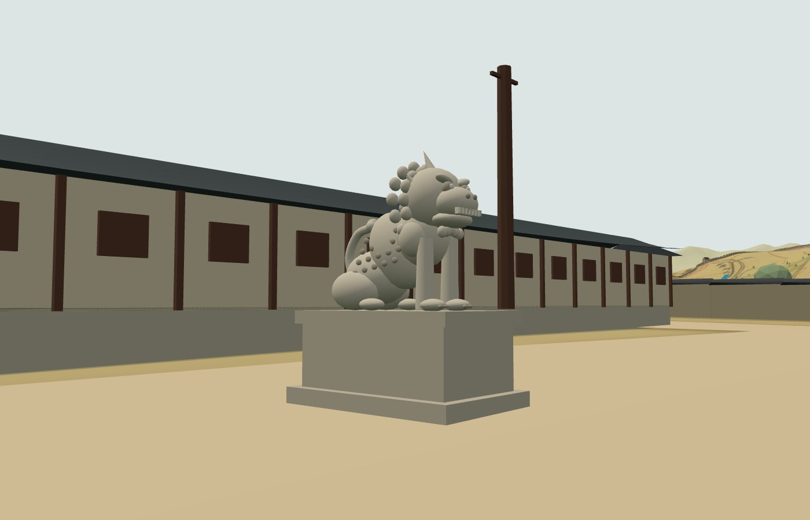

# 287 — 광화문 해태 다듬기

- 방향: 해태 한 쌍이 남쪽을 보던 것을 길 가운데를 서로 마주 보게 돌렸다. 1890년대 모펫 사진에서 두 해태가 모두 옆모습으로 보인다.
- 모양: 상자와 공 몇 개이던 것을 앉은 해태로 다시 만들었다(`createHaetae`, `landmarks1907.js`).
  - 받침: 층진 대좌(굽·몸·띠·덮개돌).
  - 몸: 곧게 버틴 앞다리와 어깨, 접은 뒷다리, 가파르게 솟은 가슴.
  - 머리: 큰 머리, 굵은 눈썹과 튀어나온 눈, 넓은 코와 이를 드러낸 입, 귀, 뒤로 휜 뿔 하나.
  - 장식: 얼굴 둘레와 목덜미의 곱슬 갈기, 턱수염, 옆구리 비늘, 등 위로 말아 올린 꼬리.
  - 조각을 닮게 만든 개념 모형이지 실물 복제는 아니다.
- 성능: 해태 한 마리가 작은 도형 약 150개라, 만들 때 재질별로 하나의 메시로 합쳐 그리기 호출을 3개로 줄였다.
- 충돌: 대좌 방향에 맞춰 막는 영역을 바꿨다(길을 따라 1.9 m, 길을 가로질러 3 m).

## 확인

- 해태 근접·측면과 모펫 사진 자리에서 캡처해 확인했다.
- `check_minimap_landmarks_browser.py`의 관아 10곳과 광화문·관리인 검사를 통과했다.

2026-09-26 웹 v0.5.54로 운영 반영했다([기록 288](20260926_288_deploy_v0554.md)).
