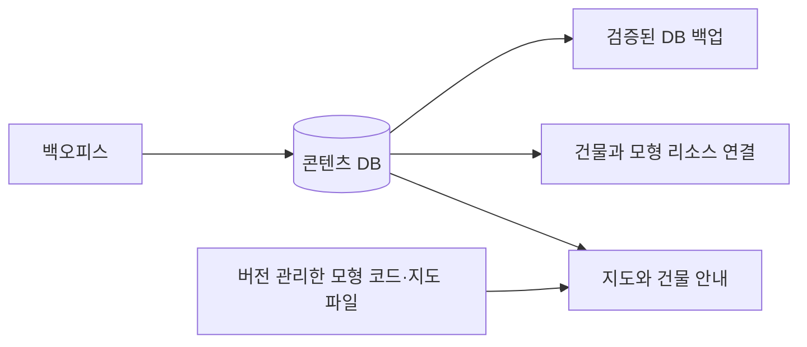

# 콘텐츠 DB와 백오피스

## 현재 범위

한양3D 전용 관리 화면은 `/office/`에서 모듈별로 만들고 있다(설계: [office_design.md](office_design.md)). 아래 Django 관리 화면은 편집 도구로 유지한다.

로컬과 운영 웹 v0.3.0은 SQLite DB이며 관리 화면은 `/backoffice/`다. 최초 가져오기로 건물 103곳, 이야기 33편, 상세 설명 102개, 리소스 110개(모형 생성기 15개 + 공개 파일 95개)를 등록한다.

- **건물 목록**: 이름·분류·짧은 소개·존재 시기·1750년 설명·공개 여부·표시 순서·모형 연결. 고정 ID는 생성 후 백오피스에서 바꾸지 않는다.
- **건물 상세 설명·안내**: 기존 안내 문서의 제목·문단·목록·표·출처를 보존한 Markdown. 건물의 ‘상세 설명’ 연결에서 편집 화면으로 이동한다. 여러 건물을 함께 설명하는 절은 공유한다. 건물 카드의 짧은 소개와 안내 페이지의 긴 설명은 별도 필드다.
- **장소 이야기**: 건물 외래 키 또는 실제 다리·동네 선택, 연도·본문·설화 표시·출처·공개 여부. 공개할 때 출처가 필요하다. 비공개 건물에 연결된 이야기는 공개 지도에서도 제외한다. 상세 설명 절은 별도 공개 여부로 관리한다.
- **리소스 목록**: 파일 경로·종류·출처·이용 조건·설명과 건물 모형 생성기. 파일 본문은 DB에 넣지 않는다. 현재 JavaScript 모형 코드는 버전 리소스로 유지하고 DB에는 모형 선택과 매개변수를 둔다.
- **물건·가격, 가게**: 물건마다 이름·단위·값(문)·설명·아이콘·쓰임(말 타기)·최대 보유 수·공개 여부, 가게마다 소개와 파는 물건. 물건 목록에서 값과 공개 여부를 바로 고칠 수 있다. 거래와 지도 가게 창은 이 값을 서버에서 읽는다. 처음 값은 migration `0004_items_shops`가 `gis/characters/npcs.json`에서 한 번 가져온다. 대화 문장과 처음 엽전(`wallet`)은 JSON에 남는다.
- **영어**: 건물·이야기·안내·물건·가게·출처마다 영어 열이 있다(‘영어’ 접이식 묶음). 비어 있으면 영어 화면에도 한국어가 나온다. Git의 `_en` 자료와 `docs/landmarks_en.json`은 `sync_content`가 한국어와 같은 규칙으로 반영한다.
- **권한·기록**: Django 관리자 인증·staff 및 모델별 권한, CSRF, 관리자 변경 이력. 공개 사용자는 수정할 수 없다. 기본 관리자 계정이나 고정 비밀번호는 만들지 않는다.

리소스 목록은 기존 공개 파일의 카탈로그다. 임의 서버 경로 공개, 실행 코드 업로드, 외부 GLB 업로드·뷰어는 이번 범위에 포함하지 않는다. 새 모형 생성기는 코드와 리소스 등록을 추가한 뒤 배포한다. 동일 모형을 쓰는 여러 건물은 리소스 하나에 연결된다.

## 구성



## 로컬 시작

```bash
.venv/bin/python manage.py migrate
.venv/bin/python manage.py import_content --dry-run
.venv/bin/python manage.py import_content
.venv/bin/python manage.py createsuperuser
.venv/bin/python manage.py runserver 127.0.0.1:18014 --noreload
```

로그인 주소: `http://127.0.0.1:18014/backoffice/`. 기본 DB는 `data/content.sqlite3`이며 Git·Docker 이미지에 포함되지 않는다. 서버 재시작 뒤에도 로그인 상태를 유지하려면 로컬에서도 `DJANGO_SECRET_KEY`를 고정된 비밀 환경 변수로 설정한다.

`HANYANG_DB_PATH`로 DB 경로를 지정할 수 있다. 콘텐츠 모드는 `HANYANG_CONTENT_SOURCE=database|files`다. DB 모드에서는 오류가 나도 파일 자료로 조용히 되돌아가지 않는다. 초기화되지 않은 DB는 readiness 검사에서 실패한다. `files`는 기존 릴리스 호환용이다.

DB에서 공개한 변경은 다음 지도·안내 페이지 요청부터 반영된다. 이미 열어 둔 지도는 새로고침해야 한다. 콘텐츠는 HTML에 포함하며 장기 캐시하는 버전 리소스 URL로 제공하지 않는다. 모형 코드·지형 파일의 기존 캐시 정책은 유지한다.

## 초기 데이터와 운영 데이터의 경계

`import_content`는 빈 콘텐츠 DB에서만 실행된다. 트랜잭션 하나에서 JSON과 안내 문서를 모두 검증해 가져온 뒤 완료 표시를 기록한다. 완료 표시가 있으면 이후 실행은 아무것도 바꾸지 않는다. 기존 콘텐츠가 있는데 완료 표시가 없으면 덮어쓰지 않고 실패한다. `--replace` 기능은 없다.

가져온 뒤부터 DB가 콘텐츠 정본이다. Git의 건물·이야기 JSON과 `npcs.json`의 물건·가게 수정은 `manage.py sync_content`(미리보기, `--apply`로 저장)가 반영하며, DB 모드 `deploy.sh`가 가져오기 뒤에 `--apply`로 실행한다. 마지막 동기화 이후 운영에서만 바뀐 항목은 유지하고, Git과 운영이 모두 바꾼 항목은 충돌로 보고만 한다. 첫 동기화 전에는 가져온 뒤 저장된 적 없는 항목을 편집되지 않은 것으로 본다. `docs/landmarks.md` 안내 문단은 차이 수만 보고하고 바꾸지 않는다. 출처·좌표·표시 순서와 기존 안내 문단을 초기 자료와 비교하는 테스트를 둔다. 지도 모형의 원도 좌표·치수·고증 상태는 건물의 고급 JSON 설정에 그대로 보존한다.

계정·세션을 제외한 콘텐츠 내보내기:

```bash
.venv/bin/python manage.py export_content /tmp/hanyang-content.json
```

새 파일에만 저장하며 덮어쓰지 않는다. 이 JSON은 콘텐츠 이동용이고 전체 DB 백업을 대신하지 않는다. `loaddata`는 기존 운영 DB를 덮어쓸 수 있으므로 **새 빈 DB의 복원·검증에만** 사용한다.

## 컨테이너의 DB 모드

2026-09-15 운영 웹 v0.3.0을 DB 모드로 전환했다. [운영 백오피스](https://hanyang3d.nopeoplestime.info/backoffice/)의 관리자 계정과 초기 비밀번호는 개발 호스트의 Git 제외 파일 `.env.admin`(권한 600)에 전달하며 운영 문서나 저장소에 기록하지 않는다. 로그인 화면은 Nginx가 IP당 분당 10회(버스트 5)로 제한한다. 첫 로그인 후 관리자 화면에서 비밀번호를 변경할 수 있다. Docker 이미지 자체의 기본값은 기존 배포 호환을 위해 `files`다.

DB 전환 시 `deploy/host/docker-compose.content.yml`을 기본 Compose와 함께 사용한다. `/srv/hanyang3d/content`만 `/content`로 쓰기 마운트하며 원본 지도 `/runtime`은 계속 읽기 전용이다. 백업 디렉터리는 웹 컨테이너에 마운트하지 않는다.

1. 운영 비밀 설정과 기존 호스트 파일을 접근 제한된 위치에 백업한다. 기존 `.env.django`의 비밀키·허용 호스트를 보존한다.
2. 호스트에서 `/srv/hanyang3d/content`를 UID/GID 10001의 쓰기 가능한 디렉터리로 준비한다(예: 소유자 10001:10001, 모드 750). DB 폴더와 비밀 파일은 이미지·지도 데이터 묶음과 분리한다.
3. `.env`의 다른 항목을 보존하면서 `COMPOSE_FILE=docker-compose.yml:docker-compose.content.yml`을 지정한다. 새 이미지와 content override 파일을 먼저 준비해야 한다.
4. 웹 컨테이너를 중지한 상태에서 **새 이미지의 일회용 컨테이너**로 `migrate`, `import_content`, `createsuperuser`를 실행한다. 호스트 Django로 운영 DB를 쓰지 않는다.
5. 웹을 시작하고 `/healthz`의 `content_source=database`, 건물 103·이야기 33, `/backoffice/` 로그인과 편집 반영을 확인한다. 멀티플레이는 이 DB를 사용하지 않는다.

예시(운영 루트에서, 위 준비 완료 후):

```bash
docker compose stop hanyang3d
docker compose run --rm --no-deps --entrypoint python hanyang3d manage.py migrate --noinput
docker compose run --rm --no-deps --entrypoint python hanyang3d manage.py import_content
docker compose run --rm --no-deps --entrypoint python hanyang3d manage.py createsuperuser
docker compose up -d --no-deps --wait hanyang3d
```

이후 DB 모드의 `deploy.sh <웹 버전> [멀티플레이 버전]`는 **웹 중지 → 기존 DB 검증 백업 → 새 이미지의 일회용 컨테이너 migrate·최초 가져오기 → 웹 시작 → 확인**을 수행한다. 가져오기 완료 표시가 있으면 편집 데이터를 그대로 보존한다. 일반 시작 스크립트는 미적용 migration을 검사하고 거부하며 자동 migration을 하지 않는다. DB 스키마 롤백은 별도 검토·복원이 필요하며 이전 이미지로의 복귀가 DB까지 되돌리지는 않는다.

[백업과 복원](content_backup.md)의 매시·일간·NAS 보관을 운영에 설치하고 실제 사본을 검증했다. 멀티플레이 이미지 태그는 v0.2.4로 유지하며 일반 웹 배포와 분리한다.

## 장면 데이터만 갱신

1907년 도로·민가·인물·보행·전차와 건물 배치 갱신은 [데이터 갱신 절차](scene_data_updates.md)를 따른다. 최초 기능 배포 후에는 이미지 재빌드 없이 DB 데이터를 교체할 수 있다.
