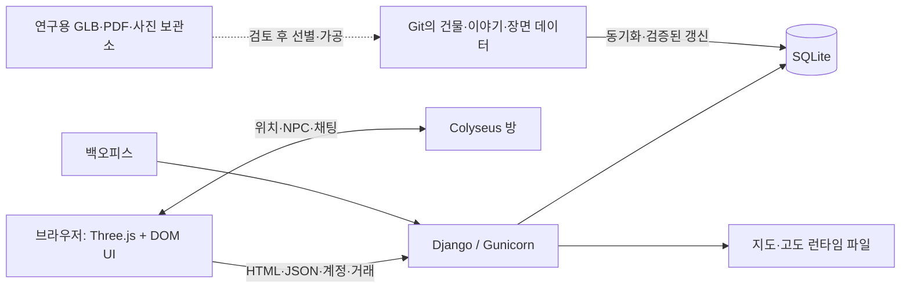

# 한양3D 기술 현황과 Steam 전환 검토

작성일: 2026-09-20  
코드 기준: `3efb678` — 영추문 추가·숭례문 현판 수정까지  
배포 설정 기준: 웹 `v0.5.35`, 멀티플레이 `v0.5.31`  
문서 성격: 저장소 실사와 공식 플랫폼 문서에 근거한 기술 평가 및 초기 공수 추정

## 1. 의사결정 요약

**Three.js를 유지한 채 Steam용 데스크톱 게임으로 전환하는 것이 가능하다.** 현재 규모와 표현 수준을 유지한다면 엔진 전체 교체보다, Windows용 Electron 실행기와 배포 가능한 게임 데이터 패키지를 먼저 만드는 편이 적은 작업으로 검증할 수 있다. 다만 실행 파일을 만드는 작업과 판매 가능한 게임으로 완성하는 작업은 별개다.

현재 한양3D는 **두 시대의 역사 도시 탐색에 생활형 상호작용과 소규모 멀티플레이를 더한 웹 게임**이다. 도시, 이야기, 이동·생활 기능은 상당 부분 존재한다. 반면 독립 실행·오프라인 저장·Steam 계정 연동·게임패드 조작·출시 품질 보증은 아직 없으며, 퀘스트 진행기는 설계 단계다.

Windows 우선, 현재의 단순화된 시각 표현, 기존 서버 유지, 대규모 콘텐츠 추가 제외를 전제로 한 판단은 다음과 같다. 공수는 아래 8절에서 산정한다.

| 목표 | 총 예상 공수 | 숙련 개발자 1명 전담 시 작업 기간 환산 |
| --- | ---: | ---: |
| 실행 가능성 검증용 Windows 프로토타입 | 5~10인일 | 1~2주 |
| 온라인 필수 Steam 초기 출시판 | 40~70인일 | 8~14주 |
| 기본 생활 기능까지 오프라인 가능한 출시판 | 70~120인일 | 14~24주 |
| Godot/Unity 등으로 현재 기능·표현 수준 이식 | 160~280인일 | 32~56주 |

기간은 1인일=8시간, 주 5인일의 단순 환산이며 출시일 약속이 아니다. 권리 허가 대기, Steam 대기·심사, 외주 제작, 지원 OS 확대는 별도다. 추정 신뢰도는 웹 유지안 ‘중간 이하’, 엔진 이식안 ‘낮음’이다. Windows 패키지와 실제 대상 PC를 아직 시험하지 않았으므로 첫 5~10인일 검증 뒤 재산정해야 한다.

가장 먼저 해결할 선행 조건은 **FABDEM의 상업 이용 권리**다. 현재 지형 원본은 CC BY-NC-SA 4.0이며 공개 라이선스에 상업 이용이 포함되지 않는다. 유료 Steam판은 별도 이용 허가 또는 상업 이용 가능한 고도 자료로의 교체를 먼저 결정해야 한다. 공식 제공처도 상업 이용 문의를 별도로 안내한다. [University of Bristol — FABDEM V1-2](https://research-information.bris.ac.uk/en/datasets/fabdem-v1-2/)

## 2. 조사 기준과 한계

- 실제 확인: 의존성 고정 파일, Django 모델·URL, Three.js 모듈, Colyseus 방 구현, GIS JSON, 에셋 manifest, Docker 설정, 기존 검증 스크립트.
- 수량은 **저장소 파일 기반 초기 데이터**다. 운영 DB에서 편집한 항목 수와 동일하다고 보장하지 않는다.
- 배포 버전은 저장소 배포 설정 및 직전 작업 기록 기준이다. 이 보고서 작성 중 운영 서버를 다시 조회하거나 배포하지 않았다. 영추문 등 최신 커밋의 내용은 운영판과 차이가 있다.
- 다운로드 중인 `aks_objects_manifest.json`의 로컬 상태를 읽었다. 이 파일의 별도 변경을 보고서 커밋에 포함하지 않는다. 다운로드 수량은 시점에 따라 달라진다.
- 기존 문서에는 오래된 수치가 있다. 예를 들어 `multiplayer/README.md`의 일부 문단에는 정원 32명이 남아 있지만, 현재 `room.js`의 기본 제한은 10명이다. ‘로그인 미구현’이라는 과거 설명 역시 현재 Django 계정 구현과 다르다. 이 보고서는 코드를 우선했다.
- 이번 작업은 현황 조사다. 전체 테스트 재실행, FPS·GPU 메모리 측정, 동시접속 부하 시험, Steam 실기기 시험을 수행한 성능 인증 보고서가 아니다.

## 3. 기술 스택과 구성

| 계층 | 현재 기술·버전 | 역할과 근거 |
| --- | --- | --- |
| 3D 렌더링 | Three.js **0.180.0**, WebGL | 로컬 vendor 배포·import map. `webapp/static/vendor/three/README.md` |
| 게임 클라이언트 | JavaScript ES modules, HTML, CSS | React/Vue 등 UI 프레임워크 없이 DOM UI와 Three.js 장면을 직접 구성. 자체 JS 모듈 61개 |
| 2D 조사 도구 | Leaflet 1.9.4 로컬 vendor | GIS 검토 화면 계열. 주 게임의 3D 렌더러와 별도 |
| 웹·계정·콘텐츠 | Django **5.2.17**, Python **3.12** 컨테이너 | HTML 초기 데이터 주입, API, 백오피스, 콘텐츠 관리 |
| HTTP 앱 서버 | Gunicorn **25.1.0** | Django 운영 실행 |
| 영구 저장 | SQLite | 건물·이야기·물품·계정·거래·생활 기능 상태 |
| 실시간 서버 | Node.js >=22.12, Colyseus core **0.18.14**, ws-transport **0.18.2**, SDK **0.18.2**, Express **5.2.1** | 위치·NPC 스냅샷·채팅. `multiplayer/package.json` |
| 자료 가공 | Python, NumPy **2.5.3**, Pillow **12.3.0** | 지도 이미지, 고도 격자와 좌표 자료 가공 |
| 배포 | Docker / Compose, nginx / HTTPS | 웹·멀티플레이 별도 이미지, 외부 런타임 데이터와 SQLite 보존 |
| 검증 | Django 테스트, Node 내장 테스트, Playwright | Django 테스트 파일 8개, `scripts/terrain/check*browser.py` 62개. 파일 수이지 테스트 케이스 수는 아님 |

버전은 `requirements.txt`, `deploy/requirements.txt`, `multiplayer/package.json`, 로컬 vendor 기록의 고정값이며 최신 버전을 추천하는 목록이 아니다.

Django가 게임에 필요한 초기 JSON을 템플릿에 넣는 부분이 있으므로, 정적 HTML 파일을 복사하는 것만으로 독립 실행판이 되지는 않는다. 이를 장면 부트스트랩 데이터로 내보내거나 API에서 읽도록 분리해야 한다. 현재 `/1907/`와 1750년 화면은 별도 진입 코드가 있고, 이동·대화·거래 등의 공통 모듈을 공유한다.

## 4. 구현 범위

| 영역 | 현재 구현 | 범위·한계 |
| --- | --- | --- |
| 역사 도시 | 1750년경 한양·1907년경 경성, 옛지도 오버레이와 지형 | 연속적인 모든 연도 시뮬레이션은 아님. 건물별 연대 데이터와 장면의 시대 선택을 구분해야 함 |
| 공간 정합 | 고지도 기준점·변환, 현대 고도 기반 지형, 산·하천 위치 보정 | 현대 고도는 과거 지표의 실측 복원이 아님. 수작업 추정 배치 포함 |
| 환경 | 산·화강암 표현·수목·청계천·교량·도로·성곽·궁장·민가 | 수목·민가의 상당 부분은 규칙에 따른 생성. 모든 필지의 개별 복원 아님 |
| 랜드마크 | 파일 기준 1750년 114개, 1907년 76개, 총 190개 | 하나의 레코드가 건물군·터·표석일 수도 있음. 모두 서로 다른 정밀 모델 190개라는 의미는 아님 |
| 실내·접근 | 명동성당 실내, 회동서관 책장·실내, 일부 관청 안뜰, 계단·기단 접근 | 모든 건물의 내부가 구현된 것은 아님. 건물 유형별 수작업 충돌·높이 조정 |
| 보행·승마 | 1인칭, 점프, 말 타기·내리기, 속보·Shift 갤롭, 말·기수 애니메이션 | 자체 운동·충돌 규칙. 범용 물리 엔진이나 말의 생체역학 시뮬레이션 아님 |
| 인물 | 행인, 상인, 경비병, 관리인, 신부, 기도하는 사람, 낚시꾼, 취객 등 | 단순 도형과 관절 변환으로 표현. 모션캡처·고급 행동 트리 기반 군중 아님 |
| 대화 | 말풍선·장문 이야기·선택지·건물 설명·출처 링크 | 작성된 대사 기반. 생성형 AI 대화 서비스는 확인되지 않음 |
| 생활·경제 | 물건 구매·판매, 엽전, 16칸 가방 UI, 액션바, 말고삐·낚싯대 사용 | 현재 가격은 놀이용 값. 경제 균형·장기 성장 설계는 별도 |
| 낚시·채집 | 10초 낚시 진행, 여러 물고기, 여러 약초·재생성·판매 | 서버에 낚시·채집 상태 모델이 있으나 세계 전체 이동까지 서버 권위화한 구조는 아님 |
| 전차 | 1907년 노선·레일, 움직이는 차량·운전수·승객, 행인 회피, 설명 | 자유 탑승·운전 게임으로 완성된 체계라고 볼 수 없음 |
| UI | 시대·설정 메뉴, 큰 지도 M·위치·랜드마크, 미니맵, 3D 나침반, 채팅, 화면 위젯 숨김 | 키보드·마우스와 모바일 터치 중심. 게임패드 전용 탐색은 미구현 |
| 멀티플레이 | 같은 공간의 캐릭터·NPC 상태 공유, 문자 채팅 | 소규모 함께 걷기. MMO·서버 권위 전투·플레이어 거래 시스템 아님 |
| 언어 | 한국어·영어 필드와 UI 번역 경로 | 전체 문구의 전문 번역·상용 QA 완료를 의미하지 않음 |
| 운영 | 계정·백오피스·콘텐츠 동기화·데이터 별도 갱신·백업·이미지 롤백 | Steam 설치·업데이트·고객 PC 로그 수집 체계는 아직 없음 |

**아직 설계·조사 단계:** 심부름 진행기, 아관파천 이벤트, 장기 퀘스트·업적, 시대에 따른 공유 세계 변화, 당시 음악 활용. 아관파천은 [P02 설계](../devlog/20260920_P02_agwanpacheon_event.md)에 정리되어 있고 영추문은 그 선행 건축물이다. 조사된 역사 사건의 개수를 플레이 가능한 이벤트 개수로 세면 안 된다.

현재 사용자에게 제공되는 기본 순환은 ‘도시 탐색 → 장소·NPC 이야기 → 생활 활동 → 물건·돈 → 탐색’이다. 판매할 게임의 목표가 역사 탐방이면 이를 다듬는 쪽이 가깝고, 퀘스트 중심 RPG라면 진행·보상·실패·저장·튜토리얼을 추가하는 제품 개발이 필요하다.

## 5. 에셋과 콘텐츠

### 5.1 실제 실행에 사용하는 에셋

- **자체 절차 생성 건물:** `gate.js`, `palace.js`, `throne_hall.js`, `landmarks1907.js`, `cathedral1907.js`, `bookshop1907.js` 등이 코드로 geometry/material을 생성한다. 재사용 가능한 유형과 개별 건물 특화 모형이 혼재한다.
- **사람·말·수목·전차:** 단순 메시, InstancedMesh, 코드 애니메이션. 제작 연도가 2020~2022인 외부 스캔을 그대로 과거 장면에 사용하는 방식이 아니다.
- **지형·지도:** FABDEM 가공 격자, 도성대지도·최신경성전도 파생 이미지, 기준점과 보정 자료. 주요 경로는 `gis/georeferenced/`, `gis/control_points/`와 `data/maps/`다.
- **장면 배치:** 건물·도로·성벽·식생·민가·보행·전차 JSON. 1907년 장면 데이터 5종은 `SceneDataset`으로 운영 DB에서 관리한다.
- **문헌·대사:** 건물마다 설명·연대·출처, 공통 장소 이야기 49건, 1907년 이야기꾼 배치 레코드 21개. 별도 조사 파일에는 사건 31건과 이야기 후보 24건이 있으며 런타임 이야기와 중복될 수 있다.
- **경제 콘텐츠:** 공통 NPC 초기 파일에 물품 25종·가게 9개 정의. 1907년 상인 배치 12개는 가게 정의 수와 다른 단위다.
- **소리:** 자체 게임 JS에서 오디오 재생 체계가 확인되지 않았다. Three.js 라이브러리에 Audio 클래스가 들어 있다는 사실은 음악·효과음 구현을 뜻하지 않는다. 발소리·환경음·말·전차 소리·오디오 설정은 출시 작업으로 잡는 편이 적절하다.

공간 자료와 이야기·출처·연대 데이터가 재사용 가치가 높은 핵심 자산이다. 반대로 Three.js의 DOM 이벤트, 메시 생성 코드, 충돌 처리와 UI는 다른 게임 엔진에서 바로 실행할 수 없다.

### 5.2 확보한 연구용 자료

2026-09-20 로컬 manifest를 읽은 시점의 수량이다. `verified`는 파일 검증 상태이며 **상업 이용 허가·고증 적합성·실행 성능 검증을 의미하지 않는다**.

| 분류 | 목록 URL | 검증 완료 | 기타 | 보관 경로 |
| --- | ---: | ---: | --- | --- |
| AKS 건축 GLB | 1,034 | 1,015 | 실패 19 | `data/models/aks-hanyang/glb/` |
| AKS 복식 | 414 | 407 | 실패 7 | `data/models/aks-hanyang/costumes/` |
| AKS 물품 | 609 | 603 | 실패 6 | `data/models/aks-hanyang/` 아래 manifest 지정 경로 |
| AKS 음식 | 180 | 0 | 목록만 확보 180 | 향후 취득 대상 |
| AKS PDF | 92 | 92 | — | `data/texts/aks-hanyang/pdf/` |

근거: [건축 manifest](aks_architecture_manifest.json), [복식·물품·음식 manifest](aks_objects_manifest.json), [PDF manifest](aks_pdf_manifest.json). 한 URL당 한 건이며 역사적 건물·물품의 고유 개체 수와 같지 않다.

파일의 논리적 크기를 합산하면 `data/` 전체 약 **218.60GiB**, 그중 `data/models/` 약 **208.06GiB**다. 이는 연구 보관소 크기다. **게임 설치 용량이 218GB라는 의미가 아니다.** 연구 모델·PDF는 현재 게임 실행에 일괄 로드되지 않으며 Docker에서도 제외한다.

비교용 로컬 폴더 합계는 `gis/georeferenced/` 약 21.2MiB, `data/maps/` 약 49.0MiB다. 이 역시 검토용·미사용 파일을 포함하고 압축·캐시를 반영하지 않으므로 게임 다운로드 용량으로 사용하지 않는다. 최종 설치 용량은 실제 런타임 파일 목록을 추출해 Electron 런타임과 합쳐 측정해야 한다.

자료는 Git에 바이너리 전체를 넣지 않고 manifest·해시·원본 위치를 관리한다. NAS 보관 절차는 [보관 문서](aks_archive_storage.md)에 있으나 이번 조사에서 NAS 사본을 재검증하지는 않았다. 기존 문서의 ‘물품은 목록만 확보’ 부분은 이번 로컬 manifest보다 오래된 상태다.

### 5.3 외부 GLB를 쓰려면 필요한 작업

대상 연도의 존속·형태 확인 → 파일별 이용권 확인 → 실제 메시·재질 분석 → 좌표·크기 정규화 → 불필요한 부품 제거 → 폴리곤·텍스처 축소 → 충돌 메시 → LoD → 장면 연결 → 저사양 시험 순서가 필요하다. 복식은 몸체·리깅·애니메이션 호환 작업도 필요하다. 파일을 확보한 것만으로 ‘게임용 고품질 캐릭터 에셋 수백 개 완성’으로 계산할 수 없다.

### 5.4 출시용 권리 확인

| 자료 | 현재 확인 수준 | Steam 준비 시 처리 |
| --- | --- | --- |
| FABDEM·가공 지형 | 공식 CC BY-NC-SA 4.0 | 상업 허가 또는 대체 DEM. 파일 형식을 바꾸거나 엔진을 바꾸어도 이 문제가 해결되지 않음 |
| 고지도 이미지 | 내부 카탈로그에 주요 지도 공공누리 제1유형 기록 | 실제 배포할 원본·파생본별 원출처 조건과 출처표시 증빙 재확인 |
| AKS GLB | 건축 manifest는 GLB 권리 미확정, 물품 계열도 미확정 | 홈페이지 글의 이용 조건을 모델에 자동 적용하지 말고 파일별 재배포·가공·상업 이용 확인 |
| 사진·논문 PDF | 연구 자료로 수집 | 연구 참고와 게임 포함을 구분. 게임에 넣을 것만 권리 확인·허가·대체 |
| 자체 모형·대사 | 저장소에서 직접 생성·작성 | 인용·외부 자료·참여자별 권리와 배포용 라이선스 정리 |
| 라이브러리·폰트 | Three.js·Colyseus 등에 라이선스 파일 보존 | 배포에 실제 포함되는 라이브러리·폰트·네이티브 모듈 고지 목록 생성 |

이 표는 확인 작업의 범위를 정한 것이며 개별 자료에 대한 법적 이용 허가 판단을 대신하지 않는다. 무료 Steam 공개도 자동으로 비영리 조건을 충족한다고 전제하지 않는다.

## 6. 저장·네트워크·성능의 현재 경계

### 저장 경계

| 상태 | 현재 위치 | Steam 전환 시 과제 |
| --- | --- | --- |
| 계정·비밀번호 해시·돈·물건·거래 | Django SQLite (`Player`, `PlayerItem`, `Trade`) | SteamID 연결·기존 계정 연결 정책, 계정 복구 |
| 낚시·약초 상태 | `FishingCast`, `HerbHarvest` | 오프라인 모드가 있으면 별도 로컬 서비스 구현·저장 버전 관리 |
| 마지막 걷기 위치·방향 | 브라우저 localStorage | PC 변경·Steam Cloud용 명시적 세이브로 분리 |
| 현재 플레이어 위치·NPC·채팅 | Colyseus 프로세스 메모리 | 서버 재시작·재접속 정책. 채팅 최근 50개, 영구 채팅 기록 아님 |
| 건물·이야기·가격·장면 | 콘텐츠 DB와 Git 초기 데이터 | 실행 코드와 데이터 버전 호환성, 오프라인 스냅샷 |
| 계정의 마지막 활동 | `Player.last_seen` 필드 | 세션 시작·종료 이력 테이블과는 다름. 제품 분석용 세션 이력은 별도 설계 |

Steam Cloud는 서버 DB의 플레이어 정보를 자동으로 옮기는 기능이 아니다. 로컬 저장 파일을 지정하거나 Cloud API를 연동해야 하며, 서버 경제와 오프라인 세이브를 섞으면 복제·충돌 규칙이 필요하다. 초기에는 온라인 경제와 오프라인 프로필을 분리하는 쪽이 단순하다. [Steam Cloud 공식 문서](https://partner.steamgames.com/doc/features/cloud)

### 네트워크

`multiplayer/room.js` 기준 플레이어/NPC 시뮬레이션 간격은 100ms, 플레이어 상태 전송 10Hz, NPC 전송 5Hz다. 기본 접속 제한은 `WALK_MAX_PLAYERS=10`이며 실제 운영 환경값은 별도다. 이 수치를 부하 시험을 거친 수용 능력으로 해석하면 안 된다.

Django가 이름·만료시각을 서명한 입장권을 만들고 실시간 서버가 검증한다. 거래 가격·지갑은 서버에 있지만 플레이어의 이동·충돌은 클라이언트 중심이다. 전투, 경쟁 보상, 플레이어 간 거래, 공유 희소 자원이 추가되면 서버 검증 범위가 커진다. Steam 로그인으로 바꾼다고 이동 판정이 자동으로 서버 권위화되지 않는다.

### 성능

이미 적용한 수단은 InstancedMesh, 정적 메시의 재질별 병합, 1907년 건물 LoD, 거리별 표시, 지형 Worker, 실내에서 외부 이름 숨김, 제한된 실시간 전송 등이다. 다만 상세/간략 모델이 준비되어 있다는 것과 모든 장면이 목표 FPS를 만족한다는 것은 다르다.

첫 패키지에서 1750년 도심, 1907년 종로 군중·전차, 명동성당 실내, 산 정상 원경을 각각 3분 이상 측정한다. 평균 FPS보다 p95/p99 프레임 시간, draw call·triangle 수, JS heap·GPU 메모리, 첫 로딩 시간, 시대 전환 후 메모리 회수, Alt-Tab·절전 복귀를 기록한다. 목표 예시는 1080p 중간 옵션에서 60FPS, 저사양 옵션에서 안정적 30FPS이며 아직 달성 사실이 아니다.

## 7. Steam 전환 방식 비교

| 방식 | 재사용 | 새 작업 | 판단 |
| --- | --- | --- | --- |
| Electron에서 운영 URL을 여는 실행기 | 현재 화면·API 거의 그대로 | Windows 빌드·창·입력·보안·Steam 실행 시험 | 가장 빠른 가능성 검증. 서버 장애가 전체 게임 실행에 영향을 주고 오프라인 불가 |
| Electron에 게임 코드·선별 에셋 포함, 서버는 API만 제공 | Three.js·UI·모형·데이터 대부분 | Django 템플릿 의존 제거, API/인증·버전 호환, 저장 파일·설치 패키지 | **첫 출시의 권장 후보**. 서버 필수 기능과 로컬 실행 범위를 명확히 분리 |
| Electron 오프라인 + 선택적 온라인 | 위와 동일 | 로컬 경제·낚시·채집·계정 없는 프로필·Cloud·동기화 | 혼자 탐방하는 구매형 게임에 적합하지만 저장 구조 변경이 큼 |
| Godot/Unity 등으로 이식 | 좌표·연대·대사·출처·배치 데이터, 내보낸 정적 메시 일부 | UI·이동·충돌·군중·승마·실내·재질·애니메이션 재구현 | 장기적으로 편집·캐릭터·물리 요구가 커질 때 검토. Steam만을 이유로 택할 필요는 낮음 |

엔진 이식은 자료를 버리는 작업은 아니다. 그러나 코드로 만든 모형을 GLB로 내보내도 게임 행동, 라벨, 충돌, 바닥 높이, NPC 상태와 DOM UI가 함께 이전되지는 않는다. 역으로 지형·배치·연대·출처를 렌더러 독립 데이터로 정리해 두면 어느 방식을 선택해도 도움이 된다.

Electron은 Chromium·Node.js를 포함하므로 Windows 배포에서 브라우저 환경을 고정하기 좋다. 성능이 자동으로 개선되지는 않으며 GPU 드라이버와 그래픽 가속을 실제 게임으로 확인해야 한다. [Electron 성능 안내](https://www.electronjs.org/docs/latest/tutorial/performance)

원격 콘텐츠에 Node 권한을 노출하지 않고 `contextIsolation`·sandbox·좁은 IPC만 사용한다. 외부 출처 링크는 검증 후 기본 브라우저로 열어 게임 창 내 임의 사이트 이동을 막는다. 보안 설정을 끄는 방식으로 CORS/세션 문제를 해결하지 않는다. [Electron 보안 안내](https://www.electronjs.org/docs/latest/tutorial/security)

Tauri 같은 다른 웹뷰 패키징도 후보가 될 수 있으나 이번 공수는 Electron 기준이다. Steamworks 네이티브 바인딩은 유지보수 상태·라이선스·배포 ABI·오버레이 작동을 검증한 뒤 선정한다. 특정 JS 패키지가 모든 Steam 기능을 보장한다고 가정하지 않는다.

## 8. 예상 공수와 포함 범위

### 산정 가정

- 현재 코드에 익숙한 숙련 개발자 1명이 전담하고, 아트·오디오·번역은 필요한 범위에서 별도 지원한다.
- Windows 64비트 우선, 키보드·마우스 우선, 현재의 개념 모형 수준을 유지한다.
- 기존 온라인 서버를 계속 사용하며 대규모 동시접속 증설·MMO화는 제외한다.
- 공수는 조사·통합·수정·기본 QA를 포함한 엔지니어링 시간이다. 저작권료, 사운드 구매, 외주 인건비와 마케팅 비용은 포함하지 않는다.
- 각 안의 숫자는 **지금부터의 누적 공수**다. 프로토타입 5~10인일을 출시안에 다시 더하지 않는다.

### 온라인 필수 출시안의 작업 분해

| 작업 | 인일 | 완료 조건 |
| --- | ---: | --- |
| Windows/Electron·Steam 실행 검증 | 5~10 | 새 PC에서 시작·종료, GPU 가속, 입력 잠금, 오버레이 가능 여부 확인 |
| 로컬 게임 코드·데이터 부트스트랩, 배포 목록 | 6~10 | Django HTML 의존 분리, 필요한 자산만 패키지, 서버 데이터 버전 검사 |
| 계정·SteamID·세션·장애 UX | 5~8 | Steam 티켓 서버 검증, 기존 계정 정책, 끊김·점검 안내 |
| 창·입력·설정·온보딩·기초 사운드 연결 | 5~10 | 전체화면·해상도·볼륨·감도·단축키·초기 안내. 사운드 원본 제작은 별도 |
| 성능·메모리·크래시 계측과 우선 수정 | 5~8 | 목표 PC 반복 측정, 문제 구간 수정, 로그 수집 |
| 회귀·설치·업데이트·세이브 QA | 8~14 | 한영·화면비·권한·설치 경로·기존 계정·재접속 시험 |
| SteamPipe·상점 기술 설정·권리 목록·심사 수정 | 4~7 | 테스트 브랜치, 출시 체크, 포함 파일별 고지. 권리 협상 대기는 제외 |
| **소계** | **38~67** | **대외 계획 범위는 40~70인일** |

상점 그래픽·트레일러를 처음부터 만드는 시간은 별도 제작비/일정으로 잡는다. Steam 계정 연동은 편의·제품 설계 선택이지 모든 Steam 게임에 일률적으로 필수인 조건은 아니다. 위 안은 계정 연결을 제공하는 경우로 산정했다. 서버는 티켓을 검증해야 하며 클라이언트가 보낸 SteamID 문자열만 신뢰해서는 안 된다. [Steam 인증·소유권 문서](https://partner.steamgames.com/doc/features/auth)

### 추가 범위

| 추가 요구 | 온라인 기본안 대비 추가 공수 | 설명 |
| --- | ---: | --- |
| 오프라인 생활 기능·저장·Cloud | 30~50인일 | 합계 70~120인일. 로컬 서비스·마이그레이션·저장 충돌·온라인 프로필 분리 |
| 아관파천 등 완결된 첫 체험 챕터 | 30~60인일 | 퀘스트 진행기, 가마·동선·연출·저장·튜토리얼. 고증 대기·음성 연기는 별도 |
| 게임패드 UI·Steam Deck 검증 | 15~30인일 | 포커스 탐색·액션 매핑·작은 화면·휴면 복귀·실기기 QA |
| 고도 자료 교체 | 10~25인일 | 적합한 대체 자료 확보 후 가공·하천·계단·건물 접지 재검증. 원본 허가 비용 별도 |
| 고품질 캐릭터·애니메이션·대량 실내 | 별도 견적 | 현재 모델 유지라는 가정을 깨므로 위 공수에 넣을 수 없음 |

추가 작업끼리 QA가 겹칠 수 있으므로 행을 기계적으로 전부 더하지 않는다. 반대로 엔진 이식 160~280인일은 현재 기능 수준의 이식 추정일 뿐, 위의 새 챕터·고품질 아트까지 모두 포함한 값도 아니다. 소규모 팀이라도 병렬화가 어려운 구조 변경과 통합 QA가 있어 인원수만큼 기간이 줄지는 않는다.

## 9. 권장 실행 순서

1. **제품 범위와 권리 경로 확정:** ‘역사 도시 탐방·생활’ 중심 Windows판으로 시작할지 정한다. FABDEM 허가 또는 교체 경로를 확인하고, 외부 GLB 전체를 초기 출시 목록에서 제외한다.
2. **5~10인일 기술 검증:** Electron에서 현재 두 시대를 구동하고 실제 대상 PC에서 성능·한글 입력·승마·실내·Alt-Tab·Steam 실행을 확인한다. 원격 URL 방식은 이 단계의 실험으로 활용한다.
3. **통과 시 40~70인일 온라인 초기판 진행:** 정적 자산을 선별 패키징하고 API·버전 계약·저장·설정·Steam 연결을 정리한다. 사용자에게 인터넷 필요 여부를 분명히 알린다.
4. **플레이테스트 결과로 콘텐츠 투자 결정:** 탐방만으로 만족하는지, 퀘스트가 필요한지 확인한 뒤 아관파천 챕터와 오프라인 모드를 분리 투자한다.
5. **엔진 이전은 측정 결과로 결정:** 해결하기 어려운 성능·아트 제작·물리 요구가 확인될 때 대표 구간 이식 실험을 한다. 전체 도시를 먼저 재작성하지 않는다.

첫 기술 검증의 산출물은 설치 가능한 Windows 빌드, 4개 대표 장면의 성능 표, 런타임 에셋 목록·용량, 외부 링크·Steam 오버레이 시험 결과, 다음 단계의 갱신 견적이다. 현재 저장소에는 이 산출물이 아직 없다.

## 10. Steam 등록·출시 일정의 별도 요소

Steam Direct는 제품당 100달러 등록비를 안내하며, 초기 출시에는 등록비 납부 후 30일과 Coming Soon 공개 최소 2주의 조건을 안내한다. 개발 기간과 겹쳐 진행할 수 있지만 개발 완료 직후 즉시 출시할 수 있다고 잡아서는 안 된다. [Steam Direct](https://partner.steamgames.com/steamdirect)

상점과 빌드는 각각 검토 대상이며, 공식 심사 안내는 통상 3~5영업일과 수정 여유를 둔 최소 7영업일 계획을 권한다. 지원한다고 표시한 OS에서 실행되고, 판매 페이지에 명시한 기능이 실제 빌드에 들어 있어야 한다. 이 보고서는 Steam 승인 가능성을 보장하지 않는다. [Steam 심사 절차](https://partner.steamgames.com/doc/store/review_process)

Steam 도입만으로 기존 Django·Colyseus 서버가 대체되지는 않는다. 온라인 기능을 남기면 서버 비용, 백업·복구, 계정 문의, 장애 대응도 출시 후 계속 필요하다.

## 11. 코드·문서 추적표

| 확인 항목 | 위치 |
| --- | --- |
| Python·서버 의존성 | [requirements.txt](../requirements.txt), [운영 requirements](../deploy/requirements.txt), [Dockerfile](../deploy/Dockerfile) |
| 게임·실시간 서버 | [Three.js vendor](../webapp/static/vendor/three/README.md), [package.json](../multiplayer/package.json), [room.js](../multiplayer/room.js) |
| 두 시대 장면 | [terrain3d.js](../webapp/static/terrain3d.js), [seoul1907.js](../webapp/static/seoul1907.js) |
| 이동·경제·생활 | [first_person.js](../webapp/static/first_person.js), [shop.js](../webapp/static/shop.js), [models.py](../webapp/models.py), [urls.py](../webapp/urls.py) |
| 건물·LoD | [landmarks1907.js](../webapp/static/landmarks1907.js), [lod1907.js](../webapp/static/lod1907.js), [1907 건물 데이터](../gis/buildings/1907_landmarks.json) |
| 자산 제공·패키징 경계 | [resources.py](../webapp/resources.py), [.dockerignore](../.dockerignore), [자료 목록](../data/catalog/assets.csv) |
| 콘텐츠 저장·갱신 | [백오피스](backoffice.md), [장면 데이터 갱신](scene_data_updates.md), [백업](content_backup.md) |
| 고도·권리 | [FABDEM 검토](fabdem_review.md), [출처 페이지](../webapp/templates/credits.html) |
| 연구 자료 | [AKS 보관](aks_archive_storage.md), [자료 수집 계획](aks_3d_collection_plan.md), [1907 사건·사진](seoul1907_events_and_photos.md) |
| 후속 게임 설계 | [심부름 P01](../devlog/20260915_P01_errands.md), [아관파천 P02](../devlog/20260920_P02_agwanpacheon_event.md) |

이 문서는 코드와 자료가 늘어나면 수량·버전·견적을 갱신하는 기준 문서로 사용한다. 현재 판단에서 가장 경제적인 다음 단계는 엔진 교체 착수보다 **권리 확인과 작은 Windows 실행 검증을 먼저 수행하는 것**이다.
